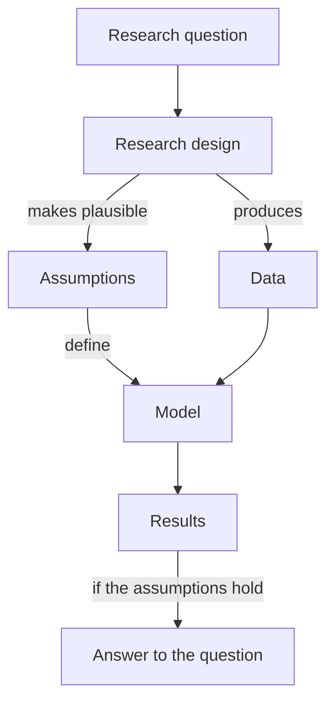
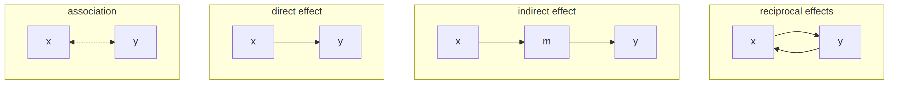
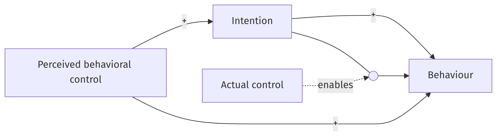

# From research question to interpretation {#sec-rq-to-interpretation}

On election day 2010, sixty-one million Americans logged into Facebook and, without noticing, took part in an experiment. Most saw a banner urging them to vote, along with the faces of friends who had already voted; a smaller group saw the banner without the faces; a control group saw nothing. The researchers then matched users to public voting records. The message with faces produced about 340,000 extra real-world votes, and a friend's face turned out to matter more than the message itself [@bond2012].

Why believe any of that? Not because the dataset was enormous. Sixty-one million observations of people who *chose* to see political messages would prove nothing about influence, since the kind of person who seeks out political content votes anyway. The finding stands because of one design decision: an algorithm assigned the banners at random. Everything in this chapter unfolds from that observation. Data never speak for themselves; a study answers its question through a chain of reasoning, and the strength of the chain decides whether numbers become knowledge.

## The chain: question, design, model

{#fig-chain width="45%" fig-align="center"}

@fig-chain shows the structure. A **research question** motivates a **research design**: a plan for which data to collect and how. The design has one job, and it is subtler than "gathering data". The design makes a set of **assumptions** plausible. Those assumptions, taken together, form the **model**. Fitting the model to the data yields **results**: estimates, intervals, predictions. And the results answer the research question *to the extent that the assumptions hold*.

The last clause carries all the weight, so consider it once more. Numbers that come out of an analysis are just numbers. They become an answer to a question about the world only through the assumptions, and the assumptions are believable only because of the design. In the Facebook experiment, comparing voting rates across banner groups estimates the banner's effect *if* the groups were alike before the banners appeared, and random assignment made that assumption plausible. A regression coefficient from a randomized experiment and a numerically identical coefficient from a self-selected sample are different objects: different assumptions stand behind them.

This chain also describes a job, the one this book trains you for. The methodologist formulates research questions worth asking; evaluates the available designs and data against the assumptions the model needs; proposes new data collection when the needed assumptions have no support; carries out the modeling, with estimates and their uncertainty; and judges how the inevitable violations of assumptions would change the conclusions. Notice what the list omits. No step reads "apply the standard method for this type of data". Methods enter only as consequences of assumptions.

Research questions themselves come in kinds, and the kind matters because each demands different things from design and model [@shmueli2010; @hofman2021]. A **descriptive** question asks what the world looks like: how many students drop out, how much incomes vary. An **explanatory** question, or plainly a causal one, asks what would happen if we changed something; its tell-tale sign is a hidden "if we intervened", and its currency is the comparison between what happened and what would have happened otherwise, the "counterfactual" [@shadish2002]. A **predictive** question asks about units we have not observed: which patients will miss tomorrow's appointments. The same fitted equation can serve any of the three, so when reading a study, first establish which question is on the table. Prediction gets a chapter of its own (@sec-explanation-prediction); until then our questions are descriptive and, mostly, explanatory.

::: {.callout-tip icon="false" title="Exercise 1.1"}
Classify as descriptive, explanatory, or predictive: (a) Does mandatory quarantine reduce influenza transmission? (b) How many students drop out of secondary school in Utrecht each year? (c) Which loan applicants will default? (d) Do students who use AI tools learn less? (e) Did the Facebook banner increase turnout among users who never post about politics?
:::

::: {.callout-note collapse="true" icon="false" title="Answer 1.1"}
(a) Explanatory. (b) Descriptive. (c) Predictive. (d) Explanatory; the causal claim hides in "because of the tools", and a mere association between tool use and learning would be descriptive. (e) Explanatory, asked within a subgroup; the experiment answers it as long as assignment was random within that subgroup too.
:::

## The elements of a verbal theory

Research questions arrive wrapped in theories: verbal accounts of how some corner of the world works. Before any statistics can happen, the theory must be taken apart into standard elements. The dissection looks trivial. It is not, and everything downstream inherits its quality.

**Units of analysis.** The things the theory makes claims about: persons, families, hospitals, countries, occasions. Units hide in plain sight. "Neighborhood trust reduces crime" is a claim about neighborhoods, not people, and analyzing it at the wrong level produces answers to a question nobody asked.

**Variables.** The properties of units that vary. A constant explains nothing: "being human" cannot account for why some people are depressed. Two labels recur throughout this book. Variables the theory sets out to explain are **endogenous**; variables it takes as given are **exogenous**.

**Relationships.** The claims connecting variables, and here vocabulary pays off immediately, because verbal theories mix two kinds of claims that demand different evidence. An **association** says that when one variable is high, the other tends to be high (a positive association) or low (a negative one). Association is symmetric: "wine drinkers live longer" and "long-lived people drink more wine" say the same thing. An **effect** says that changing one variable would change the other, and effects have direction. They come in shapes: a *direct* effect, an *indirect* effect running through an intermediate variable, and *reciprocal* effects where each variable influences the other. @fig-relationships draws the inventory.

{#fig-relationships width="100%" fig-align="center"}

**Functional form.** Verbal theories also whisper claims about *how* effects operate, and two are worth extracting explicitly. Is each effect **linear**, the same change in the outcome for each unit change in the cause? And are the effects **additive**, each cause contributing its share regardless of the others' levels? A theory that says "provocation leads to aggression mainly in people who believe aggression is normal" denies additivity: one variable's effect depends on another's level. We call that a *conditional* relationship and draw it as an arrow pointing at another arrow.

Watch the dissection on a real theory, one of the most cited in social science, the theory of planned behavior [@ajzen1991]:

> People perform a behavior when they intend to; the stronger the intention, the more likely the performance. Intending is not enough, though: carrying out the behavior also requires actual control over it, such as time, money, and skill. People's perception of their control influences their intentions, and it also predicts the behavior directly.

Units: individual people. Variables: intention, actual control, perceived control (all exogenous or endogenous as the arrows dictate), and the behavior. Effects: intention affects behavior; perceived control affects intention; perceived control affects behavior directly. And one claim is conditional: intention produces behavior *only when actual control is present*. Motivation without means achieves nothing, so the theory denies additivity, in words a careless reader would skim right past.

A **path diagram** assembles the elements into one picture: boxes for variables, single-headed arrows for claimed effects, and curved double-headed arcs for associations the theory allows without explaining. One habit belongs in your hands from today: when exogenous variables could plausibly be associated, connect them with a curved arc unless the theory claims otherwise. Omitting these arcs is the most common error in diagram construction, and @sec-theory-to-glm shows that the arcs change the numbers.

{#fig-tpb width="80%" fig-align="center"}

::: {.callout-tip icon="false" title="Exercise 1.2"}
Dissect this micro-theory: "In neighborhoods where residents trust one another, people intervene when teenagers misbehave, and this informal social control reduces crime. Trust is higher where residential turnover is lower." Identify the units, the variables, and each relationship with its type (association or effect; direct, indirect, reciprocal, or conditional). Sketch the path diagram.
:::

::: {.callout-note collapse="true" icon="false" title="Answer 1.2"}
Units: neighborhoods; every variable is a neighborhood property. Variables: residential turnover (exogenous), trust, informal social control, crime. All claims are effects, forming a chain: turnover lowers trust; trust raises informal control; informal control lowers crime. Trust therefore has an indirect effect on crime. The diagram is a four-box chain with three arrows; with only one exogenous variable, no curved arcs are needed. Criminologists know this theory as "collective efficacy".
:::

::: {.callout-tip icon="false" title="Exercise 1.3"}
For each claim, association or effect? (a) "Children who sleep less use screens more." (b) "Screen use displaces sleep." (c) "Poor sleep and heavy screen use reinforce each other over time." Draw the mini-diagram for each.
:::

::: {.callout-note collapse="true" icon="false" title="Answer 1.3"}
(a) Association: the sentence survives swapping its halves; draw a dashed double-headed arc. (b) A direct effect of screens on sleep: one-headed arrow. (c) Reciprocal effects: arrows both ways. The three claims need three different designs to support them, which is why the vocabulary matters.
:::

## Threats to validity

An inference can go wrong in many ways, and @shadish2002 spent careers cataloguing them as "threats to validity", sorted into four families.

**Statistical conclusion validity** concerns the bare inference that two variables covary. Its enemies are low power, too little data to detect what is there, and fishing, searching until something "significant" appears; fishing returns in the final section.

**Internal validity** concerns the inference that covariation reflects cause. Each threat is a rival explanation for an observed difference, and the classic villains deserve to be known by name:

- *Ambiguous temporal precedence*: which variable came first is unclear, so cause and effect may be swapped.
- *Selection*: the compared groups differed from the start in ways that also affect the outcome.
- *History*: something else happened at the same time as the treatment.
- *Maturation*: people were already changing (healing, aging, learning) and would have changed anyway.
- *Regression artifact*: units selected for extreme scores drift back toward the middle on remeasurement.^[This one artifact explains a remarkable share of everyday miracles. Patients who enter therapy at their lowest point improve. The football team that fires its coach after a disastrous season does better. Extremes tend not to repeat, treatment or none.]
- *Attrition*: people drop out, unevenly across groups.
- *Testing*: being measured changes the next measurement.
- *Instrumentation*: the measuring instrument drifts, as when a police force redefines how it records crime.

**Construct validity** concerns the leap from operations to concepts. You manipulated a twenty-minute app session and measured a seven-item mood scale; the title claims "mindfulness improves wellbeing". Whether the operations deserve the labels is its own argument, threatened by reactivity (people respond to being studied) and experimenter expectancy, among others.

**External validity** concerns whether the causal relationship holds beyond this study, for other people, treatments, outcomes, and settings. Every threat has the same form: the effect depends on something this study held fixed, as when a therapy tested on student volunteers fails in older patients in routine care.

Treat these lists as a repertoire of rival explanations rather than a liturgy. Their working question is always: which rivals does this design silence, and which are left talking?

## Designs, with their equations

A **research design** is a plan for producing data: whom to measure, when, and above all who becomes exposed to what, and how that was decided. Campbell's tradition writes designs in a compact notation that repays learning. Each row is a group, time runs left to right, $O$ is an observation, $X$ is exposure to treatment, and $R$ marks randomized assignment. For each design below, the notation comes first, then the threats it removes, then the regression that analyzes it, because a design without an analysis is a promise without a payoff.

**The randomized experiment.**

| | | |
|---|---|---|
| $R$ | $X$ | $O$ |
| $R$ | | $O$ |

The coin flip removes *selection* in one stroke: randomization "equates groups on expectations of every variable before treatment, whether observed or not" [@shadish2002]. On expectations, mind, and on everything, including whatever nobody thought to measure. The comparison group absorbs shared history and maturation. The analysis is the simplest regression there is,
$$
y = \beta_0 + \beta_1 T + \varepsilon,
$$
with $T = 1$ for the treated; under the design's assumptions $\hat\beta_1$ estimates the average effect. The Facebook study is this design at planetary scale, with three rows instead of two. What randomization does not remove: attrition after assignment, and every construct and external validity threat. A banner effect among 2010 Facebook users is a fact about that platform, that year.

**The natural experiment.** Sometimes bureaucracy flips the coin for us. During the Vietnam War, draft priority was assigned by a televised lottery over birth dates. @hearst1986 realized decades later that the lottery had randomized, in effect, an entire life exposure: men with unlucky numbers were more likely to have served. Comparing later mortality by lottery number, they found elevated suicide and motor-vehicle deaths among draft-eligible men. Notice the two questions such a design can answer. Comparing by *lottery number* estimates the effect of eligibility, the "intention-to-treat" effect, and inherits the lottery's full credibility. Estimating the effect of *actual service* takes more, since not all eligible men served; the repair, using the lottery as a lever on service, is the instrumental-variable idea of @sec-identification. The design's weak point is the exclusion of other pathways: a lottery number that changed lives in ways other than service (some men stayed in university to avoid the draft) muddies the comparison.

**Two groups, before and after.**

| | | | |
|---|---|---|---|
| | $O$ | $X$ | $O$ |
| | $O$ | | $O$ |

No randomization: one group happens to become exposed, say to a policy, and both groups are measured before and after. The pre-measurement reveals the starting difference, and the analysis compares *changes* rather than levels, a comparison economists call **difference-in-differences**:
$$
y = \beta_0 + \beta_1 G + \beta_2\,\text{Post} + \beta_3\,(G \times \text{Post}) + \varepsilon .
$$
$\hat\beta_3$, the extra change in the exposed group, estimates the effect under one assumption: without treatment the two groups would have changed in parallel. Stable selection differences cancel out. What survives is selection interacting with change, as when groups were already on different trends, or a group adopts a policy right after an untypically bad year and rebounds regardless (a regression artifact wearing policy clothes). Plotting the pre-period trends of both groups is the standard, and revealing, diagnostic. A cousin for single treated units, the synthetic control method, builds the comparison "group" as a weighted blend of untreated units; @andersson2019 evaluated Sweden's pioneering carbon tax against a synthetic Sweden mixed from other OECD economies, finding transport emissions about 11% lower than the counterfactual.

**The regression discontinuity.** Some treatments switch on at a sharp threshold: a passing grade, an income ceiling, a birthdate. In 1972 the United Kingdom raised its school-leaving age from fifteen to sixteen, and the rule bit according to birth month: children born after a cutoff date had to stay a year longer. @geruso2018 compare women born just before and just after the cutoff to estimate schooling's effect on early family formation. The logic: units just left and just right of a threshold are as good as randomized, since nobody controls their position that finely. The regression fits the outcome as a smooth function of the "running" variable (birth date) and looks for a jump at the cutoff:
$$
y = \beta_0 + \beta_1\,\mathbb{1}(\text{past cutoff}) + f(\text{running variable}) + \varepsilon .
$$
The estimate $\hat\beta_1$ is credible near the cutoff and silent far from it; the threats are misjudging the shape of $f$, and units manipulating their position around the threshold.

**The cross-over experiment.**

| | | | | |
|---|---|---|---|---|
| $R$ | $X_A$ | $O$ | $X_B$ | $O$ |
| $R$ | $X_B$ | $O$ | $X_A$ | $O$ |

Each unit receives both conditions in randomized order and serves as its own control, removing stable between-person differences entirely. The price is a fresh assumption: the first condition must not linger into the second ("no carry-over"), which is why the design suits reversible treatments, a drug that washes out, and not surgery or education.

**The matched case-control study.** For rare outcomes, waiting for cases is hopeless, so the design samples on the outcome: cases with the disease, controls without, matched on age, sex, and other characteristics, then compared on past exposures. Matching *constructs* comparability where randomization would have guaranteed it, and the analysis is a logistic regression (@sec-theory-to-glm) of case status on exposure. If the matching did its job, this simple analysis answers the question. That "if" works hard: matching equates the groups only on the matched variables, and on nothing else. The design is genuinely useful and visibly less convincing, a trade epidemiology accepts with open eyes.

The catalogue could continue, and does not need to. Real datasets increasingly arrive with no purposeful design at all, and no list can anticipate every clever identification argument. What transfers is the way of thinking: ask what assumptions the analysis needs, and which feature of the data collection, if any, makes them plausible. A missing design feature does not remove an assumption. It leaves the assumption standing there, unsupported, waiting for a referee to notice.

Before moving on, watch the central threat operate. In the simulation below, exercising has *no effect whatsoever* on depressive symptoms, but motivated people both exercise more and feel better. A thousand observational studies compare exercisers with non-exercisers; a thousand experiments randomize exercise.

```{r}
#| label: fig-confounding
#| fig-cap: "The same true (zero) effect of exercise on symptoms, estimated in 1,000 simulated observational studies (left) and 1,000 randomized experiments (right). The vertical line marks the truth."
set.seed(1)
one_study <- function(randomized) {
  n <- 300
  motivation <- rnorm(n)                          # never measured
  if (randomized) {
    exercise <- rbinom(n, 1, 0.5)                 # coin flip
  } else {
    exercise <- rbinom(n, 1, plogis(motivation))  # the motivated exercise more
  }
  symptoms <- 10 - 1.5 * motivation + 0 * exercise + rnorm(n)
  coef(lm(symptoms ~ exercise))["exercise"]
}
obs <- replicate(1000, one_study(randomized = FALSE))
rct <- replicate(1000, one_study(randomized = TRUE))
par(mfrow = c(1, 2))
hist(obs, main = "Observational", xlab = "Estimated effect",
     xlim = c(-2, 1), breaks = 30); abline(v = 0, lwd = 2)
hist(rct, main = "Randomized", xlab = "Estimated effect",
     xlim = c(-2, 1), breaks = 30); abline(v = 0, lwd = 2)
```

The left panel shows *bias*: the estimates pile up in the wrong place, study after study, and more data would only sharpen the pile. The right panel shows noise around the truth. Randomization converted a systematic error into an unbiased scatter, which is the entire moral of this section in one picture.

::: {.callout-tip icon="false" title="Exercise 1.4"}
Name the most worrying threat, and one design feature that addresses it. (a) A hospital compares mortality in the six months after a new triage protocol with the six months before; a new director started the same week. (b) A tutoring program admits the students with the lowest test scores and celebrates their gains at the next test. (c) An eight-week fitness-app trial loses 40% of its treatment group and 5% of its control group. (d) A study of a new pension policy compares savings in the adopting country with a neighbor, using one measurement after adoption.
:::

::: {.callout-note collapse="true" icon="false" title="Answer 1.4"}
(a) History; a comparison hospital or a long interrupted series of monthly measurements would separate the protocol from the moment. (b) Regression artifact; the lowest scorers rebound on retest regardless, so randomize among eligible students or at least select a comparison group the same way. (c) Attrition; the surviving 60% are a self-selected subsample, so analyze everyone as assigned and compare dropouts with completers at baseline. (d) Selection; with no pre-measurement, level differences between countries are fatal, so add pre-period data and compare changes (difference-in-differences), then inspect the pre-trends.
:::

## From designs to models

The regressions above are the smallest members of a large family. Every method in this book, and in the research literature beyond it, is a model in the same sense: a set of assumptions about how the data arose, within which the results answer the question.

| Model | Typical question it serves |
|---|---|
| Linear regression | How does a numeric outcome relate to its causes or predictors? |
| Logistic regression | The same, for a yes/no outcome |
| ANOVA and multilevel models | How much variation lies between groups, and where? |
| Factor analysis, item response theory | What do many related measurements have in common? |
| Hidden Markov models | How does an unobserved state evolve over time? |
| Gaussian processes | What smooth function could have produced these points? |
| Random forests, neural networks, transformers | What best predicts the outcome, functional form unknown? |

: Models are sets of assumptions; each row serves characteristic questions. {#tbl-models}

Two remarks about @tbl-models. No row is exempt from the chain: a transformer embodies assumptions (that deployment data resemble training data, above all) just as surely as a *t*-test does. And no row is intrinsically causal or non-causal; whether a model's output answers a causal question is settled by design-backed assumptions, never by the arithmetic. The same regression can describe, explain, or predict [@hofman2021].

## Exploratory and confirmatory research

The chain has so far run forward: question, then design, then model. Real research often runs backward. You have data, collected for another purpose; a pattern catches your eye; and only then do you formulate the question the pattern seems to answer. This is **exploratory** research, and it is how many good ideas are born.

Exploration is not the sin. The sin is dressing exploration up as confirmation, because the disguise invalidates the statistics. A $p$-value of .05 promises that results this extreme arise by chance one time in twenty *when this single test was fixed in advance*. Run twenty tests and report the prettiest, and the chance that something somewhere clears the bar is .64; at fifty tests, .92 [@shadish2002]. The promised design ("I will test this one hypothesis") never happened. The practice has many names: fishing, $p$-hacking, and, for hypothesizing after the results are known, HARKing. Prediction offers no refuge, since free choice of task, metric, and preprocessing can dress the same model up as impressive or as useless [@hofman2017].

The remedies are plain. Label exploration as what it is; an exploratory finding labeled as such is a legitimate contribution. Better, let old data pose the question and new data answer it: a fresh sample, a preregistered replication, or a held-out portion never touched during the search. Then the chain runs forward again, with the question in place before the design that answers it.

::: {.callout-tip icon="false" title="Exercise 1.5"}
A team measures 120 food items and 40 health outcomes and reports: "Yogurt consumption was significantly associated with lower blood pressure ($p = 0.01$)." What might make this exploratory research in disguise, and what happens to the meaning of the $p$-value?
:::

::: {.callout-note collapse="true" icon="false" title="Answer 1.5"}
There are $120 \times 40 = 4{,}800$ pairs, so about 48 clear $p \le .01$ by chance even if nothing is real. If the yogurt pair was reported *because* it stood out, the $p$-value's promise no longer describes what happened: the chance of finding some pair this extreme was near certainty. The search legitimately generates the yogurt hypothesis; answering it takes new data or an analysis that accounts for the search.
:::

## Five questions

Everything in this chapter compresses into a checklist you can carry into any seminar. What is the research question, and is it descriptive, explanatory, or predictive? What is the design: who was measured, and who became exposed to what, decided how? What is the model, meaning which assumptions does interpreting the results require? How do design and model combine into an answer? And does the design warrant the assumptions, or are some standing unsupported? The rest of this book practices these five questions with increasing precision, and the next chapter takes the step this one skipped: how a verbal theory becomes a specific model, with coefficients to estimate, interpret, and be proven wrong about.

## Test yourself {.unnumbered}

These closing exercises are harder than the inline ones.

::: {.callout-tip icon="false" title="Exercise 1.A"}
The general aggression model [@allen2018] holds, in brief: person factors (such as trait hostility) and situation factors (such as provocation or heat) influence a person's present internal state, consisting of cognition, affect, and arousal, which influence one another reciprocally. The internal state leads, through appraisal and decision processes, to an aggressive or nonaggressive outcome of the encounter. Person and situation factors can work additively or interactively: provocation matters more for people who consider aggression normal. Each encounter's outcome feeds back into the person's future characteristics.

(a) Specify the units of analysis.
(b) Specify the variables.
(c) Name the relationships and their types. Are all relationships linear and additive? Why (not)?
(d) Draw the path diagram, including any associations among exogenous variables.
:::

::: {.callout-note collapse="true" icon="false" title="Answer 1.A"}
(a) Persons in social encounters; strictly person-episodes, since the theory describes a repeating cycle. (b) Person factors, situation factors, cognition, affect, arousal, appraisal/decision, and the outcome. (c) Effects from person and situation factors to the three internal-state variables; reciprocal effects among cognition, affect, and arousal; a chain from internal state through appraisal to outcome; a feedback effect from outcome to person factors. Not all additive: "additively or interactively" plants a conditional relationship, and the reciprocal and feedback claims break any simple one-way chain. (d) Person and situation factors joined by a curved arc; arrows to the internal-state triangle with double-headed connections inside it; the chain to the outcome; the feedback arrow. The curved arc among the exogenous variables belongs in a complete answer.
:::

::: {.callout-tip icon="false" title="Exercise 1.B"}
An abstract reads: "Whether the association between poverty and mental health in developing countries is causal remains open. We estimate the causal effect of poverty on mental health by exploiting a natural experiment: weather variability across 440 Indonesian districts ($N = 577{,}548$). Precipitation anomaly serves as an instrument for poverty, measured by household consumption. Halving consumption raises the probability of mental illness by 0.06 points, an effect about five times stronger than the naive association." [@hanandita2014]

(a) Identify the units of analysis and the variables.
(b) Which design from this chapter is this, and what argument must the authors make for it?
(c) The naive association was five times weaker than the design-based estimate. Name one threat that could produce this discrepancy, with its direction.
:::

::: {.callout-note collapse="true" icon="false" title="Answer 1.B"}
(a) Units: persons, nested in districts. Variables: rainfall anomaly (district), household consumption, mental illness. (b) A natural experiment: nature assigns rainfall shocks, and the authors must argue the shocks are unrelated to everything else affecting mental health and touch mental health only through economic hardship, the lever logic of @sec-identification. (c) Measurement error in consumption attenuates the naive association toward zero; reverse causation (illness lowers earning capacity) and confounding are also defensible answers, with the discrepancy's direction explained.
:::

::: {.callout-tip icon="false" title="Exercise 1.C"}
A study finds that patients treated in high-volume hospitals have better surgical outcomes than patients in low-volume hospitals, adjusting for age and comorbidity. The authors conclude that concentrating surgery in high-volume centers would improve outcomes.

(a) State the question the analysis answers and the question the conclusion answers.
(b) Identify the design and the most worrying threat.
(c) Propose one design improvement and name the new assumption or limitation it buys.
:::

::: {.callout-note collapse="true" icon="false" title="Answer 1.C"}
(a) The analysis answers a descriptive question (do outcomes differ between hospital types among comparable-looking patients?); the conclusion answers a causal one (would redirecting patients improve their outcomes?). (b) An observational cohort comparison with adjustment; the threat is selection, since patients reach hospitals through referral, geography, and severity in ways two adjusters cannot capture, and high-volume hospitals may decline high-risk cases. (c) Randomizing referral among consenting patients removes selection at the price of external validity (consenters and participating regions only). Exploiting quasi-random variation in distance to a high-volume center is cheaper and buys the instrumental-variable assumptions of @sec-identification instead.
:::
