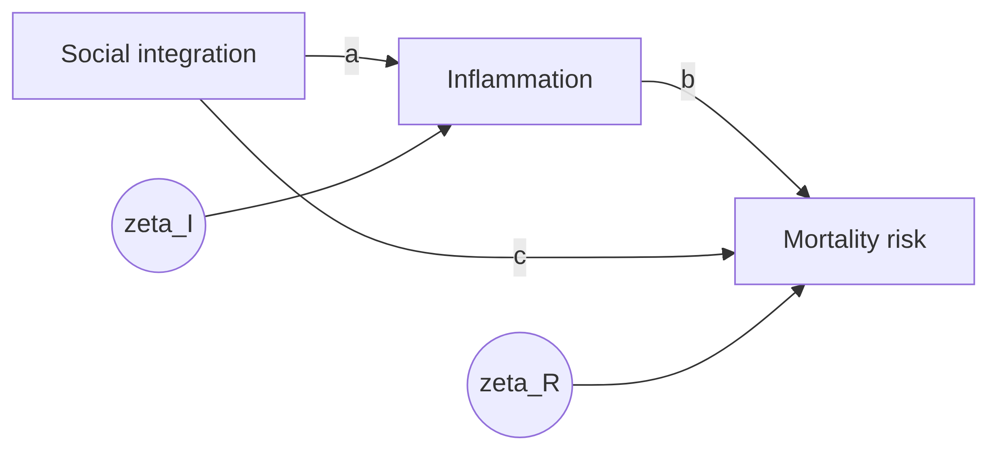

# From theory to model: (generalized) linear models {#sec-theory-to-glm}

Lonely people die younger. Epidemiologists have measured the mortality risk of social isolation and found it rivals smoking and obesity, a comparison that made headlines and changed public-health agendas. But *how* does a social fact reach into the body? One prominent answer: isolation gets under the skin. Social connection regulates stress physiology, so the isolated carry more chronic inflammation and higher blood pressure, and those, over the years, kill. @yang2016 traced exactly this account in four large cohorts spanning adolescence to old age, linking survey measures of social integration to blood-based markers such as C-reactive protein.

That account is a theory told in words. This chapter turns such words into a statistical model, step by step, following a method worked out by @saris1984: treat the verbal theory as the object of interest, and build the model as its translation, precise enough to estimate and precise enough to be wrong. Along the way the two workhorses of applied statistics, linear regression and logistic regression, enter exactly where they are needed. The payoff at the end is a research cycle you can run yourself: verbal propositions, a testable model, estimates that say something about the world *if the model is true*, and tests that say something about the theory.

## From words to a diagram

Begin by dissecting the theory with the tools of @sec-rq-to-interpretation. The units are persons. The variables: social integration (how embedded someone is in relationships), physiological dysregulation (which we will shorten to *inflammation*, its most prominent marker), and mortality risk. The claims: integration lowers inflammation; inflammation raises mortality risk; and integration may also protect life through other routes, safer behavior and quicker help in emergencies, which we bundle into a direct effect.

Draw the claims before writing any algebra. Each variable becomes a box; each claimed effect becomes an arrow; and each endogenous variable receives an extra arrow from a circle, its **disturbance**, of which more in a moment.

{#fig-yang width="75%" fig-align="center"}

The diagram is not an illustration of the model. The diagram *is* the model, and reading it carefully reveals every commitment the theory makes. Two boxes receive arrows, so the theory explains two variables: inflammation and mortality risk are endogenous. One box receives none: social integration is exogenous, taken as given. And some arrows are missing. Nothing points from inflammation back to integration, for instance, though the sick may well withdraw from social life. A missing arrow is a claim too, the claim that this effect is zero, and by convention every effect not drawn is asserted absent [@saris1984]. Such claims of absence are the most valuable ones a theory makes, because they are the easiest to prove wrong. A theory in which everything affects everything can never be embarrassed by data.

Which variables must the diagram include? The rules follow from what omission does. A **common cause** of two variables under study can never be left out: omit it, and its work reappears disguised as an effect between them. That is the confounding of @sec-rq-to-interpretation, now in diagram form, and @sec-identification makes it sting. An intervening variable may be dropped harmlessly, its indirect effect then presenting itself as direct. A variable affecting only one box costs nothing but unexplained variance.

## From the diagram to equations

Now the algebra, and the rule could not be shorter: **every box with an arrow pointing into it becomes the left-hand side of one equation, with its incoming arrows on the right.** Two endogenous boxes, two equations. Write $S$ for social integration, $I$ for inflammation, $R$ for mortality risk, and keep every variable standardized (mean 0, standard deviation 1) so that coefficients are comparable.^[Standardization is a convenience, not a commitment. Unstandardized coefficients answer questions in natural units ("one more close relationship corresponds to this many mg/L of C-reactive protein") and travel better across populations; standardized ones compare effects within one analysis. Each converts to the other.]

$$
\begin{aligned}
I &= a\,S + \zeta_I \\
R &= b\,I + c\,S + \zeta_R
\end{aligned}
$$ {#eq-yang}

The letters on the arrows became coefficients, and each carries the theory's claims: the theory expects $a < 0$, $b > 0$, $c < 0$. The $\zeta$ ("zeta") terms are the disturbances, and @saris1984 list exactly what lives inside one: the effects of unknown variables, the effects of known but omitted variables, the intrinsic randomness of human lives, and measurement error. The model claims that integration matters, never that integration is everything. One assumption rides on the disturbances and carries the entire causal reading: **each disturbance must be unrelated to the predictors in its equation.** If some omitted variable, childhood adversity, say, drives both isolation and inflammation, then $\zeta_I$ travels together with $S$ and the assumption fails. No dataset can check this assumption. Its plausibility equals the thoroughness of the hunt for common causes, and the design behind the data.

Two quieter assumptions also slipped in with the equations, and they are different assumptions, worth prying apart. **Linearity**: each unit of $S$ shifts $I$ by the same amount $a$, at every level of $S$. **Additivity**: the contribution of one cause does not depend on the level of another; nothing in @eq-yang lets integration's effect on risk grow when inflammation is high. A relationship can be linear but non-additive, as in the theory of planned behavior's claim that intention works only given actual control, and additive but nonlinear, as when each additional confidant helps, but less than the one before. The verbal theory said nothing either way; translation forced the choice, and the simplest workable form won. Remember that it was a choice.

::: {.callout-tip icon="false" title="Exercise 2.1"}
The collective-efficacy theory of Exercise 1.2 has four neighborhood variables: residential turnover, trust, informal social control, and crime, in a causal chain. (a) Which variables are endogenous? (b) Write the equations, one per endogenous variable, with disturbances. (c) The theory as drawn claims turnover affects trust but not, directly, crime. Say in one sentence what data pattern could embarrass this claim of absence.
:::

::: {.callout-note collapse="true" icon="false" title="Answer 2.1"}
(a) Trust, informal social control, and crime; turnover is exogenous. (b) With standardized variables: $\text{Trust} = a\,\text{Turnover} + \zeta_1$; $\text{Control} = b\,\text{Trust} + \zeta_2$; $\text{Crime} = c\,\text{Control} + \zeta_3$. (c) A correlation between turnover and crime stronger than the chain can transmit (the product $a \times b \times c$, as the next section shows) would demand a direct path or a common cause that the diagram denies.
:::

## What the theory predicts: the tracing rules

Here the translation starts paying rent. Once a theory is a set of linear equations, it makes quantitative predictions about something observable: the correlations among the variables. The recipe for reading those predictions off the diagram is a pair of rules that @saris1984 call the decomposition rules; the trace-following version goes back to Sewall Wright's path analysis [@wright1934].

> **First decomposition rule.** The model-implied correlation between two variables is the sum, over all valid traces connecting them, of the products of the coefficients along each trace. Traces are classified by their shape: a *direct* effect, an *indirect* effect (forward through intervening variables), a *spurious* component (backward then forward through a common cause), and a *joint* component (through a curved arc).

A valid trace never visits the same variable twice, never goes forward along arrows and then backward, and crosses at most one curved arc. You may walk backward first, against the arrowheads, and then forward; once moving forward, there is no turning back.

> **Second decomposition rule.** The variance of an endogenous variable equals the variance its causes explain plus the disturbance variance; with standardized variables, $1 = R^2 + \operatorname{var}(\zeta)$.

Apply the first rule to @fig-yang with some concrete numbers. Suppose, for teaching purposes rather than as estimates from the paper, that $a = -0.20$, $b = 0.25$, and $c = -0.15$. What correlation between integration and mortality risk does the model imply? Two traces connect $S$ and $R$: the direct path, contributing $c = -0.15$, and the indirect path through inflammation, contributing $a \times b = -0.20 \times 0.25 = -0.05$. The model therefore predicts
$$
\rho(S, R) = c + ab = -0.15 - 0.05 = -0.20 .
$$
And between inflammation and risk? The direct path contributes $b = 0.25$; the trace backward to integration and forward to risk, $I \leftarrow S \rightarrow R$, has a common cause at its turn and contributes the spurious component $a \times c = (-0.20)(-0.15) = 0.03$; together, $\rho(I, R) = 0.28$. The decomposition tells you what a raw correlation is made of. Anyone who reads the observed inflammation-mortality correlation as "the effect of inflammation" is overstating that effect by the spurious share, and anyone who intervenes on inflammation should expect the smaller number, 0.25, if the model is true.

The same rules run on real numbers. A recent study of 1.2 billion online reviews asked why women rate products more favorably than men, and proposed a mechanism: writing a negative review is a small public confrontation, and women anticipate harsher social consequences for it, a "fear of negative evaluation" [@bayerl2024]. In one of their experiments ($n = 1{,}172$), the standardized estimates were, in our notation with $G$ for gender (1 = woman), $F$ for fear, and $V$ for review submission: $G \rightarrow F$: $a = 0.40$; $F \rightarrow V$: $b = -0.19$; and a direct path $G \rightarrow V$: $c = -0.42$.

::: {.callout-tip icon="false" title="Exercise 2.2"}
Practice the mechanics one trace at a time, on the review model. (a) How many valid traces connect $G$ and $F$, and what is the implied $\rho(G,F)$? (b) Why is $F \rightarrow V \leftarrow G$ not a valid trace from $F$ to $G$? (c) Compute the implied $\rho(F,V)$. (d) Recompute it if the direct gender effect had the opposite sign, $c = +0.42$. What happens, and what is the lesson?
:::

::: {.callout-note collapse="true" icon="false" title="Answer 2.2"}
(a) One trace, $G \rightarrow F$, so $\rho(G,F) = a = 0.40$. (b) The walk enters $V$ going forward and would have to leave going backward; forward-then-backward is forbidden, because variables are correlated through common causes, not through common effects. (c) Direct $b = -0.19$ plus the spurious trace $F \leftarrow G \rightarrow V$ contributing $a \times c = 0.40 \times -0.42 = -0.168$; together $-0.358$. (d) With $c = +0.42$: $-0.19 + 0.168 = -0.022$. The correlation nearly vanishes while the causal effect stays $-0.19$; components can cancel, so a near-zero correlation does not mean no effect.
:::

Estimation reverses the tracing rules: given observed correlations, find the coefficients that reproduce them. In R, the lavaan package does this for entire equation systems, and feeding it the correlations our review model implies returns the coefficients we started from:

```{r}
#| label: bayerl-lavaan
library(lavaan)
R <- matrix(c(
    1.000,  0.400, -0.496,
    0.400,  1.000, -0.358,
   -0.496, -0.358,  1.000),
  nrow = 3, byrow = TRUE,
  dimnames = list(c("G", "F", "S"), c("G", "F", "S")))
model <- "
  F ~ G
  S ~ F + G
"
fit <- sem(model, sample.cov = R, sample.nobs = 1172)
round(coef(fit), 2)
```

The matrix holds the three correlations; the model string holds one line per equation, `~` read as "is regressed on"; and the output returns 0.40, $-0.19$, $-0.42$ along with the two disturbance variances.^[The same trick reanalyzes any published correlation or covariance matrix, no raw data required, which makes half the literature your dataset.] With three coefficients facing three correlations, this model reproduces any data perfectly; the fit is a bookkeeping identity. The theory starts risking something the moment an arrow is forbidden. Someone claiming that fear is the whole story, no direct path, would fix $c = 0$, leaving two coefficients to face three correlations, and their model would predict $\rho(G,V) = a \times b$. The data can refuse, and here they do:

```{r}
#| label: bayerl-test
fit0 <- sem("F ~ G \n S ~ F", sample.cov = R, sample.nobs = 1172)
round(fitMeasures(fit0, c("chisq", "df", "pvalue")), 2)
```

The chi-square statistic measures the gap between the correlations the restricted model can produce and those observed; a true restriction lands the statistic near its degrees of freedom, here 1, and 218 is a resounding refusal. The "fear only" theory dies.^[Conditionally, as always: a test confronts one claim given every other claim in the model, and the surviving model is not thereby true. Other stories reproduce these same three correlations exactly as well, and that unsettling fact is the subject of @sec-identification.]

## Interpreting linear coefficients

The fitted equations mean what the model says they mean:

> A one-unit increase in $x$ goes with a $\hat\beta$-unit change in $y$, holding the other predictors in that equation constant. Under the model's assumptions, and only under them, "goes with" strengthens to "produces".

The strengthening happens outside the arithmetic, in the design and the defense of the disturbance assumption; no software option performs it. Judging a coefficient's *size* takes one more habit: scale by the variable's realistic range. In an analysis of who votes, a coefficient of 0.017 per year of age looks negligible until you notice that fifty years separate the youngest and oldest voters, so age spans $50 \times 0.017 = 0.85$ units of effect, a large difference. Small coefficient, big variable, big effect.

## When the outcome is yes or no: logistic regression

Mortality, employment, voting: many outcomes are binary, and a straight line fitted to a probability eventually predicts nonsense, probabilities below zero or above one. The repair keeps the linear machinery and changes what the line predicts: not the probability but its **log-odds**, also called the logit. Odds are the bookmaker's currency, probability $p$ against its complement, $p/(1-p)$: probability .75 is odds of 3, probability .5 is odds of 1. The logarithm of the odds stretches over the whole number line, so a linear equation can roam freely,
$$
\log \frac{P(y = 1)}{1 - P(y = 1)} = \beta_0 + \beta_1 x_1 + \beta_2 x_2 + \dots,
$$
and any value translates back to a legal probability. This is **logistic regression**, and with linear regression it forms the family of "generalized linear models": one recipe, different links between the linear part and the outcome.

Interpretation costs a little more than before, and two conversions pay most of the bill. First, exponentiate: $e^{\beta}$ is the **odds ratio**, the factor by which one unit of $x$ multiplies the odds. For small coefficients a rule of thumb applies, $e^{\beta} \approx 1 + \beta$, so a coefficient of 0.10 means roughly 10% higher odds per unit; the approximation is decent up to about $|\beta| = 0.3$. Second, for any concrete person, build the linear predictor, then invert the logit, $P = 1/(1 + e^{-\text{logit}})$, which R computes as `plogis()`.

A worked example, from a logistic regression of voting in the last Dutch parliamentary election on data from the LISS panel, a probability-based online panel. All continuous predictors are centered, so zero stands for the sample average; a selection of the output:

| Variable | Coefficient (logit) | Std. error |
|---|---|---|
| Constant | 0.359 | 0.196 |
| Age (centered) | 0.017 | 0.003 |
| Political interest (1–3) | 0.915 | 0.088 |
| Education level (1–6) | 0.229 | 0.038 |
| Female | 0.054 | 0.103 |

: Logistic regression of voting (1 = voted) on selected predictors. {#tbl-voting}

What is the probability that a woman votes? Centering means the average person has zeros everywhere except the dummy variables, so an otherwise average woman has logit $0.359 + 0.054 = 0.413$:

```{r}
#| label: voting-probs
p_women <- plogis(0.359 + 0.054)
p_men   <- plogis(0.359)
round(c(women = p_women, men = p_men, difference = p_women - p_men), 3)
```

A 60.2% chance against 58.9%, a difference of 1.3 percentage points. Keep both scales in view: the same odds ratio moves probabilities most near 50% and barely at all near the extremes, so always translate coefficients into probabilities for realistic cases before judging them.

Interactions are where logistic tables bite hardest, and they reward slowing down. @forster2016 asked whether vocational education, compared with general education, helps employment early in working life but hurts later, when specific skills age badly. Their model for men includes, among other terms:

| Term | Coefficient |
|---|---|
| Age (age 16 = value 0) | 0.208 |
| Vocational (Ref. = general) | 0.487 |
| Age $\times$ vocational | $-0.017$ |

: Selected coefficients from a pooled logistic regression of employment among men in 24 countries [@forster2016]. {#tbl-forster}

Resist reading "the vocational effect is 0.487". In a model with an interaction, the vocational effect is a *line*, $0.487 - 0.017 \times \text{Age}$, and the parenthetical "(age 16 = value 0)" tells you where the line starts: at age sixteen the effect is $+0.487$, an early advantage, exactly as hypothesized. Each year of age eats $0.017$ of it. The advantage runs out where $0.487 - 0.017 \times \text{Age} = 0$, at $0.487/0.017 \approx 28.6$ years *after age sixteen*, so around age 45 the advantage turns into a penalty, the paper's second hypothesis. Every step is small; the art is only in respecting the coding and keeping track of which terms belong to the effect at hand. The next two exercises walk the two standard computations slowly.

::: {.callout-tip icon="false" title="Exercise 2.3"}
Using the women's version of the model (constant $-0.880$; Vocational $0.229$; Age $\times$ vocational $-0.013$; parental tertiary education $0.072$; reference categories: general education, lower secondary schooling, parents with primary education), compute step by step the employment probability of a 16-year-old woman in vocational education whose parents completed tertiary education. (a) Which terms enter her linear predictor, and which are zero, and why? (b) Sum the logit. (c) Convert to a probability.
:::

::: {.callout-note collapse="true" icon="false" title="Answer 2.3"}
(a) At age 16 the age variable equals 0, so the age term and the interaction vanish; "lower secondary" is her own-education reference and contributes nothing; entering are the constant, Vocational (0.229), and parental tertiary (0.072). (b) $-0.880 + 0.229 + 0.072 = -0.579$. (c) `plogis(-0.579)` $\approx 0.36$. The classic mistakes: adding coefficients for reference categories, keeping the interaction alive at age 16, and stopping at the logit as if it were the answer.
:::

::: {.callout-tip icon="false" title="Exercise 2.4"}
From @tbl-forster: (a) verify the age at which the vocational effect reverses for men; (b) compute the vocational effect at age 60; (c) state the odds-ratio reading of the age-16 vocational effect, exactly and by the rule of thumb; (d) explain in one sentence why the rule of thumb misbehaves here.
:::

::: {.callout-note collapse="true" icon="false" title="Answer 2.4"}
(a) $0.487/0.017 \approx 28.6$ years past sixteen, roughly age 44.6. (b) The age variable equals 44, so $0.487 - 0.017 \times 44 \approx -0.26$, a penalty of about a quarter logit. (c) Exactly $e^{0.487} \approx 1.63$, 63% higher odds; the rule of thumb says 49%. (d) At $\beta \approx 0.5$ the coefficient sits far outside the small-coefficient range where $e^{\beta} \approx 1 + \beta$ holds.
:::

Generalized linear models extend past the binary case. When @casedeaton2017 documented the rise of "deaths of despair" among middle-aged white Americans, the outcomes were mortality *rates* by cohort, education, and year, modeled with the same recipe under a different link, and the analysis turned on interactions: mortality rising for those without a university degree while falling for graduates. The one lesson to carry over is unchanged: with any nonlinear link, coefficients speak an odds- or rate-language, and conclusions should be translated back to probabilities or rates for concrete cases before anyone acts on them.

## What this chapter left out, on purpose

The models here are linear and additive, with a link function when the outcome demands one. The world is not, and you may wonder why a book written now spends a chapter this way when random forests fit curves automatically and agent-based models skip equations altogether, simulating individuals following rules. Three reasons. The chain of @sec-rq-to-interpretation is fully general: flexible methods and simulations answer questions through designs and assumptions in exactly the same way, only with the logic buried under more machinery, so we learn it where it is visible. At the sample sizes common in social and health research, the data cannot pay for much flexibility anyway; a linear approximation estimated precisely beats a true curve estimated as noise. And when data are plentiful and prediction is the goal, the later chapters supply the flexible tools, which will lean on everything learned here.

The deeper omission is a warning. Estimates say something about the world if the model is true, and tests say something about the theory, but a model that survives its tests is not thereby true: other models, saying different things about the world, can fit the same data exactly as well. How bad can that get? The next chapter answers: arbitrarily bad, and the design is the only way out.

## Test yourself {.unnumbered}

::: {.callout-tip icon="false" title="Exercise 2.A"}
A classic model in behavior genetics explains the IQ scores of twin pairs, $y_1$ and $y_2$, by a genetic factor for each twin ($A_1$, $A_2$), a shared environment ($C$, the same variable for both), and unique environments ($E_1$, $E_2$), all standardized and mutually independent except that $A_1$ and $A_2$ correlate 0.5 in fraternal twins. Loadings: 0.7 for $A$, 0.5 for $C$, 0.5 for $E$, identical for both twins.

(a) Draw the diagram and write the equation for each observed variable.
(b) Derive the implied correlation between $y_1$ and $y_2$, showing your traces.
(c) In identical twins $A_1$ and $A_2$ correlate 1. Derive the implied twin correlation in that group.
(d) Suppose people increasingly select environments matching their genes, so that $A_1$ and $E_1$ become correlated. What changes in the diagram, and which new component enters the implied correlation between $A_1$ and $y_1$?
:::

::: {.callout-note collapse="true" icon="false" title="Answer 2.A"}
(a) $y_1 = 0.7A_1 + 0.5C + 0.5E_1$; $y_2 = 0.7A_2 + 0.5C + 0.5E_2$. (b) Trace through the shared environment: $0.5 \times 0.5 = 0.25$; trace through the genetic arc: $0.7 \times 0.5 \times 0.7 = 0.245$; sum 0.495. (c) $0.25 + 0.7 \times 1 \times 0.7 = 0.74$. The gap between 0.74 and 0.495 is what lets researchers separate genes from environments. (d) A curved arc between $A_1$ and $E_1$; the implied $\rho(A_1, y_1)$ gains a joint component, $\rho(A_1,E_1) \times 0.5$, on top of the direct 0.7, so the loading no longer equals the gene-IQ correlation.
:::

::: {.callout-tip icon="false" title="Exercise 2.B"}
Return to the social-integration model of @eq-yang with the illustrative values $a = -0.20$, $b = 0.25$, $c = -0.15$.

(a) Compute the share of the integration-mortality correlation that runs through inflammation.
(b) A colleague estimates the effect of inflammation on mortality by the raw correlation between the two. By how much do they err, and why?
(c) Mortality is a yes/no outcome over any fixed window. Which two assumptions of the linear equations does this strain, and what is the standard repair?
(d) Name one plausible common cause omitted from the diagram, and state which coefficient it would bias and in which direction.
:::

::: {.callout-note collapse="true" icon="false" title="Answer 2.B"}
(a) Indirect over total: $(-0.05)/(-0.20) = 0.25$, a quarter of the association, if the model is true. (b) They report $0.28$ where the causal coefficient is $0.25$; the excess is the spurious component through integration, $ac = 0.03$. (c) Linearity (a straight line escapes the 0-1 range) and the constant-effect reading that goes with it; the repair is a generalized linear model, logistic regression. (d) For example, socioeconomic status: wealth buys both social opportunities and healthier bodies, so omitting it inflates $|c|$ (and plausibly $|a|$); childhood adversity works similarly. Any defensible example earns the point if the biased path and direction are argued.
:::

::: {.callout-tip icon="false" title="Exercise 2.C"}
A study of hospital readmission reports a logistic regression: constant $-1.5$; frailty score (standardized) $0.4$; lives alone $0.3$; frailty $\times$ lives alone $0.25$.

(a) Interpret the frailty coefficient exactly, for patients who do not live alone.
(b) Compute the readmission probability for a patient one standard deviation above average frailty who lives alone, step by step.
(c) For which patients does frailty matter more, and by how much on the logit scale?
(d) The authors write that "living alone raises readmission risk by 30%". Give two distinct reasons this sentence misleads.
:::

::: {.callout-note collapse="true" icon="false" title="Answer 2.C"}
(a) Among patients not living alone (interaction term zero), each standard deviation of frailty adds 0.4 to the log-odds of readmission, other terms constant. (b) Logit $= -1.5 + 0.4(1) + 0.3(1) + 0.25(1 \times 1) = -0.55$; `plogis(-0.55)` $\approx 0.37$. (c) For those living alone: frailty's slope is $0.4 + 0.25 = 0.65$ per standard deviation, versus 0.4 otherwise. (d) First, 0.3 is a log-odds shift, about 35% higher *odds*, and the probability change depends on the baseline; second, with an interaction the living-alone effect also depends on frailty ($0.3 + 0.25 \times \text{frailty}$), so no single percentage describes it; third, acceptable as well: the design is observational, so "raises" overreaches.
:::
