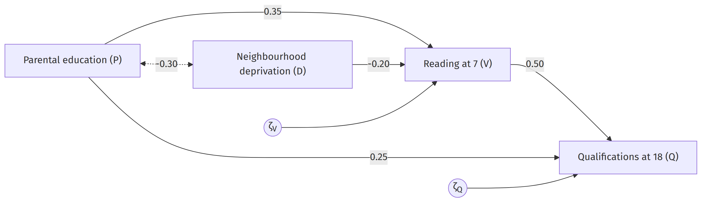

# From theory to model: (generalized) linear models {#sec-theory-to-glm}


> People who are well connected to others live longer. The connection is not merely a matter of mood. Being embedded in a social network changes the body: it changes how much low-grade inflammation a person carries, what their blood pressure does, how much weight they put on around the middle. Those physiological states are the proximate causes of chronic disease and death. So social integration should show up in the blood, and what shows up in the blood should show up in the mortality tables.

That paragraph is the verbal theory behind a study by Yang and colleagues, who tested it in four American surveys spanning adolescence to old age [@yang2016]. Among adolescents, social isolation raised the odds of high inflammation about as much as physical inactivity did. Among the elderly, isolation raised the odds of hypertension more than diabetes did.

How can we turn this paragraph into an inference based on data? The route is to state the theory as a set of claims about specific variables, draw the claims, turn the drawing into equations, work out what the equations imply about data not yet seen, and compare. Two things come out at the end. Estimating the model tells you something about the world *if the model is true*. Testing the model tells you something about some of the assumptions and/or the theory.

## From words to graphical models

A verbal theory contains two kinds of statement.

A **covariation statement** says that two variables go together: the more social integration, the less inflammation. Turned around, the sentence says the same thing: the less inflammation, the more social integration. That symmetry is the diagnostic. If you can swap the halves and lose nothing, you have a covariation statement.

A **causal hypothesis** says that one variable produces a change in another. Saris and Stronkhorst put the difference in terms of force: "a change in one variable (the cause) actually produces a change in another variable (the effect)" [@saris1984]. English marks these claims with verbs like *affect*, *influence*, *raise*, and *determine*, and the sentence does not survive being turned around. "Integration lowers inflammation" and "inflammation lowers integration" are different claims about different worlds, and only one of them justifies telling a health authority to fund community centres.

::: {.callout-tip icon="false" title="Exercise 2.1"}
For each statement, say whether it is a covariation statement or a causal hypothesis, and apply the swap test.

(a) The higher a country's income per head, the longer its people live.
(b) Losing a job raises the risk of a depressive episode.
(c) Smokers have lower birth weight babies.
(d) Air pollution damages children's lungs.
:::

::: {.callout-note collapse="true" icon="false" title="Answer 2.1"}
(a) Covariation. "The longer a country's people live, the higher its income per head" says the same thing, and both directions are substantively arguable.
(b) Causal. Swapping gives "a depressive episode raises the risk of losing a job", which is a different claim, and also probably true, which is why studying this needs care about timing.
(c) Covariation, as written. It reports a difference between groups. Most readers will supply the causal version silently.
(d) Causal. "Children's lungs damage air pollution" is not a sentence anyone means.
:::

Once the claims are sorted, three steps produce the theory in a form you can draw [@saris1984]:

1. List every variable in the theory;
2. Put the variables in causal order;
3. Say which variables directly affect which and draw the path diagram.

You have already seen the definition of a variable. Step 1 is also an opportunity to consider whether any obvious candidates are missing from the theory, and perhaps the theory may need to be amended.

Causal order is not always easy to determine. In some cases it is possible to establish causal order in advance, particularly when one variable comes after another in time. Longitudinal data are therefore a very useful design to rule out mistakes in this step, and that is why they are so popular^[They do not, however, automatically establish causality, nor are they required for useful causal inference.]. Another example is when one variable has known randomness to it, such as random assignment in an RCT or natural disasters; in this case we are confident that our social and health variables are not affecting these random events as well. In most other cases, the causal order forms part of the assumptions in the theory and model, to be tested insofar as that is possible with the data at hand (see following chapter).

Step 3 does more than it appears to. When you say which variables affect which, you are also saying, of every pair you did not connect, that the effect between them is zero: "it is a convention that effects which are not specified are supposed to be zero" [@saris1984]. This is what makes a theory testable. It is very tempting to draw arrows between all variables because there "might" be an effect. However, a picture with an arrow between every pair of variables says nothing, forbids nothing, and cannot be wrong. Again these will remain as assumptions that should be made plausible through design, or tested with the data at hand, if possible. 

When you start thinking about the variables that could be important in a given context, you will quickly find that there is an almost endless list of them. In other words, you will need to choose a scope by limiting your attention to only a subset of relevant variables. Making the model sufficiently small to manage but not so small that it becomes trivial is part of the art of modeling. However, not all variables *can* be left out of the study without causing bias (i.e. a threat to validity). The rules to follow are:

- A **common cause** of two variables you have connected can never be left out. Leave it out and its work is attributed to the arrow between them. Socioeconomic position causes both social integration and inflammation; drop it and integration gets the credit.
- An **intervening variable** may be left out freely. The theory loses detail, and the effect that ran through it becomes part of the direct effect. Nothing is biased.
- A variable that causes only one of the two, and not the other, may be left out. You lose some explained variance and nothing else.

Of these rules, the most crucial is the first one, about common causes. Ignoring it will immediately create an alternative explanation for the existence of a covariation among two variables (a threat to validity). But every common cause you add has common causes of its own, so again you need to choose a point at which to stop. This point will lead to paths among variables that covary, but about which you are not claiming any causal relationships. These are the **exogenous** variables: the model explains nothing about them, and their mutual covariation stays in the model as a curved two-headed arrow, unexplained on purpose. Everything the model does explain is **endogenous**. 

**The key assumption of any causal modeling exercise is that all common causes of variables among which you wish to claim a causal relationship are included in the model.** This applies not just to the currently discussed causal modeling framework, but to any other one as well. 

## Applying the three steps to the example

Let's apply the three steps to the theory above. 

### Step 1: list every variable

The units are individual people. Six variables appear:

1. **Social integration** — "well connected to others", "embedded in a social network"
2. **Low-grade inflammation**
3. **Blood pressure**
4. **Central adiposity** — "how much weight they put on around the middle"
5. **Chronic disease**
6. **Death**

The variable "mood" is also mentioned, but clearly not intended to be a part of this theory. For this reason we choose to omit it.

### Step 2: put them in causal order

$$\text{social integration} \;\rightarrow\; \{\text{inflammation, blood pressure, adiposity}\} \;\rightarrow\; \text{chronic disease} \;\rightarrow\; \text{death}$$

The paragraph supplies the order itself. "Being embedded in a social network changes the body" puts integration before the three body measures. "Those physiological states are the *proximate* causes" — nearest the outcome — puts them after integration and before disease. Disease before death is what the mechanism means.

Inside the trio the paragraph is silent, so they go unordered. 

For Yang and colleagues the order comes from measurement timing, four surveys running from adolescence to old age. Where it cannot come from time or from a manipulation, it is an assumption.

### Step 3: say which variables directly affect which


* "Being embedded in a social network changes (...) inflammation, blood pressure, weight". These are effects from social integration on inflammation, blood pressure, and weight. 
* "Those physiological states are the proximate causes of chronic disease and death". These are effects of the three physiological states on both disease and death
* Implied is that disease leads to death

We are now ready to draw the path diagram so far, which is presented below. 

{#fig-yang-full width="100%" fig-align="center"}

### Finalizing the model

We will still make two theory-based changes to the model. First the current model claims that social integration is the *only* reason why the three physiological measures covary. This is known to be false. For instance, there may be a preexisting condition which causes all three. Since we do not intend to explain any of these relationships among the physiological measures, we therefore allow for double-headed arrows (correlations) among their disturbance terms.

Furthermore, chronic disease is an intervening variable between the body measures and death, and does not add much to the theory. So it can be dropped without bias in our remaining model. This obviously prevents us from saying something about chronic disease specifically, which may or may not be a problem depending on our intended focus.

{#fig-yang-final width="90%" fig-align="center"}

## From graphical model to linear and additive equations

We now turn the path diagram into a set of equations. **Every variable with an arrow pointing into it is a dependent variable and gets its own equation.** Its predictors are the variables at the tails of those arrows, and its disturbance goes on the end.

In @fig-yang-final four variables have arrows pointing into them, so there are four equations. From here on the book uses the notation that is conventional for structural equation models [@saris1984; @joreskog1996]: an exogenous variable is written $\xi$ ("ksi"), the endogenous variables are $\eta_1, \eta_2, \ldots$ ("eta"), an effect of an exogenous on an endogenous variable is $\gamma$ ("gamma"), and an effect of one endogenous variable on another is $\beta$ ("beta"). Writing $\xi$ for social integration, $\eta_1$ for inflammation, $\eta_2$ for blood pressure, $\eta_3$ for central adiposity, and $\eta_4$ for death:

$$
\begin{aligned}
\eta_1 &= \gamma_1\,\xi + \zeta_1 \\
\eta_2 &= \gamma_2\,\xi + \zeta_2 \\
\eta_3 &= \gamma_3\,\xi + \zeta_3 \\
\eta_4 &= \beta_1'\,\eta_1 + \beta_2'\,\eta_2 + \beta_3'\,\eta_3 + \zeta_4 .
\end{aligned}
$$ {#eq-yang}

Social integration gets no equation, because nothing in the model explains it. The primes on the $\beta$ coefficients record a decision rather than new information: when chronic disease was dropped, each path from a physiological state to death absorbed the route that ran through it. The three curved arrows do not appear in the equations; they enter the model as three further parameters, the covariances $\psi_{12}$, $\psi_{13}$, and $\psi_{23}$ ("psi") between the disturbances of the physiological equations.

The disturbance terms $\zeta$ stand for everything that affects the outcome and is not in the model: the effects of unknown variables, the effects of variables known but omitted, the randomness of human behaviour, and measurement error [@saris1984]. 

Coupled with the above equations is the key assumption: each disturbance is uncorrelated with the predictors in its own equation, and every disturbance covariance not drawn in the diagram is zero. The three covariances among the physiological disturbances were freed on purpose; the covariances between $\zeta_4$ and each of them stay fixed at zero, and that is a claim. It corresponds to the assumption that no common cause of the physiological states and death was omitted. So the model does not claim that *no* variables were omitted, but rather that any variables omitted are not shared causes of variables in the model. If something affects inflammation and also affects death, it sits inside both $\zeta_1$ and $\zeta_4$, the two are correlated, and the assumption is false. This assumption is the essence of "internal validity", which the design is intended to strengthen, as you saw in @sec-rq-to-interpretation.

We have made two further choices in the equations above.

**Linearity** says that a one-unit change in a cause produces the same change in the outcome wherever you start. For example, it fails when returns saturate: an extra thousand euros a year transforms life at the bottom of the income distribution and is invisible at the top.
```{r}
#| label: fig-linearity
#| echo: false
#| fig-cap: "The linearity assumption, drawn for one arrow of the model. Left: a one-unit increase in social integration changes inflammation by the same amount wherever you start, so the two dashed steps are equal. Middle: the protective effect is strong at low integration and nearly exhausted at high integration. Right: the direction of the effect itself depends on the starting point. In both nonlinear panels the same one-unit step produces different changes at the two marked locations."
#| fig-width: 7
#| fig-height: 2.7
guides <- function(f, x0s) {
  for (x0 in x0s) for (x in c(x0, x0 + 1)) {
    segments(x, par("usr")[3], x, f(x), lty = 2, col = "grey45")
    segments(par("usr")[1], f(x), x, f(x), lty = 2, col = "grey45")
  }
}
panel <- function(f, main) {
  curve(f(x), 0, 5, lwd = 2, xlab = "Social integration",
        ylab = "Inflammation", main = main, axes = FALSE, ylim = c(0, 5.6))
  box(); guides(f, c(0.5, 3.5))
}
op <- par(mfrow = c(1, 3), mar = c(4, 4, 2.5, 0.7), cex.main = 1)
panel(function(x) 5 - 0.6 * x,            "Linear")
panel(function(x) 0.8 + 4.4 * exp(-0.9 * x), "Nonlinear: flattens")
panel(function(x) 1.4 + 0.42 * (x - 2.8)^2,  "Nonlinear: reverses")
par(op)
```

**Additivity** says that the effect of one cause does not depend on the value of another. It fails whenever a theory contains the words "only if", "particularly for", or "unless". The theory of planned behaviour in @sec-rq-to-interpretation fails additivity, because intention converts to behaviour only when the person has the control to act. One method of modeling non-additivity is by including product terms ("interactions") in the equations.
```{r}
#| label: fig-additivity
#| echo: false
#| fig-cap: "The additivity assumption, drawn for the death equation. Left: the effect of inflammation on mortality risk is the same at every level of blood pressure (BP), so the lines are parallel and blood pressure shifts the level rather than the slope. Middle: a product term lets the slope grow with blood pressure. Right: the slope is largest at medium blood pressure and equally modest at low and high, a nonadditivity no single product term can produce, since a product term forces the slope to change in one direction only."
#| fig-width: 7
#| fig-height: 2.7
draw <- function(main, ic, sl) {
  plot(NULL, xlim = c(0, 5.6), ylim = c(0.4, 5.0), xlab = "Inflammation",
       ylab = "Mortality risk", main = main, axes = FALSE)
  box()
  for (i in 1:3) {
    segments(0, ic[i], 4, ic[i] + 4 * sl[i], lwd = 2)
    text(4.12, ic[i] + 4 * sl[i], paste(c("low", "medium", "high")[i], "BP"),
         adj = 0, cex = 0.8, col = "grey30")
  }
}
op <- par(mfrow = c(1, 3), mar = c(4, 4, 2.5, 1.2), cex.main = 1)
draw("Additive",                   ic = c(0.8, 1.5, 2.2), sl = c(0.5, 0.5, 0.5))
draw("Nonadditive: product term",  ic = c(0.8, 1.3, 1.8), sl = c(0.2, 0.45, 0.7))
draw("Nonadditive: nonmonotonic",  ic = c(0.8, 1.3, 1.8), sl = c(0.2, 0.7, 0.2))
par(op)
```

You can have either without the other. A model can be curved in $x$ and still additive; a model can be perfectly straight in both causes and still contain an interaction between them. Nonadditivity is also more general than just "product terms": on the right-hand side of @fig-additivity, the slope depends on blood pressure, but in a nonmonotonic way. So product terms are just one way to model nonadditivity, but they do not encompass all cases and still involve assumptions. 

::: {.callout-tip icon="false" title="Exercise 2.2"}
Which assumption does each scenario violate, linearity or additivity? Write the term you would add to the equation.

(a) A drug lowers blood pressure, but only in patients who also take a diuretic.
(b) Each extra year of schooling raises earnings, and the increment is larger for the years that finish a degree than for the years in between.
(c) Loneliness raises mortality risk, and the increase is steeper for men than for women.
(d) The effect of income on life satisfaction is large among the poor and negligible among the rich.
(e) Finally, work backwards: draw the diagram implied by the equations $\eta_1 = \gamma\,\xi + \zeta_1$ and $\eta_2 = \beta\,\eta_1 + \zeta_2$, and say what the diagram claims by omission.
:::

::: {.callout-note collapse="true" icon="false" title="Answer 2.2"}
(a) Additivity. Add $\beta\,(\text{drug} \times \text{diuretic})$.
(b) Linearity. The effect of schooling on earnings is not a constant per year, so add a nonlinear term, for example dummies for completed qualifications or a spline in years.
(c) Additivity. Add $\beta\,(\text{loneliness} \times \text{male})$.
(d) Linearity. Add a term such as $\log(\text{income})$ or a quadratic. Note that (b) and (d) say nothing about how the effect of one variable depends on another, and (a) and (c) say nothing about curvature. The two assumptions are independent.
(e) A chain: $\xi \rightarrow \eta_1 \rightarrow \eta_2$, with a disturbance arrow into $\eta_1$ and another into $\eta_2$, and no equation for $\xi$. By omission it claims that $\xi$ has no direct effect on $\eta_2$, that nothing causes $\xi$ within the model, and that $\zeta_1$ and $\zeta_2$ are uncorrelated, which is to say that $\eta_1$ and $\eta_2$ share no unmeasured cause.
:::

### Interpreting the coefficients of linear equations


An **unstandardized** coefficient is a statement in the original units: a one-unit increase in the predictor goes with a $b$-unit change in the outcome, holding constant the other variables in that equation. As an example, the disease equation of the final model can be estimated on real data. The LISS panel is a probability sample of Dutch households whose members answer questionnaires online every month; in the autumn of 2025, 4,158 adult panel members answered both the health module and the social integration module.^[LISS data are freely available to researchers but may not be redistributed, so the file does not ship with the book. The script `analysis/liss/01-prepare-liss.R` in the book's repository builds it from the source files.] Blood pressure enters as ever having received a hypertension diagnosis (0 or 1), central adiposity as body mass index (BMI, in kilograms per square metre of height, from self-reported height and weight), and disease burden as the number of chronic conditions a physician has ever diagnosed, counted over a list of thirteen that excludes hypertension itself (0 to 13).

```{r}
#| label: liss-lm
d <- readRDS("../data/liss-health-social-integration/liss_ch2_combined.rds")
fit <- lm(disease_count ~ hypertension + bmi, data = d)
round(coef(summary(fit)), 3)
```

So: people with a hypertension diagnosis have 0.82 more diagnosed conditions on average than people of the same BMI without one; each additional BMI point goes with 0.020 more conditions, at the same hypertension status.

These statements are the left-hand panels of @fig-linearity and @fig-additivity in numbers. One slope per predictor: the BMI point from 20 to 21 adds the same 0.020 conditions as the point from 39 to 40. And no product terms: the model puts the hypertension gap at 0.82 conditions whatever the BMI, which is the parallel-lines claim.

It can be helpful to judge the size over a typical range rather than per unit. Two hundredths of a condition per BMI point sounds like nothing. But BMI in this sample runs from 15 to 58, so the variable spans about 0.9 conditions, roughly the size of the hypertension gap itself.

A **standardized** coefficient does a version of that scaling for you, using the standard deviation rather than the range: it reports the change in standard deviations of the outcome per standard deviation of the predictor.

```{r}
#| label: liss-std
coef(fit)[["bmi"]] * sd(d$bmi, na.rm = TRUE) / sd(d$disease_count, na.rm = TRUE)
```

A standard deviation means something different in every population, so unstandardized coefficients travel between studies and standardized ones do not. Within one sample, standardized coefficients let you compare predictors measured in different units. One caution for 0/1 variables like the hypertension diagnosis: nobody changes by "a standard deviation of hypertension", so standardizing a dummy rarely clarifies anything, and its unstandardized coefficient, the gap between the two groups, is already the interpretable number.

A prediction follows by filling in values. For a person with a hypertension diagnosis and a BMI of 30,

$$\widehat{\text{count}} = 0.026 + 0.823 \times 1 + 0.020 \times 30 = 1.45 \text{ conditions},$$

against 0.63 for an otherwise identical person without the diagnosis.

Standardized coefficients are criticized by some. The reason is that `sd(d$bmi)` is somewhat arbitrary, in that it will differ across populations and settings. The variance of a variable can be increased or decreased by measurement error, precision, and data collection methods. If BMI is a variable we want to manipulate in a future study, we might be able to take its values across a larger (or smaller) range than just the standard deviation it happens to have in this setting. For this reason, if you are interested in comparing coefficients across populations, or would like to predict an effect in a different setting than the one in which data were collected, you should probably avoid standardization. At the same time, in social and health research, scales are often very arbitrary and it is useful to be able to compare effects with each other in terms of "typical deviations".

::: {.callout-tip icon="false" title="Exercise 2.3"}
Use the disease regression above (intercept 0.026, `hypertension` 0.823, `bmi` 0.020).

(a) Interpret the coefficient on `bmi` in a full sentence, with units, and with the clause that makes it a statement about this equation rather than about adiposity in general.
(b) A newspaper reports: "people with hypertension have 0.82 chronic conditions." Correct the sentence.
(c) A colleague fits the same model in a bariatric clinic, where nearly every patient's BMI lies between 35 and 45. The standardized coefficient of `bmi` is 0.10 in LISS and 0.04 in the clinic; the unstandardized coefficients are 0.020 and 0.019 conditions per BMI point. The colleague concludes that adiposity matters far more in the general population than among clinic patients. What is the better conclusion?
(d) Would you report the effect of `bmi` as "0.020 conditions per BMI point" or as "about 0.9 conditions across the observed range"? Say what each phrasing is good for.
:::

::: {.callout-note collapse="true" icon="false" title="Answer 2.3"}
(a) Among people with the same hypertension status, each additional point of BMI goes with 0.020 more diagnosed chronic conditions on average. The "same hypertension status" clause is what ties the number to this equation: add or remove predictors and the comparison changes.
(b) The sentence is wrong twice over. The 0.82 is not a number of conditions but a difference in conditions, between people with a hypertension diagnosis and people without one; and the comparison holds BMI constant. "People with a hypertension diagnosis have 0.82 more chronic conditions than people of the same BMI without one" is the sentence the coefficient supports.
(c) The per-point effects are nearly identical, so the effect is nearly the same in both settings. Almost the whole difference between 0.10 and 0.04 comes from the standard deviation of BMI, which the clinic's intake has compressed to a narrow band. A standard deviation is a property of a population and a data collection, not of the effect, so standardized coefficients should not be compared across the two samples; the numbers to compare are 0.020 and 0.019.
(d) Both, for different jobs. Conditions per BMI point is the number another researcher can carry to their own population; conditions across the range is the number that says whether the variable matters in this one. Reporting the per-unit slope alone invites judging importance by it, which is only safe when you also know the range.
:::

## What the theory implies about the data

So far we have turned a verbal theory into a statistical model with a set of equations. The parameters of these equations are of interest to us, since they will tell us about our theory, under the assumptions of the model, as made plausible by the design. We will obtain estimates of these parameters from data by (1) deriving the relationship between the parameters and observed data, assuming the model is true; (2) getting some observed data and working back to the most likely parameter values. 

This is where our choice for linear and additive models will really help. As it turns out, linear and additive equations can really only affect the means, variances, and covariances of variables. Any other features of the data distribution have nothing to do with the parameters of interest (except through means, variances, and covariances). This remarkable fact makes our life very easy: we only need to work out how the parameters relate to the means, variances, and covariances, and everything else follows. Such is the power of simple models! 

Here we will further simplify the discussion by ignoring means and standardizing all variables; we then only have to deal with correlations.

The final model in @fig-yang-final is a lot to start with. So we begin with a smaller practice model of the same form, drawn in @fig-yang, and return to the full version once the rules are in hand. It keeps social integration ($\xi$), one physiological state ($\eta_1$, inflammation), and mortality risk ($\eta_2$); a direct arrow from integration to mortality stands in for every route that bypasses inflammation. This model has three unknown parameters: the effects $\gamma_1$ and $\gamma_2$ of the exogenous variable, and the effect $\beta$ of one endogenous variable on the other. The data contain three correlations. What connects the parameters and the equations? The answer is the **decomposition rule**^[The recipe works for **recursive** models, meaning models without reciprocal effects or feedback loops. This way of computing implied correlations is classically known as the *tracing rules* [@wright1934; @saris1984].].

{#fig-yang width="80%" fig-align="center"}

> **Decomposition rule** 
> The correlation coefficient between two variables is equal to the sum of the direct effects, the indirect effects, the spurious relationships and the joint effects.

You should be able to recite this rule if woken up in the middle of the night.

Each of the direct effects, indirect effects, spurious relationships, and joint effects makes a specific contribution to the total correlation. The rules for the contribution of each relationship to the overall correlation among two variables are as follows:

* **Direct effect.** An arrow from one variable to the other: $X \overset{a}{\rightarrow} Y$ contributes $a$.

* **Indirect effect.** A chain of arrows, all pointing the same way, from one variable to the other through intermediates: $X \overset{a}{\rightarrow} Y_1 \overset{b}{\rightarrow} Y_2$ contributes $ab$. 

* **Spurious relationship.** A common cause, with a chain of arrows running out of it to each of the two variables: $Y_1 \overset{a}{\leftarrow} X \overset{b}{\rightarrow} Y_2$ contributes $ab$. With longer chains, multiply every coefficient along both: one spurious contribution for every common cause and every pair of chains out of it.

 * A **joint effect** is a relationship that has been left purposefully unspecified: it could be a direct effect in either direction, or spurious -- we just do not know. A popular way of thinking about joint effects [@pearl2009] is that they are spurious relationships in which the common cause has been replaced by a curved two-headed arrow. But the true relationship could be spurious or direct. @fig-joint illustrates this. It also shows that, whatever the true model, the rule for its contribution to the correlation is the same:
   for example, $X_1 \overset{\phi}{\leftrightarrow} X_2 \overset{\beta}{\rightarrow} Y$ means the joint effect equals $\phi \beta$.

{#fig-joint width="90%" fig-align="center"}

The sum in our decomposition rule runs over *every* contribution of *every* kind. Every arrow between the pair, every one-way chain, every common cause with every pair of chains running out of it, every curved arrow with every pair of chains running out of its ends; with longer chains, multiply every coefficient along the way. 

Let's apply this to @fig-yang. Suppose, for the sake of arithmetic, that the true values are $\gamma_1 = -0.40$, $\beta = 0.30$, and $\gamma_2 = -0.50$, with all three variables standardized.

Between $\xi$ and $\eta_1$ only one of the four relationships can be recognized: the direct arrow, so $\rho_{\xi\eta_1} = \gamma_1 = -0.40$. Note that even though there is a route $\xi \rightarrow \eta_2 \leftarrow \eta_1$ (that is, $\eta_2$ is a common *effect* of the two), such *colliders* do not contribute anything to the correlation $\rho_{\xi\eta_1}$. Colliders such as $\eta_2$ are relevant in a different situation, however, namely when we *condition* on $\eta_2$: among people with high mortality risk, social integration and inflammation may correlate less, or even negatively, so the partial correlation $\rho_{\xi\eta_1 \cdot \eta_2}$ differs from $\rho_{\xi\eta_1}$. This "collider bias" [@elwert2014; @hernan2004] is the same effect that is called "restriction of range" by some social scientists [@kkv1994]. Another way of thinking about this phenomenon is that the rules for decomposing a *partial* correlation are different than those for a correlation. Here we are dealing with the latter.

Between $\xi$ and $\eta_2$ two relationships appear: the direct effect $\gamma_2$, and an indirect effect through inflammation, the chain $\xi \rightarrow \eta_1 \rightarrow \eta_2$ with product $\gamma_1\beta$.

$$\rho_{\xi\eta_2} = \gamma_2 + \gamma_1\beta = -0.50 + (-0.40)(0.30) = -0.62.$$

Between $\eta_1$ and $\eta_2$ there are also two: the direct effect $\beta$, and a spurious relationship, because $\xi$ is a common cause of both, with the chain $\gamma_1$ running to $\eta_1$ and the chain $\gamma_2$ running to $\eta_2$.

$$\rho_{\eta_1\eta_2} = \beta + \gamma_1\gamma_2 = 0.30 + (-0.40)(-0.50) = 0.50.$$

Something important has happened to $\rho_{\eta_1\eta_2}$. The causal effect of inflammation on mortality risk is 0.30, and the correlation between them is 0.50: two thirds larger than the effect itself. The gap of $\gamma_1\gamma_2 = 0.20$ is confounding, manufactured by a variable that is in the model and that we know about. If social integration were not in the model, we would read 0.50 as the effect and never know that a large part of it is spurious.


::: {.callout-tip icon="false" title="Exercise 2.4"}
Practice applying the decomposition rule one contribution at a time, on @fig-yang with the same values.

(a) Which contributions make up $\rho_{\xi\eta_1}$, and what is its implied value?
(b) Why does the route $\xi \rightarrow \eta_2 \leftarrow \eta_1$ contribute nothing to $\rho_{\xi\eta_1}$?
(c) Recompute $\rho_{\eta_1\eta_2}$ if the direct effect had the opposite sign, $\gamma_2 = +0.50$. What happens, and what is the lesson?
(d) What would $\rho_{\eta_1\eta_2}$ be if $\xi$ had no direct effect on $\eta_2$ at all?
:::

::: {.callout-note collapse="true" icon="false" title="Answer 2.4"}
(a) A single direct effect, the arrow itself, so $\rho_{\xi\eta_1} = \gamma_1 = -0.40$.
(b) $\eta_2$ is a common effect of the two, and none of the four relationships contains a common effect: it is not an arrow between them, not a one-way chain, not a common cause, not a curved arrow. Common effects do not induce correlation between their causes. (They do induce one *among units selected on $\eta_2$*, a separate trap with its own name, collider bias.)
(c) $\rho_{\eta_1\eta_2} = 0.30 + (-0.40)(0.50) = 0.10$. Flipping the sign of a path that is not on the direct route still changes the correlation, and here it moves the other way, so the observed correlation now understates the effect. A correlation is a sum of contributions from the whole model, and no part of it can be read off in isolation.
(d) With $\gamma_2 = 0$ the spurious relationship vanishes and $\rho_{\eta_1\eta_2} = \beta = 0.30$. The correlation would then equal the effect. That is what "no confounding" means, and it rests on an assumption rather than on data.
:::

Now return to @fig-yang-final. Between inflammation ($\eta_1$) and blood pressure ($\eta_2$), two relationships can then be recognized. Social integration is a common cause, with the chains $\gamma_1$ and $\gamma_2$ running out of it: a spurious relationship of $\gamma_1 \gamma_2$. And the curved arrow joins the two variables directly, with both of its chains empty: a joint effect of $\psi_{12}$. So $\rho_{\eta_1\eta_2} = \gamma_1 \gamma_2 + \psi_{12}$: one part the model explains, one part it declines to. Between inflammation and death ($\eta_4$), three of the four kinds appear at once: the direct effect $\beta_1'$; two spurious relationships through social integration, $\gamma_1 \gamma_2 \beta_2' + \gamma_1 \gamma_3 \beta_3'$; and two joint effects through the curved arrows, $\psi_{12}\, \beta_2' + \psi_{13}\, \beta_3'$, each with an empty chain on the inflammation side and the chain into death on the other.

The decomposition rule does not apply only to models with observed variables (in boxes), but can also be applied to more complex models with unobserved variables in them (in circles). One example of such a model is the "ACE" model from twin studies. This is a model for data that have been collected from two groups of twins. 
Identical twins share essentially all their genes; fraternal twins share half on average. ACE models each twin's trait as the sum of an additive genetic factor $A$, an environment $C$ shared by both twins, and an environment $E$ unique to each [@rijsdijk2002]. All three are unobserved, which is why @fig-ace draws them in circles. You can assume the variables $y_1$ and $y_2$ are standardized.

{#fig-ace width="100%" fig-align="center"}

$$
\begin{aligned}
y_1 &= 0.7\,A_1 + 0.5\,C + 0.5\,E_1 \\
y_2 &= 0.7\,A_2 + 0.5\,C + 0.5\,E_2 .
\end{aligned}
$$

The 0.5 on the curved arrow in panel (a) of @fig-ace was not estimated from these twins, but predetermined by the fact that fraternal twins share 50% of their genetic material on average. Decompose the correlation between $y_1$ and $y_2$. The shared environment $C$ is a common cause, with a chain of 0.5 to each twin: a spurious relationship of $0.5 \times 0.5 = 0.25$. The genetic factors are joined by the curved arrow, with the chain 0.7 out of each end: a joint effect of $0.7 \times 0.5 \times 0.7 = 0.245$. The unique environments contribute nothing, since each acts on one twin alone: they are not common causes, and no chain connects them to the other twin. The sum is $0.495$.

Now change one number. For identical twins the genetic correlation is 1 instead of 0.5, as in panel (b) of @fig-ace, and nothing else about the model changes. The genetic joint effect becomes $0.7 \times 1 \times 0.7 = 0.49$, and the implied covariance is $0.25 + 0.49 = 0.74$, a correlation of $0.747$. The model therefore predicts that identical twins will resemble each other considerably more than fraternal twins do, and by a specific amount. Comparing the two observed correlations is how heritability gets estimated; across 17,804 traits and fifty years of twin studies, the average reported heritability is 49 percent [@polderman2015].

::: {.callout-tip icon="false" title="Exercise 2.5"}
Using the ACE diagram, suppose a trait has a genetic loading of 0.6, a shared-environment loading of 0.4, and a unique-environment loading of 0.69.

(a) Write the two equations.
(b) Derive the implied covariance between the twins' scores for fraternal twins, showing each contribution and naming its kind.
(c) Do the same for identical twins.
(d) Suppose children of more educated parents are better able to benefit from favourable genetics. Which assumption of the model does that violate?
:::

::: {.callout-note collapse="true" icon="false" title="Answer 2.5"}
(a) $y_1 = 0.6A_1 + 0.4C + 0.69E_1$ and $y_2 = 0.6A_2 + 0.4C + 0.69E_2$.
(b) Two contributions. A spurious relationship through the shared environment, their common cause: $0.4 \times 0.4 = 0.16$. A joint effect through the genetic factors' curved arrow: $0.6 \times 0.5 \times 0.6 = 0.18$. Total $0.34$. (The implied variance is $0.36 + 0.16 + 0.476 = 1.00$, so the correlation is $0.34$ as well.)
(c) The genetic joint effect becomes $0.6 \times 1 \times 0.6 = 0.36$, so the total is $0.52$.
(d) Additivity. The claim is that the effect of $A$ on the trait depends on the value of another variable, parental education, which is a product term. Answering "linearity" would be a different claim: that the effect of $A$ changes as $A$ itself changes.
:::

## Estimating and testing

In the previous section, you saw that correlations can be written in terms of parameters by using the decomposition rule. In practice, we would like to know (or estimate) the parameters, because they say something about causal effects or about the theory, under the assumptions of the model (made plausible by the design). We cannot directly observe the parameters, but we can observe (or estimate) the correlations. And each correlation gives an equation in the parameters. So if we can solve these equations for the parameters, then *under the assumptions of the model* we will have estimated the parameters. That is what fitting a structural model does, and `lavaan` does it in a few lines. It is worth doing once by hand first, because the hand version shows exactly what the software is doing.

The decomposition rule gave three equations for the practice model of @fig-yang:

$$
\begin{aligned}
\rho_{\xi\eta_1}    &= \gamma_1 \\
\rho_{\xi\eta_2}    &= \gamma_2 + \gamma_1\beta \\
\rho_{\eta_1\eta_2} &= \beta + \gamma_1\gamma_2 .
\end{aligned}
$$

Three equations, three unknowns. The first hands us $\gamma_1$ directly. Substituting it into the other two leaves two linear equations in $\beta$ and $\gamma_2$, and solving them gives

$$
\gamma_2 = \frac{\rho_{\xi\eta_2} - \rho_{\xi\eta_1}\,\rho_{\eta_1\eta_2}}{1 - \rho_{\xi\eta_1}^2},
\qquad
\beta = \frac{\rho_{\eta_1\eta_2} - \rho_{\xi\eta_1}\,\rho_{\xi\eta_2}}{1 - \rho_{\xi\eta_1}^2}.
$$

The LISS panel does not measure inflammation, so to put these formulas to work on real data we use three variables that it does measure: age ($\xi$), the hypertension diagnosis ($\eta_1$), and the number of other chronic conditions ($\eta_2$). The structure is exactly that of the practice model: age affects the chance of a hypertension diagnosis, hypertension affects the number of other conditions, and the direct arrow collects every route from age to disease that bypasses hypertension.^[Hypertension is a 0/1 variable, which sits somewhat awkwardly in a linear model; the next section takes that problem seriously. For the moment its correlations are used like any other variable's.] The observed correlations are

```{r}
#| label: liss-sem-cor
liss <- na.omit(d[, c("age", "hypertension", "disease_count")])
round(cor(liss), 3)
```

These are sample correlations, so the parameter values obtained from them are estimates, and they carry sampling error. Plugging them into the formulas:

```{r}
#| label: liss-sem-hand
r      <- cor(liss)
r_x1   <- r["age", "hypertension"]
r_x2   <- r["age", "disease_count"]
r_12   <- r["hypertension", "disease_count"]
gamma1 <- r_x1
gamma2 <- (r_x2 - r_x1 * r_12) / (1 - r_x1^2)
beta   <- (r_12 - r_x1 * r_x2) / (1 - r_x1^2)
round(c(gamma1 = gamma1, beta = beta, gamma2 = gamma2), 3)
```

Note what the middle number says. The correlation between hypertension and disease count is 0.316, but the estimated effect $\hat\beta$ is 0.245. The difference is the walkthrough's confounding gap in real numbers: the spurious contribution through age is $\hat\gamma_1\hat\gamma_2 = 0.296 \times 0.237 = 0.070$, and reading the raw correlation as the effect would overstate it by about a quarter.

`lavaan` produces the same estimates from the same equations:

```{r}
#| label: liss-sem-lavaan
library(lavaan)
liss_std <- data.frame(scale(liss))
model <- "hypertension  ~ gamma1 * age
          disease_count ~ beta * hypertension + gamma2 * age"
fit <- sem(model, data = liss_std)
parameterEstimates(fit)[1:3, c("lhs", "op", "rhs", "est", "se", "z")]
```

The estimates match the hand calculation exactly, and this is no accident: with three parameters and three correlations, the model can always reproduce the observed correlations perfectly, whatever they are. A recursive model in this state is called **saturated** or **just identified**. Its perfect fit is guaranteed in advance, so the fit itself carries no information about the theory; the information is in the estimates.

A quick count tells you in advance whether a model is in this state. With $k$ observed variables there are $k(k+1)/2$ variances and covariances to fit, or $k(k-1)/2$ correlations if everything is standardized; count the free parameters and subtract. A model with more parameters than moments cannot possibly be identified, and a model with the same number can fit anything. Saris and Stronkhorst are careful to add that passing the count is necessary and not sufficient, a point @sec-identification returns to.

To learn something from fit, the theory must forbid something. Suppose the claim is that age affects disease *only* through hypertension, so that $\gamma_2 = 0$. This is the practice-model version of the claim our final model makes about social integration, that it reaches death only through the body; for age the claim is almost certainly false, which is exactly what makes it a good demonstration. Under the restriction, the three equations become

$$
\rho_{\xi\eta_1} = \gamma_1, \qquad
\rho_{\xi\eta_2} = \gamma_1\beta, \qquad
\rho_{\eta_1\eta_2} = \beta .
$$

Three equations, but now only two unknowns: the system is overdetermined, and one equation is left over as a prediction the data can reject. Solving the first and third equations gives $\hat\gamma_1 = 0.296$ and $\hat\beta = 0.316$. The middle equation then predicts $\rho_{\xi\eta_2} = \hat\gamma_1\hat\beta = 0.094$, while the observed value is 0.310. The residual, $e = 0.310 - 0.094 = 0.217$, measures how far the data are from what the restricted model can produce. Dividing its square by its approximate variance gives a chi-square statistic with one degree of freedom, one for the one leftover equation:

```{r}
#| label: liss-sem-test-hand
e <- r_x2 - r_x1 * r_12
chisq_hand <- nrow(liss) * e^2 / ((1 - r_x1^2) * (1 - r_12^2))
round(c(residual = e, chisq = chisq_hand), 2)
```

A chi-square of 237 on one degree of freedom is far beyond any conventional critical value, so the restriction is firmly rejected: no values of $\gamma_1$ and $\beta$ can reproduce these three correlations. Two remarks connect this hand calculation to what software reports. First, the choice to solve the first and third equations was arbitrary. Solving the first and *second* instead would give $\hat\beta = 0.310/0.296 = 1.05$, larger than any correlation can be, which shows how wrong the restriction is but also that an arbitrary choice of equations can produce strange estimates. It is better to find the parameter values that come closest to satisfying *all* the equations at once, which is done by numerical optimization; the usual criterion is called **maximum likelihood**. Second, because we are testing a single restriction, the chi-square is asymptotically equal to the square of the $z$-statistic of $\hat\gamma_2$ in the saturated model, printed in the `lavaan` output above: $15.8^2 = 250$. Testing an estimate against zero this way is called a **Wald test**. In practice a model usually has more than one leftover equation, and then there is no single residual to inspect; the chi-square simply gains a degree of freedom for each. `lavaan` computes the maximum-likelihood version of all of this:

```{r}
#| label: liss-sem-test
model0 <- "hypertension  ~ gamma1 * age
           disease_count ~ beta * hypertension"
fit0 <- sem(model0, data = liss_std)
fitMeasures(fit0, c("chisq", "df", "pvalue"))
```

The maximum-likelihood chi-square of 243 is close to the hand-calculated 237, and both lead to the same conclusion: the data reject the idea that age reaches disease only through hypertension.

Tests are useful for comparing models, and you have seen that the incorrect restriction $\gamma_2=0$ is correctly rejected by the model test. However, there is an inherent limit to such tests. First, if the rest of the model is incorrect, it is possible that a set of restrictions is rejected while in fact it is a different aspect of the model that is causing the misfit. That is, tests, like estimation, are conditional on the assumptions behind the model. Second, as with all statistical tests, it is possible that an incorrect restriction will not be rejected. This is particularly likely when the statistical power is low. Aspects that affect the power are sample size, measurement error, and the overall predictive power of variables in the model. Third, it is possible for two completely different models to produce the same model fit, regardless of the parameter values (the identification problem). We will discuss this in much more depth in the following chapter.

## Binary outcomes: logistic regression and the *generalized* linear model

Everything so far assumed outcomes that are quantitative. Plenty of outcomes are not: whether a baby is born underweight, whether a person votes, whether a patient survives the year. If such an outcome is coded 0 and 1 and a straight line is fitted to it, two things go wrong. The fitted values can fall below 0 or above 1, which are impossible values for a probability. And the model claims that a unit change in the predictor changes the probability by the same amount everywhere, which cannot hold near the boundaries, since a probability of 0.98 can increase by at most 0.02.

To fix this, we cannot have a linear model for the probability. But we can still have a linear model for a transformation of the probability. To find this transformation, start with the **odds**, the probability of the event divided by the probability of its absence. A probability of 0.5 is odds of 1; a probability of 0.8 is odds of 4, or "four to one on". Odds run from 0 to infinity, which removes the ceiling but not the floor. Taking the logarithm gives the **log-odds**, or **logit**, which runs from minus infinity to plus infinity and is symmetric about zero. A straight line for the log-odds can therefore never produce an impossible value:

$$\log \frac{P(y_i = 1)}{1 - P(y_i = 1)} = \beta_0 + \beta_1 x_{1i} + \beta_2 x_{2i} + \dots$$

This is **logistic regression**, and it is the most used member of the family of **generalized linear models**: a linear predictor, plus a function that connects it to the scale of the outcome.

For a real example, we return to the LISS data and to a binary variable the previous section set aside: the hypertension diagnosis, now as the outcome of its own equation, with social integration as the theory's predictor and age, gender, and BMI as covariates.

```{r}
#| label: liss-glm
fit_ht <- glm(hypertension ~ integration + age + female + bmi,
              family = binomial, data = d)
round(cbind(coef = coef(fit_ht), odds_ratio = exp(coef(fit_ht))), 3)
```

The coefficient on social integration is $-0.044$: each additional point of integration goes with lower log-odds of a hypertension diagnosis, in the protective direction the theory predicts, although this estimate is not statistically distinguishable from zero. To see how logistic coefficients are read, the BMI coefficient of 0.092 is a better example, and it can be read three ways, from most literal to most useful.

*On the log-odds scale.* Each additional BMI point goes with 0.092 higher log-odds of a hypertension diagnosis, holding integration, age, and gender constant. To get some intuitive idea of what this means, the **divide-by-four rule** helps: the change in probability for a unit change in the predictor is at most the log-odds coefficient divided by 4, a maximum that is reached when the probability is near 0.5 [@gelmanhill2007]. Here $0.092/4 = 0.023$, so an extra BMI point shifts the probability of a diagnosis by at most about 2 percentage points. It is also helpful to remember a few anchor points: log-odds of 0 correspond to a probability of 0.5, and log-odds of $+3$ and $-3$ to probabilities of 0.95 and 0.05. A change of 1 on the log-odds scale is a lot. @fig-divide4 shows where the rule comes from.

```{r}
#| label: fig-divide4
#| echo: false
#| fig-cap: "The divide-by-four rule. The logistic curve maps log-odds to probabilities. Its slope is steepest at the centre, where the probability is 0.5, and there the slope is exactly 1/4: a small change in the log-odds changes the probability by a quarter of that amount. Everywhere else the curve is flatter, so β/4 is the *maximum* change in probability per unit of a predictor with log-odds coefficient β."
#| fig-width: 4.4
#| fig-height: 3
op <- par(mar = c(4, 4, 0.6, 0.6))
curve(plogis(x), -6, 6, lwd = 2, xlab = "log-odds", ylab = "probability")
abline(a = 0.5, b = 1/4, lty = 2, col = "grey45")
points(0, 0.5, pch = 19)
text(2.4, 0.36, "tangent at 0:\nslope = 1/4", col = "grey30", cex = 0.85)
par(op)
```

*As an odds ratio.* Exponentiating gives $\exp(0.092) = 1.10$: the odds of a diagnosis are about 10 percent higher per BMI point. This is the number papers report, and it is why regression tables in epidemiology so often carry a column headed OR. A rule of thumb helps for small coefficients: when $b$ is under about 0.2, $\exp(b) - 1 \approx b$, so 0.092 means roughly a 9 percent increase in the odds, as the table confirms. The rule breaks down as $b$ grows: a difference of ten BMI points has coefficient $0.92$, and $\exp(0.92) = 2.5$, a 150 percent increase in the odds rather than 92.

*As a probability.* The most interpretable option is to convert to probabilities at informative points. The linear predictor for a specific person, written $\ell$, is summed up from the coefficients, and the inverse of the logit, $p = 1/(1 + e^{-\ell})$, turns it into a probability; `R` calls this function `plogis`. For a 60-year-old woman with an integration score of 1 and a BMI of 25,

$$\ell = -7.864 - 0.044 \times 1 + 0.063 \times 60 - 0.139 \times 1 + 0.092 \times 25 = -1.97,$$

so $p = 1/(1 + e^{1.97}) = 0.12$. Software does the same job with the unrounded coefficients:

```{r}
#| label: liss-glm-predict
women <- data.frame(integration = 1, age = 60, female = 1, bmi = c(25, 35))
round(predict(fit_ht, newdata = women, type = "response"), 3)
```

At a BMI of 35 the same woman's probability is 0.26 instead of 0.12: the ten-point odds ratio of 2.5 amounts, for this profile, to a difference of about 14 percentage points. For a different profile the percentage-point difference is different even though the odds ratio is the same, which is a common source of confusion when logistic coefficients are interpreted.

The rest of the family works the same way with a different link. Counts and rates take a logarithm, so a coefficient becomes a multiplier on the rate: 0.10 means a rate 10 percent higher. Case and Deaton used models of this kind to show that mortality in middle age rose through the 2000s for Americans without a four-year degree while it fell for those with one, driven by drug overdose, suicide, and alcoholic liver disease [@casedeaton2017].

::: {.callout-tip icon="false" title="Exercise 2.6"}
Using the fitted model above (intercept $-7.864$, integration $-0.044$, age 0.063, female $-0.139$, bmi 0.092):

(a) What is the predicted probability of a hypertension diagnosis for a 70-year-old man with an integration score of 0 and a BMI of 30?
(b) And for an otherwise identical man with an integration score of 6?
(c) Express the difference between (a) and (b) as an odds ratio and as a difference in probabilities.
(d) Which of the two numbers in (c) would you put in an abstract, and why?
:::

::: {.callout-note collapse="true" icon="false" title="Answer 2.6"}
(a) $\ell = -7.864 + 0.063 \times 70 + 0.092 \times 30 = -0.69$, so $p = 1/(1 + e^{0.69}) = 0.33$.
(b) $\ell = -0.69 - 0.044 \times 6 = -0.96$, so $p = 0.28$.
(c) The odds ratio is $\exp(-0.044 \times 6) = 0.77$. The difference in probabilities is $0.33 - 0.28 = 0.05$, that is about 5 percentage points.
(d) Both are defensible, and if only one, the probability difference, since it is on the scale of the decision anyone is making. The odds ratio is stable across profiles and is the right number for comparing studies. It is also routinely misread as a risk ratio, which overstates the association whenever the outcome is common; at the roughly 11 percent prevalence in this sample the two are still fairly close, but that is a fact to check rather than to assume.
:::

Published tables are less tidy than this one. Forster, Bol and van de Werfhorst asked whether vocational education helps or harms employment over a career, using the international survey of adult skills known as PIAAC, in 22 countries, with 52,677 men and 57,955 women [@forster2016]. They proposed that vocational schooling gives a head start early on, when specific skills are worth something to an employer, and becomes a liability later, when those specific skills go obsolete while general education keeps paying. Here is the heart of their table.

| Coefficient (log-odds) | Men (2) | Men (3) | Women (2) | Women (3) |
|---|---|---|---|---|
| Age (age 16 = value 0) | 0.209 | 0.208 | 0.164 | 0.191 |
| Age squared (divided by 10) | −0.044 | −0.043 | −0.034 | −0.033 |
| Vocational (ref. = general) | 0.432 | 0.487 | 0.229 | 0.277 |
| Age × vocational | −0.018 | −0.017 | −0.013 | −0.013 |
| Numeracy | | 0.741 | | 0.887 |
| Age × numeracy | | −0.001 | | −0.011 |
| Upper or post secondary (ref. = lower secondary) | 0.700 | 0.478 | 0.736 | 0.572 |
| Tertiary | 1.229 | 0.839 | 1.292 | 1.004 |
| Parental secondary (ref. = primary) | 0.095 | 0.018 | 0.112 | 0.063 |
| Parental tertiary | 0.046 | −0.082 | 0.072 | −0.021 |
| Constant | −0.796 | −2.555 | −0.880 | −3.052 |

: Employment as a function of education type and age, from @forster2016, models (2) and (3), with country fixed effects. Standard errors omitted here. Model (3) adds numeracy and its interaction with age. {#tbl-forster}

Three features of @tbl-forster change the arithmetic and are easy to miss. Age is coded so that 16 equals zero, so the constant describes a 16-year-old rather than a newborn. Age squared has been divided by 10 to keep the printed digits readable. And three separate education variables are in play: the *type* of education (vocational, with general as the reference), the *level* the person reached (with lower secondary as the reference), and the level their parents reached (with primary as the reference).

Model (3) for men illustrates. The effect of vocational education on the log-odds of employment, at age $16 + t$, is

$$0.487 - 0.017\,t .$$

At the start of a career the effect is positive. It shrinks by 0.017 each year, and it crosses zero when $0.487 = 0.017\,t$, that is at $t = 28.6$ years, or around age 45. The authors report the same figure. After that, vocational education goes with lower employment odds than general education. Both halves of their theory are visible in two numbers, and neither is visible in either number alone.

::: {.callout-tip icon="false" title="Exercise 2.7"}
Stay with @tbl-forster, and use the column for women, model (2), throughout.

(a) Take it in three steps. What is the effect of vocational education on the log-odds at age 16? By how much does it change per year? At what age does it cross zero?
(b) What are the odds ratio and its interpretation at age 16?
(c) What is the probability of employment for a 16-year-old woman in vocational education, whose own education is lower secondary and whose parents completed tertiary education?
(d) Why does the age-squared row play no part in (a)?
:::

::: {.callout-note collapse="true" icon="false" title="Answer 2.7"}
(a) At age 16 the effect is $0.229$, since the interaction term is multiplied by zero. It falls by $0.013$ per year. It reaches zero at $0.229/0.013 = 17.6$ years after 16, so at about age 34.
(b) $\exp(0.229) = 1.26$: at 16, a woman with vocational education has 26 percent higher odds of employment than an otherwise identical woman with general education.
(c) The linear predictor is assembled from the terms that apply and no others. Constant $-0.880$; vocational $+0.229$; age and age squared are zero, so their coefficients contribute nothing, and so does the interaction; lower secondary is the reference category for the level variable and contributes nothing; parental tertiary $+0.072$. Total $-0.579$, so $p = 1/(1 + e^{0.579}) = 0.36$.
(d) Age squared applies to everyone at a given age regardless of which school they went to, so it enters both sides of the comparison and cancels. Only terms involving the vocational variable belong in the calculation of the vocational effect.
:::

The advantage of the logistic model is that it can never predict probabilities beyond the $[0,1]$ range. It also has disadvantages. One large disadvantage, at least for didactical purposes, is that it is not linear, so the decomposition rule does not apply. And, in fact, correlations are no longer enough to estimate the full model.

This raises a question with a long and still-active history: why not simply fit a linear model to the 0/1 outcome anyway? The result is called the **linear probability model** (LPM), and there are serious arguments on both sides.

The case for the LPM starts with its coefficients. An LPM coefficient is a difference in probabilities, which is usually the quantity a reader wants, and it does not change its meaning when the model changes. Logistic coefficients and odds ratios do: because the logistic model fixes the scale of its disturbance, adding a variable to the equation changes the remaining coefficients *even when the added variable is unrelated to the other predictors*, so log-odds coefficients cannot be compared across models, groups, or samples [@mood2010]. Probability differences can, and they also fit the path-analytic machinery of this chapter, which log-odds coefficients do not [@hellevik2009]. Three further points favour the linear model in specific situations. In a randomized experiment, the linear regression of a 0/1 outcome on treatment is an unbiased estimate of the average effect on the probability, and no nonlinear machinery improves on it [@gomila2021]. In models with product terms, the logit or probit interaction *coefficient* is not the interaction *effect*: the effect can differ in size and even in sign from the coefficient, and its standard software test is wrong, while in the LPM the interaction coefficient is the interaction effect [@ai2003]. And the LPM's well-known heteroskedasticity is repaired by robust standard errors, while least squares is nearly as efficient as maximum likelihood for the linear-in-probability model and far less sensitive to a few extreme observations [@battey2019].

The case against is equally concrete. A linear probability model can put fitted probabilities outside $[0,1]$, and when the true linear index does leave the unit interval, least squares is biased and inconsistent, not merely inelegant [@horrace2006]. Near the boundaries the linear approximation genuinely fails: rare outcomes are logistic regression's home ground. The popular defence "my fitted values all lie between 0 and 1" turns out to be unreliable in both directions: it is neither necessary nor sufficient for the LPM to approximate the average effects implied by a nonlinear model, and with skewed predictors logit and probit average effects are clearly more accurate [@chen2023]. The classical position, that the LPM is simply not a coherent probability model [@amemiya1981], has lost some force now that software makes the nonlinear models effortless, but it has not disappeared.

In practice the two camps agree more than the debate suggests. For experimental contrasts and models built from categories, the LPM is unimpeachable and maximally interpretable. For modeling probabilities across a wide range, especially near 0 or 1, the logistic model is the safer tool. And either way, the quantity to report is on the probability scale: predicted probabilities at informative profiles, or differences in them, rather than raw odds ratios.


## Nonlinear and nonadditive models

We all know the world isn't really linear and additive, and there is an infinite number of ways in which it can be nonlinear and nonadditive.
Many modeling approaches exist to account for such phenomena. Agent-based models specify no equations at all; random forests, boosted trees, Gaussian processes and neural networks fit shapes that no one writes down. All of these exist and later chapters use some of them.

Even though the world is not linear, it can still be a good idea to use linear models anyway. The arguments come in four groups.

The first argument is that a linear model estimates something meaningful even when it is false. When the true relationship is curved, least squares does not estimate a fiction: it estimates the *best linear approximation* to the true relationship, and inference for that approximation remains valid provided robust ("sandwich") standard errors are used [@white1980; @buja2019]. Over the range that most predictors actually cover, that approximation is often close, and transformations can extend its reach, which were Saris and Stronkhorst's own two reasons for adopting linearity. The approximation view comes with two warnings, however. The best linear approximation depends on the distribution of the predictors, so it is a property of a population as well as of a relationship [@buja2019]. And when effects differ across groups, the single linear coefficient is a weighted average of them, with weights the analyst did not choose: regression weights units by conditional variance, so the "effective sample" can differ substantially from the nominal one [@aronow2016], and in the two-group case the weights are even *inversely* related to group size [@sloczynski2022]. A linear summary of a nonlinear or heterogeneous world is legitimate, but it should be read as a summary, and checked. The checking matters more than is comfortable: in a replication of 46 published interaction effects, the assumption that the interaction is itself linear held in only about half [@hainmueller2019].

The second argument is empirical: if strong nonlinearity mattered in an application, flexible models should predict better there, and on most social and health data they do not. When 160 teams competed to predict six life outcomes from thousands of variables, using any method they liked, the best machine-learning predictions were only slightly better than a linear benchmark with a handful of predictors, and not very accurate in absolute terms [@salganik2020]. In clinical prediction, a systematic review of 71 studies found no performance advantage of machine learning over logistic regression once biased comparisons were set aside; the apparent advantage lived entirely in the studies at high risk of bias [@christodoulou2019]. The picture reverses only in particular conditions. Flexible methods need far more data: roughly ten times as many events per variable as logistic regression before their performance stabilizes [@ploeg2014], and in learning-curve comparisons the linear model wins at small samples while tree-based methods overtake it only as samples grow large, with the crossing point depending on how much signal the data carry [@perlich2003]. Where the input is unstructured and the sample enormous, nonlinear models win decisively, as when a deep network trained on 128,000 retinal photographs detected diabetic retinopathy about as well as ophthalmologists [@gulshan2016]. On tabular data of ordinary size, the gain from flexibility is usually small, and it is easily swamped by problems the comparison ignores, such as changing populations and measurement error [@hand2006].

The third argument explains the second: measurement error erases nonlinearity before it erases linear signal. Random error in a predictor smooths the relationship that can be observed, and it attenuates higher-order terms fastest: the reliability of a product term is roughly the product of its components' reliabilities [@busemeyer1983], one reason field studies so rarely detect the interactions that experiments find [@mcclelland1993]. In environmental epidemiology, exposure error "tends to flatten and apparently linearize" dose-response relationships that are truly curved or threshold-shaped [@rhomberg2011]. The general version is that noise attenuates a $k$-way interaction by the measurement reliability raised to the $k$-th power, while linear effects are attenuated only once; in 140 biomedical prediction tasks, adding noise closed the gap between flexible and linear models exactly as this predicts [@schulz2026]. The moral cuts both ways. For estimation and prediction with noisy measures, the linear model is close to the best that can be done with the data actually available. For theory, a failure to find nonlinearity in noisy data is weak evidence that the world is linear.

Taken together: a linear model is a good default when the sample is of ordinary size, the measures are noisy, the data are tabular, and the aim is interpretable estimates of effects over the range the data cover, provided its status as an approximation is kept in mind and the flexibility that matters, such as key interactions and transformations, is checked rather than assumed. Flexible nonlinear models earn their place when the data are plentiful and reliably measured, when the input is unstructured, or when prediction accuracy is the goal in a setting rich enough to reward it.

A further advantage of (generalized) linear models is that every part of them is inspectable. A coefficient can be read, a path traced, and the model's implication for a correlation worked out in advance and then found false in the data. @sec-identification shows where that sequence stops working, and why no amount of data restarts it.

## Test yourself {.unnumbered}

::: {.callout-tip icon="false" title="Exercise 2.A"}
@fig-schooling shows a four-variable model with standardized coefficients. Parental education ($P$) and neighbourhood deprivation ($D$) are exogenous and correlated at $-0.30$. Both affect a child's reading score at age 7 ($V$). Reading score affects qualifications at 18 ($Q$), and parental education also affects qualifications directly.

{#fig-schooling width="85%" fig-align="center"}

(a) Which variables are endogenous? Write the equations, including disturbances.
(b) Derive the implied correlation between parental education and reading score, showing every contribution and naming its kind.
(c) Derive the implied correlation between parental education and qualifications.
(d) Derive the implied correlation between neighbourhood deprivation and qualifications.
(e) How many free parameters does the model have, and how many correlations are there to fit? What follows for testing it?
:::

::: {.callout-note collapse="true" icon="false" title="Answer 2.A"}
(a) $V$ and $Q$ are endogenous: $V = 0.35P - 0.20D + \zeta_V$ and $Q = 0.50\,V + 0.25P + \zeta_Q$.
(b) Two contributions. The direct effect, $0.35$; and a joint effect across the curved arrow to $D$ and then forward to $V$, $(-0.30)(-0.20) = 0.06$. Total $0.41$.
(c) Three contributions from $P$ to $Q$: the direct effect, $0.25$; the indirect effect through reading, $0.35 \times 0.50 = 0.175$; and a joint effect across the curved arrow to $D$, then to reading, then to qualifications, $(-0.30)(-0.20)(0.50) = 0.03$. Total $0.455$.
(d) Three contributions from $D$ to $Q$: the indirect effect through reading, $(-0.20)(0.50) = -0.10$; a joint effect across the curved arrow to $P$ and then directly to $Q$, $(-0.30)(0.25) = -0.075$; and a joint effect across the curved arrow to $P$, then to reading, then to $Q$, $(-0.30)(0.35)(0.50) = -0.0525$. Total $-0.2275$.
(e) Standardized, four variables give $4 \times 3/2 = 6$ correlations. The free parameters are the four path coefficients and the exogenous correlation, so five. One degree of freedom is left, and exactly one claim of absence is spending it: there is no direct arrow from $D$ to $Q$. The model predicts $\rho_{DQ}$ from the other five numbers, and the data can reject that prediction.
:::

::: {.callout-tip icon="false" title="Exercise 2.B"}
A logistic regression predicts whether a patient attends a scheduled outpatient appointment. The coefficients are: constant $0.85$; age in years, centred at 50, $0.012$; distance to the hospital in kilometres $-0.031$; previous no-show (1 = yes) $-1.10$; and an interaction between previous no-show and distance of $-0.015$.

(a) Interpret the distance coefficient, and judge whether it is substantively large. State what you had to assume to judge it.
(b) What is the predicted probability of attendance for a 50-year-old living 10 km away with no previous no-show?
(c) And for an otherwise identical patient who has failed to attend before?
(d) At what distance does the effect of a previous no-show reach $-2$ on the log-odds scale?
(e) The clinic wants to know whether sending reminders would raise attendance. What, if anything, does this model tell them?
:::

::: {.callout-note collapse="true" icon="false" title="Answer 2.B"}
(a) Each extra kilometre lowers the log-odds of attendance by 0.031, holding the other variables constant, so the odds fall by a factor $\exp(-0.031) = 0.97$, about 3 percent per kilometre. Per kilometre that is small; over a realistic range it is not. If patients live between 1 and 40 km away, the span is $39 \times 0.031 = 1.21$ log-odds, a factor of 3.3 in the odds. Judging size requires knowing the range the variable actually covers, which the coefficient alone does not tell you.
(b) $\ell = 0.85 + 0.012 \times 0 - 0.031 \times 10 = 0.54$, so $p = 0.63$.
(c) $\ell = 0.85 - 0.31 - 1.10 - 0.015 \times 10 = -0.71$, so $p = 0.33$. The interaction applies only to patients with a previous no-show, and at 10 km it contributes $-0.15$.
(d) The effect of a previous no-show at distance $d$ is $-1.10 - 0.015d$. Setting this to $-2$ gives $d = 0.90/0.015 = 60$ km.
(e) Nothing directly. Every coefficient here describes differences between patients who differ in these characteristics, and reminders are not among them. The model can point at whom to remind, which is a prediction question, and it cannot say what a reminder would do, which is a causal question about an intervention that was never varied. @sec-explanation-prediction is about exactly this distinction.
:::

::: {.callout-tip icon="false" title="Exercise 2.C"}
Return to the theory of planned behaviour from @sec-rq-to-interpretation. Write $P$ for perceived behavioral control, $N$ for intention, $B$ for behaviour, and $A$ for actual control. Perceived control affects intention; intention affects behaviour; perceived control also affects behaviour directly; and actual control governs how far intention converts into behaviour.

(a) Draw the diagram for the three-variable part of the theory ($P$, $N$, $B$) and write the equations.
(b) With standardized coefficients $0.45$ from $P$ to $N$, $0.40$ from $N$ to $B$, and $0.20$ from $P$ to $B$, derive all three implied correlations.
(c) A researcher observes $\rho_{NB} = 0.49$ and concludes that the effect of intention on behaviour is 0.49. By how much are they wrong in this model, and what kind of contribution accounts for the gap?
(d) Now add $A$. Write the equation for behaviour that expresses the theory's claim about it, and say why the decomposition rule as stated cannot handle that equation.
:::

::: {.callout-note collapse="true" icon="false" title="Answer 2.C"}
(a) $P$ is exogenous; $N$ and $B$ are endogenous. $N = 0.45P + \zeta_N$; $B = 0.40N + 0.20P + \zeta_B$.
(b) $\rho_{PN} = 0.45$. $\rho_{PB} = 0.20 + 0.45 \times 0.40 = 0.38$. $\rho_{NB} = 0.40 + 0.45 \times 0.20 = 0.49$.
(c) They are wrong by 0.09. The correlation contains the direct effect, 0.40, plus a spurious relationship, since perceived control is a common cause of both, with the chain 0.45 to intention and 0.20 to behaviour: $0.45 \times 0.20 = 0.09$.
(d) $B = \beta_1 N + \beta_2 P + \beta_3 A + \beta_4 (N \times A) + \zeta_B$. The claim that intention converts into behaviour only when control is present is the term $\beta_4$. The decomposition rule assumes a linear, additive system in which the effect of each variable is a single number written on an arrow; here the effect of intention is $\beta_1 + \beta_4 A$, which is a function of another variable rather than a number, and there is no arrow to write it on. This is why @sec-rq-to-interpretation drew a conditional effect as an arrow pointing at an arrow.
:::
