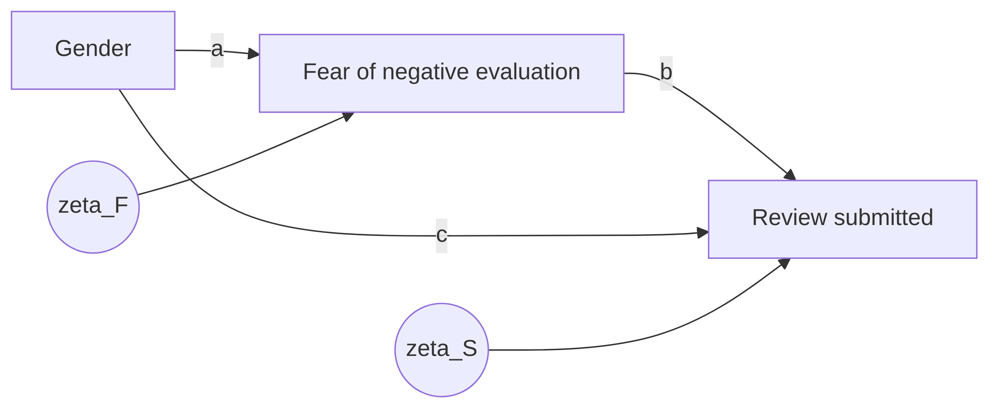
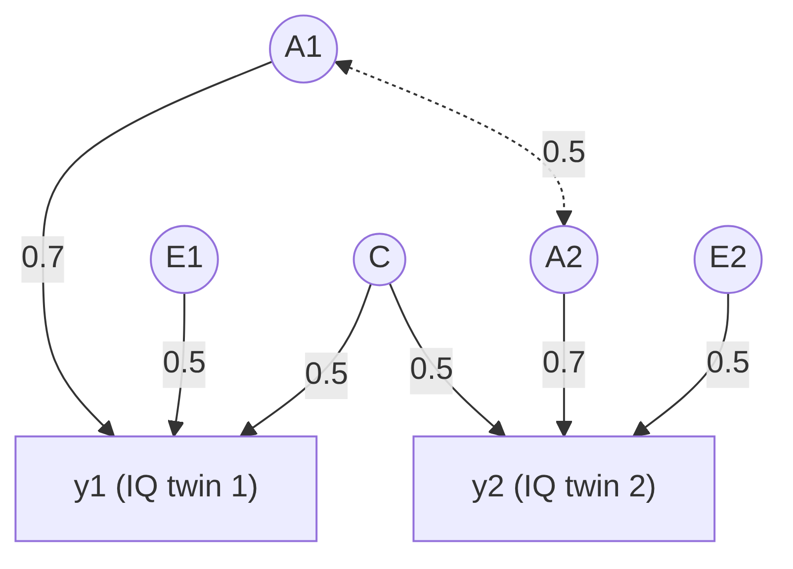

# From theory to model: (generalized) linear models {#sec-theory-to-glm}

Women rate the products and services they buy more favorably than men do. Across 1.2 billion online reviews on five platforms, the gap is consistent, and it is not because women are more satisfied: surveyed offline, they report the same dissatisfaction as men [@bayerl2024]. The researchers proposed an explanation. Writing a bad review is a small act of public aggression, and women anticipate harsher social consequences for it; a "fear of negative evaluation" keeps the one-star reviews in the drawer. In two experiments with over a thousand participants each, they measured this fear and modeled its role.

A paragraph of psychology became, in their paper, a model with three numbers attached. This chapter is about that transformation. The method follows a tradition set out by @saris1984: treat the verbal theory as the object of interest, and build the statistical model as its translation, precise enough to estimate and precise enough to be wrong. Along the way you will meet the two workhorses of applied statistics, linear regression and logistic regression, and learn to read their coefficients the way the models mean them.

## From words to claims

Start with the theory in compressed form:

> Women submit fewer (negative) online reviews than men. This happens because women experience greater fear of negative evaluation, which suppresses review submission. Being a woman may also suppress submission through other channels.

The first task is to separate the causal claims from mere statements of association. @saris1984 offer a sharp test. A causal hypothesis involves what they call "production" or force: a change in one variable brings about a change in another, and the verbal markers are words like *affects*, *suppresses*, *because*. A covariation statement is symmetric: "women submit fewer reviews" describes a difference, and you could swap the halves ("people who submit fewer reviews are more often women") without changing the content. Causation implies covariation, other things equal. Covariation implies nothing.

Their recipe for turning prose into claims has three steps: list all relevant variables; put the variables in causal order; then specify the causal hypotheses, one arrow at a time. The causal order follows the flow of the process. Gender is fixed long before any purchase; the fear response comes next; the decision to submit comes last. For our theory, with units being individual consumers:

- Gender ($G$) affects fear of negative evaluation ($F$): positive (coding women as 1).
- Fear affects review submission ($S$): negative.
- Gender may also affect submission directly: sign left open by the theory.

Equally important is what the theory does *not* claim, because the convention is that effects not specified are zero [@saris1984]. Every missing arrow is a claim of absence, and claims of absence are the most valuable claims a theory can make: they are the easiest to prove wrong. A theory in which everything affects everything can never be embarrassed by data.

Which variables belong in the model? The rules follow from what omission does. A **common cause** of two variables under study can never be left out; omit it and its work shows up disguised as a causal effect between them, the confounding of @sec-rq-to-interpretation in model form. An **intervening** variable may be dropped harmlessly, in which case an indirect effect simply presents itself as direct. A variable that affects only the outcome, such as a platform's review-prompting policy, may be dropped at the cost of unexplained variance and nothing else.

::: {.callout-tip icon="false" title="Exercise 2.1"}
Apply the swap test and the three-step recipe to this passage: "Members are more willing to participate in a protest action when they expect it to succeed. More violent actions are expected to succeed less, and violence also deters members directly. Willingness is unrelated to members' age." List the variables in causal order, state each directed claim with its sign, and state each claim of absence.
:::

::: {.callout-note collapse="true" icon="false" title="Answer 2.1"}
Variables in causal order: action violence ($x$), expected success ($m$), willingness to participate ($y$); age is mentioned only to be excluded. Claims: violence lowers expected success (negative); expected success raises willingness (positive); violence lowers willingness directly (negative). Claims of absence: age has no effect on willingness, and no other arrows exist, so for example expected success does not alter an action's violence. "More willing when they expect it to succeed" passes the swap test as stated, but the surrounding prose ("deters", "because"-logic) marks the intended claims as causal.
:::

## From claims to equations

Each variable that receives at least one arrow, each "endogenous" variable, now gets one linear equation. To keep the arithmetic transparent, assume in this chapter that all variables are standardized: mean 0, standard deviation 1.^[Standardization is a convenience, not a commitment. Unstandardized coefficients are better for policy arithmetic and for comparison across populations; standardized ones are better for comparing effects within one sample. Since each converts to the other, @saris1984 remark that the choice needs no serious argument.]

$$
\begin{aligned}
F &= a\,G + \zeta_F \\
S &= b\,F + c\,G + \zeta_S
\end{aligned}
$$ {#eq-bayerl}

Read the second equation aloud: submission is fear times $b$, plus gender times $c$, plus everything else. Three features of these equations carry all the content.

*The coefficients.* $b$ says that a one-unit increase in fear produces a $b$-unit change in submission, holding gender constant. The theory's claims become sign expectations, $a > 0$ and $b < 0$; the claims of absence are the terms that are not there.

*The disturbances.* The "$\zeta$" (zeta) terms are not an apology. @saris1984 list exactly what lives in a disturbance: the effects of unknown variables, the effects of known but omitted variables, the randomness of human behavior, and measurement error. We claim that gender and fear matter, not that they are everything. One assumption rides on these terms and carries the whole causal interpretation: the omitted influences must be unrelated to the predictors in their equation. That is the no-confounding assumption in mathematical dress. No dataset can verify it, and its plausibility is exactly as strong as the search for common causes was thorough.

*The functional form.* The equations assume the relationships are **linear**: each extra unit of fear does the same to submission as the previous unit. They also assume the effects are **additive**: the effect of fear is the same for men and for women, so the two contributions simply add up. These are two separate assumptions, and keeping them apart pays off.^[A relationship can be additive but nonlinear, as when satisfaction rises with income ever more slowly. It can be linear in each variable but non-additive, as in the theory of planned behavior, where intention only produces behavior when actual control is present: the effect of one variable depends on the level of another. Exam graders, in my experience, are picky on precisely this distinction, and they are right to be.] The verbal theory said nothing either way; translation forced a choice, and we chose the simplest workable form. We should remember having chosen.

The same model in a picture:

{#fig-bayerl width="80%" fig-align="center"}

## What the theory predicts: the tracing rules

Here is where translation pays off. Once the theory is a set of linear equations, it makes quantitative predictions about something we can observe: the correlations. The recipe is a pair of rules that @saris1984 call the decomposition rules; the trace-following version goes back to Sewall Wright's path analysis [@wright1934].

> **First decomposition rule.** The correlation between two variables equals the sum, over all valid traces connecting them, of the product of the coefficients along each trace. The components are named by their shape: a *direct* effect, an *indirect* effect (forward through intervening variables), a *spurious* component (backward then forward through a common cause), or a *joint* component (through a curved arrow).

A valid trace never passes through the same variable twice, never goes forward along arrows and then backward, and crosses at most one curved arrow. You may walk backward first, against the arrowheads, and then forward; once walking forward there is no turning back.

> **Second decomposition rule.** The variance of an endogenous variable equals the variance explained by its causes plus the unexplained (disturbance) variance. For standardized variables: $1 = R^2 + \operatorname{var}(\zeta)$.

In their first experiment ($n = 1{,}172$), the estimated standardized coefficients were $\hat a = 0.40$, $\hat b = -0.19$, and $\hat c = -0.42$ [@bayerl2024].^[Estimates from the paper's structural equation model; I have rounded. The outcome is binary in the original (submit or not), a wrinkle we return to later in the chapter.] Let us make the model predict. What correlation between fear and submission does it imply? Two traces connect $F$ and $S$:

- $F \rightarrow S$: the direct effect, contributing $b = -0.19$.
- $F \leftarrow G \rightarrow S$: backward to gender, forward to submission. A common cause sits at the turn, so this is a spurious component, contributing $a \times c = 0.40 \times -0.42 = -0.168$.

$$
\rho(F, S) = b + a\,c = -0.19 - 0.168 = -0.358 .
$$

The model predicts that fear and submission correlate at $-0.36$, and it also tells you what the correlation is made of: about half causation, about half common cause. Anyone who reads the raw correlation as "the effect of fear" is off by a factor of two. The gender-submission correlation decomposes just as easily, now into a direct and an indirect component:

$$
\rho(G, S) = c + a\,b = -0.42 + 0.40 \times -0.19 = -0.496 .
$$

::: {.callout-tip icon="false" title="Exercise 2.2"}
Practice the mechanics one trace at a time. (a) How many valid traces connect $G$ and $F$, and what is the implied $\rho(G,F)$? (b) Why is $F \rightarrow S \leftarrow G$ not a valid trace from $F$ to $G$? (c) Recompute $\rho(F,S)$ if the direct gender effect had the opposite sign, $c = +0.42$. What happens, and what is the lesson?
:::

::: {.callout-note collapse="true" icon="false" title="Answer 2.2"}
(a) One trace, $G \rightarrow F$, so $\rho(G,F) = a = 0.40$. (b) The walk goes forward into $S$ and then backward out of $S$; forward-then-backward is forbidden. (Variables are correlated through common causes, not through common effects.) (c) $\rho(F,S) = -0.19 + 0.40 \times 0.42 = -0.022$. The correlation nearly vanishes while the causal effect of fear is unchanged at $-0.19$. A correlation close to zero does not mean no effect; components can cancel.
:::

The tracing rules also organize a second, very different example, one you will meet on exams in several fields. In twin studies, the IQ scores of two twins, $y_1$ and $y_2$, are modeled as effects of a genetic factor ($A_1$, $A_2$; correlated 0.5 between dizygotic twins, who share half their segregating genes), a common environment ($C$, the same variable for both twins), and unique environments ($E_1$, $E_2$). Suppose the loadings are 0.7 for $A$, 0.5 for $C$, and 0.5 for $E$:

$$
y_1 = 0.7 A_1 + 0.5 C + 0.5 E_1, \qquad
y_2 = 0.7 A_2 + 0.5 C + 0.5 E_2 .
$$

{#fig-ace width="75%" fig-align="center"}

What twin correlation does this model imply? Two traces connect $y_1$ and $y_2$. Through the shared environment: $y_1 \leftarrow C \rightarrow y_2$, contributing $0.5 \times 0.5 = 0.25$. Through the genes: $y_1 \leftarrow A_1 \leftrightarrow A_2 \rightarrow y_2$, contributing $0.7 \times 0.5 \times 0.7 = 0.245$. The implied correlation is $0.25 + 0.245 = 0.495$. For monozygotic twins the genetic correlation is 1 instead of 0.5, and the same walk gives $0.25 + 0.49 = 0.74$. The difference between those two numbers, famously, is what lets twin researchers separate genes from environments.

::: {.callout-tip icon="false" title="Exercise 2.3"}
In the ACE model, suppose children of highly educated parents benefit more from favorable genes: the effect of $A$ on IQ is larger when parental education is high. Which assumption of the model does this violate, linearity or additivity? Explain the difference in one sentence.
:::

::: {.callout-note collapse="true" icon="false" title="Answer 2.3"}
Additivity. The claim makes the effect of one variable ($A$) depend on the level of another (parental education), which is a conditional relationship; each effect could still be a straight line at every education level, so linearity is not the issue. Linearity says each cause's effect is a straight line; additivity says the causes' contributions add up without depending on one another.
:::

## Meeting data

The tracing rules run both ways. Given coefficients, they produce correlations; given observed correlations, estimation finds the coefficients that reproduce them best. In R, the lavaan package does this for whole systems of equations. We can verify the round trip on the review model by feeding lavaan the correlations the model implies and asking for the coefficients back:

```{r}
#| label: bayerl-lavaan
library(lavaan)
R <- matrix(c(
    1.000,  0.400, -0.496,
    0.400,  1.000, -0.358,
   -0.496, -0.358,  1.000),
  nrow = 3, byrow = TRUE,
  dimnames = list(c("G", "F", "S"), c("G", "F", "S")))
model <- "
  F ~ G
  S ~ F + G
"
fit <- sem(model, sample.cov = R, sample.nobs = 1172)
round(coef(fit), 2)
```

The first command types in the correlation matrix; with standardized variables, correlations are all lavaan needs.^[The same trick re-analyzes any published correlation or covariance matrix without access to the raw data. It is one of the most useful minor skills this book teaches.] The model string has one line per equation, with `~` read as "is regressed on". The output returns the coefficients we started from: 0.40, $-0.19$, $-0.42$, plus the two disturbance variances. So far the model merely redescribes the data. With three free coefficients facing three correlations, it fits perfectly no matter what; such a model is called "saturated", and its perfect fit is a bookkeeping identity, not an achievement.

The theory starts risking something when it forbids an arrow. Suppose someone claims fear is the whole story: no direct gender effect, $c = 0$. That model has two coefficients facing three correlations, so it makes a testable prediction, namely $\rho(G,S) = a \times b$, and the data can refuse:

```{r}
#| label: bayerl-test
fit0 <- sem("F ~ G \n S ~ F", sample.cov = R, sample.nobs = 1172)
round(fitMeasures(fit0, c("chisq", "df", "pvalue")), 2)
```

The chi-square statistic measures the distance between the correlations the restricted model can produce and the ones observed. If the restriction were true it would land near its degrees of freedom, here 1; at 218 the data refuse loudly, and "fear is the whole story" dies.^[It dies conditionally. A test never confronts one claim with the data alone; it confronts one claim given every other claim in the model. And the surviving model is not thereby true: other models fit these same three correlations exactly as well, a problem so consequential it gets its own chapter (@sec-identification).] Compare @bayerl2024, who kept the direct path in the model for exactly this reason.

Interpretation now reads off the equations:

> A one-unit increase in $x$ is associated with a $\hat\beta$-unit change in $y$, holding the other predictors in the equation constant. Under the model's assumptions, "is associated with" strengthens to "produces".

The strengthening is purchased outside the arithmetic, by the design and by the defense of the disturbance assumption. There is no computational trick that does it.

## Reading real regression tables

Published tables add three habits worth acquiring, because papers will not clean themselves up for you.

First, *reference categories*. Categorical predictors enter as 0/1 variables with one category left out; the left-out category is the baseline, marked in tables as "(Ref. = ...)", and its coefficient is zero by construction. A coefficient for "Tertiary education" means "compared to the reference category", not "compared to everyone".

Second, *coding parentheticals*. A row label like "Age (age 16 = value 0)" tells you the variable was shifted so that 0 means age sixteen; "Age squared (divided by 10)" tells you a rescaling. These parentheticals change the arithmetic of every computation you do with the table, which is why they hide in parentheses where nobody reads them.

Third, *transformed terms*. A term like `poly(BMI, 2)` in R output means a second-degree polynomial was fit; its two coefficients jointly describe a curve, and the individual numbers are not directly interpretable.^[R's `poly()` uses orthogonal polynomials by default, which makes the separate coefficients even less interpretable than ordinary "BMI and BMI squared" terms. Plot the fitted curve instead of staring at the coefficients.] Whether such a block of terms improves the model is tested by comparing the model with and without the whole block, an $F$-test that R produces with `anova()`; @sec-anova develops this machinery properly.

## When the outcome is yes or no: logistic regression

Submitting a review, voting, being employed: many outcomes are binary, and a linear equation for a probability misbehaves, cheerfully predicting probabilities of $-0.2$ or $1.4$ when extended far enough. The standard repair keeps the linear machinery and changes what the equation predicts. Not the probability itself, but its **log-odds**.

Odds are the bookmaker's currency for chance: probability $p$ corresponds to odds $p/(1-p)$, so probability .75 is odds of 3 ("three to one") and probability .5 is odds of 1. Taking the logarithm stretches this scale over the whole number line. Probability 0 maps to $-\infty$, probability 1 to $+\infty$, and .5 to 0, so a linear equation can roam freely and every value translates back into a legal probability:

$$
\log \frac{P(y=1)}{1 - P(y = 1)} = \beta_0 + \beta_1 x_1 + \beta_2 x_2 + \dots
$$

This is **logistic regression**. Together with linear regression it belongs to the family of "generalized linear models": the same recipe, with different links between the linear part and the outcome. The price is paid at interpretation time, and two conversions settle most of the bill.

*Odds ratios.* Exponentiating undoes the log: each unit of $x$ multiplies the odds by $e^{\beta}$. A rule of thumb helps for small coefficients: since $e^{\beta} \approx 1 + \beta$ when $|\beta| < 0.3$ or so, the odds change by about $100 \times \beta$ percent. A coefficient of 0.10 means roughly 10% higher odds per unit.

*Probabilities.* For any concrete person, build the linear predictor and invert the log-odds with $P(y=1) = 1/(1 + e^{-\text{logit}})$, which R computes as `plogis()`.

Let us do this on real output. A logistic regression on Dutch panel data predicts whether a respondent voted in the last parliamentary election. All continuous predictors are centered, meaning zero stands for the sample average. A selection of the output:

| Variable | Coefficient (logit) | Std. error |
|---|---|---|
| Constant | 0.359 | 0.196 |
| Age (centered) | 0.017 | 0.003 |
| Political interest (1–3) | 0.915 | 0.088 |
| Education level (1–6) | 0.229 | 0.038 |
| Female | 0.054 | 0.103 |

: Logistic regression of voting (1 = voted) on selected predictors, LISS panel. {#tbl-voting}

How large is the age effect? Mechanically: each year of age adds 0.017 to the log-odds of voting, about 1.7% higher odds per year. That sounds tiny, and judging it requires scaling by the variable's realistic range. Between a 20-year-old and a 70-year-old lie 50 years, hence $50 \times 0.017 = 0.85$ logits, comparable to sliding the full political-interest scale. Age has a small coefficient and a large effect.

What is the probability that a woman votes? Because the continuous predictors are centered, an "average" woman has zeros everywhere except the female dummy, so her logit is $0.359 + 0.054 = 0.413$:

```{r}
#| label: voting-probs
p_women <- plogis(0.359 + 0.054)
p_men   <- plogis(0.359)
round(c(women = p_women, men = p_men, difference = p_women - p_men), 3)
```

A 60.2% chance against 58.9%: a difference of 1.3 percentage points. Notice how the two scales can mislead in both directions. A "large" coefficient can move probabilities barely at all near the extremes, and the same odds ratio moves probabilities most near 50%. Always report what a coefficient means in probabilities for realistic cases.

One more skill, the one students in my course have historically found hardest: interactions in logistic tables. @forster2016 test whether vocational education (relative to general education) helps employment early in the career but hurts later. Their model for men includes, among other terms,

| Term | Coefficient |
|---|---|
| Age (age 16 = value 0) | 0.208 |
| Vocational (Ref. = general) | 0.487 |
| Age $\times$ vocational | $-0.017$ |

: Selected coefficients from a pooled logistic regression of employment, men, 24 countries [@forster2016]. {#tbl-forster}

The vocational effect on the log-odds of employment is not one number; it is $0.487 - 0.017 \times \text{Age}$, a straight line in age. At age 16 (where the age variable equals 0), the effect is $+0.487$: vocational graduates start with an employment advantage. Each year eats $0.017$ of it. The advantage reaches zero when $0.487 - 0.017 \times \text{Age} = 0$, that is, at $0.487 / 0.017 \approx 28.6$ years *after age sixteen*, so around age 45 the advantage becomes a penalty. Both of the paper's hypotheses survive: an early benefit, a late reversal. Every step here is ordinary arithmetic; what trips people up is the coding parenthetical ("age 16 = value 0"), forgetting which terms belong to the vocational effect, and stopping at the log-odds scale. The following exercise walks the full computation once, slowly.

::: {.callout-tip icon="false" title="Exercise 2.4"}
Using the women's version of the same model (constant $-0.880$; Vocational $0.229$; Age $\times$ vocational $-0.013$; parental tertiary education $0.072$; reference categories: general education, lower secondary schooling, parents with primary education), compute step by step the probability that a 16-year-old woman in vocational education, herself with lower secondary schooling and parents with tertiary education, is employed. (a) Which terms enter her linear predictor, and which are zero, and why? (b) Sum the logit. (c) Convert to a probability.
:::

::: {.callout-note collapse="true" icon="false" title="Answer 2.4"}
(a) At age 16 the age variable is 0, so the age term and the age-by-vocational interaction both vanish. "Lower secondary" is the reference for own education and contributes nothing. Entering: the constant, Vocational (0.229), and parental tertiary (0.072). (b) Logit $= -0.880 + 0.229 + 0.072 = -0.579$. (c) $P = \operatorname{plogis}(-0.579) \approx 0.36$. The most common errors: adding coefficients for reference categories, keeping the interaction at age 16, and reporting the logit as if it were the answer.
:::

::: {.callout-tip icon="false" title="Exercise 2.5"}
In @tbl-forster, verify the reversal age for men, and state what happens to the vocational effect at age 60. Then explain in one sentence why "vocational education has effect 0.487" is not a correct reading of the table.
:::

::: {.callout-note collapse="true" icon="false" title="Answer 2.5"}
Reversal at $0.487/0.017 \approx 28.6$ years after age 16, so about age 44.6. At age 60 the age variable equals 44, giving $0.487 - 0.017 \times 44 = -0.26$: a penalty of about a quarter logit. The coefficient 0.487 is the vocational effect *at age 16 only*; in a model with an interaction, a main effect is the effect when the interacting variable equals zero, wherever the coding puts that zero.
:::

## Why only these models?

Some readers feel a growing unease: the world is not linear-and-additive, so why does this chapter act as if it were? Even more radically, agent-based models explain phenomena with no equations at all, only simulated actors following rules. Three answers.

The chain from @sec-rq-to-interpretation is fully general. Nonparametric methods relax linearity and additivity, and agent-based models replace equations with mechanisms, but each answers a research question through a design and a set of assumptions in exactly the same way. The logic is simply harder to see through the extra machinery, so we learn it where it is visible.

At the sample sizes common in social and health research, the data often cannot support much beyond linearity anyway. Flexibility must be paid for in data. A linear approximation estimated precisely usually beats the true curve estimated as noise.

And when you do have the data, with strong nonlinearities and prediction as the goal, the flexible methods of the later chapters are the right tool. Bring this chapter along: those methods too produce answers only through assumptions that some design must make plausible.

## Test yourself {.unnumbered}

::: {.callout-tip icon="false" title="Exercise 2.A"}
The path diagram below is the ACE model of @fig-ace: loadings 0.7 ($A$), 0.5 ($C$), 0.5 ($E$) for both twins, genetic correlation 0.5 for dizygotic twins.

(a) Write out the regression equations for both observed variables.
(b) Derive the implied correlation between $y_1$ and $y_2$, showing your work.
(c) For monozygotic twins the correlation between $A_1$ and $A_2$ equals 1. Derive the implied twin correlation in this group.
(d) Suppose the twins, as they grow older, increasingly choose environments that match their genotype, so that $A_1$ becomes correlated with $E_1$. Draw what changes in the diagram, and state which new component appears in the implied correlation between $A_1$ and $y_1$.
:::

::: {.callout-note collapse="true" icon="false" title="Answer 2.A"}
(a) $y_1 = 0.7A_1 + 0.5C + 0.5E_1$; $y_2 = 0.7A_2 + 0.5C + 0.5E_2$. (b) Trace via $C$: $0.5 \times 0.5 = 0.25$; trace via the genetic correlation: $0.7 \times 0.5 \times 0.7 = 0.245$; sum 0.495. (c) $0.25 + 0.7 \times 1 \times 0.7 = 0.74$. (d) A curved arrow between $A_1$ and $E_1$. The implied correlation between $A_1$ and $y_1$ gains a joint component, $\rho(A_1,E_1) \times 0.5$, on top of the direct 0.7; gene-environment correlation makes the genetic loading no longer equal the gene-IQ correlation.
:::

::: {.callout-tip icon="false" title="Exercise 2.B"}
A researcher regresses self-rated health (1–5) on gender, age, `poly(BMI, 2)`, smoking history, and `poly(Drinking, 2)` in 1,100 respondents aged 70 to 80. The Age coefficient is $-0.017$ (SE 0.007); the two Drinking polynomial terms are $1.86$ and $-2.83$, both significant; $R^2 = 0.047$.

(a) Interpret the Age coefficient mechanically and substantively (the sample's age range is the relevant scale).
(b) The researcher says: "drinking first improves and then damages health, since the linear term is positive and the quadratic negative." What is right and what is premature about this reading?
(c) How would you test whether Drinking as a whole improves the model?
(d) The same respondents were each also rated by three different interviewers. To control for stable differences among interviewers without generalizing beyond them, would you add fixed or random interviewer effects? (A preview of @sec-anova.)
:::

::: {.callout-note collapse="true" icon="false" title="Answer 2.B"}
(a) Each year of age is associated with 0.017 points lower self-rated health, other predictors held constant; across this sample's ten-year range that is 0.17 points on a five-point scale, modest but not negligible given the low $R^2$ overall. (b) An inverse-U shape is indeed consistent with a positive first and negative second coefficient, but with orthogonal polynomials the individual coefficients do not read off as "linear" and "quadratic" slopes; plot the fitted curve over the observed drinking range before telling that story, and remember the design is observational. (c) Fit the model with and without both Drinking terms and compare with an $F$-test (`anova(fit0, fit1)` in R): a block test, since the claim involves two coefficients jointly. (d) Fixed effects: interviewer dummies control stable interviewer differences exactly, and no generalization to a population of interviewers is wanted.
:::

::: {.callout-tip icon="false" title="Exercise 2.C"}
Return to the review model of @eq-bayerl with $a = 0.40$, $b = -0.19$, $c = -0.42$.

(a) Compute the model-implied share of the gender-submission correlation that runs through fear, and interpret it in one sentence.
(b) A colleague proposes to "keep it simple" and estimate the effect of fear on submission by the raw correlation between fear and submission. Using your tracing-rule results, say by how much and why this misleads.
(c) The outcome, submitting a review, is binary. Name the two assumptions of the linear equations that a binary outcome strains, and the standard repair.
:::

::: {.callout-note collapse="true" icon="false" title="Answer 2.C"}
(a) Indirect over total: $(0.40 \times -0.19) / (-0.496) \approx 0.15$. About 15% of the gender gap in submission runs through fear of negative evaluation, in this model; the paper's larger point is that the mechanism is real but not the whole gap. (b) The raw correlation is $-0.358$, nearly double the causal coefficient $-0.19$, because a spurious component of $-0.168$ flows through gender, a common cause of both. (c) Linearity (a straight line for a probability eventually leaves the 0-1 interval, so effects must flatten near the bounds) and, with it, the constant-effect reading; the repair is a generalized linear model, logistic regression, which makes the equation linear on the log-odds scale.
:::
