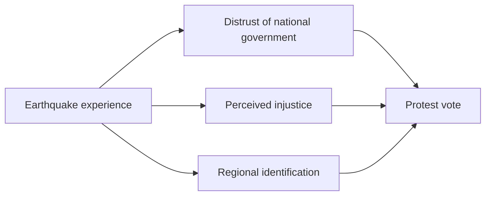
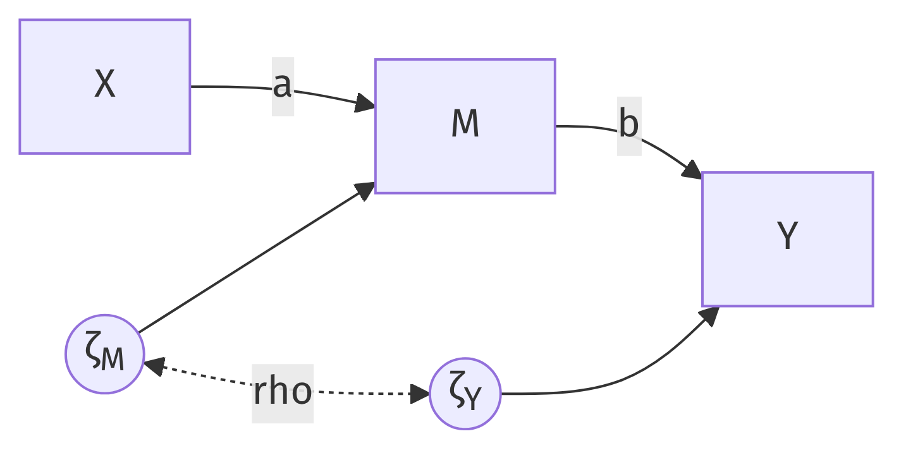

# The design limits the questions: identification {#sec-identification}

In the north of the Netherlands, decades of gas extraction have caused earthquakes, and the people who live above the gas field vote differently from the rest of the country. Researchers who surveyed the region proposed a chain of explanations [@otjes2020]: experiencing earthquakes erodes trust in the national government, feeds a sense of injustice, and strengthens regional identification, and each of these in turn pushes people toward a protest vote. @fig-otjes draws the claim, and the drawing shows its shape. The theory does not stop at "earthquakes cause protest voting"; it says the effect runs *through* something. Questions of this shape are called **mediation** questions, and the social and health sciences ask them constantly, because a mechanism is what a theory is made of, and because a mediator suggests a lever: if distrust carries the effect, restoring trust might interrupt it.

{#fig-otjes width="85%" fig-align="center"}

Mediation is also the sharpest illustration I know of a larger predicament, and that predicament is my real subject. The last chapter warned that a model which fits the data is not thereby true. Here you meet the hard version of the warning: some questions cannot be settled by any amount of data, because the design never put the answer into the data in the first place. Statisticians call this the problem of "identification". The word sounds bureaucratic. What it names is a limit on knowledge, and the design, not the sample size, sets the limit.

## The mediation model

The recipe of @sec-theory-to-glm turns the simplest mediation theory into two equations. Write $X$ for the cause, $M$ for the mediator, and $Y$ for the outcome, all standardized:

$$
\begin{aligned}
M &= a\,X + \zeta_M \\
Y &= b\,M + c\,X + \zeta_Y .
\end{aligned}
$$ {#eq-mediation}

The tracing rules hand us the decomposition that makes mediation attractive. Two traces connect $X$ and $Y$: the direct path, which contributes $c$, and the path through the mediator, which contributes $a \times b$. In the vocabulary of @sec-theory-to-glm, $c$ is the direct effect, $ab$ the indirect effect, and their sum the total effect. Here, and only because nothing in this model is a common cause of $X$ and $Y$, that sum is also the implied correlation. Estimate the two equations, multiply, and you can report "the share of the effect that runs through the mediator".^[This estimation recipe has circulated in psychology for decades under the name of @baron1986. My subject is what the numbers mean, not how to compute them.]

::: {.callout-tip icon="false" title="Exercise 3.1"}
In a study of education ($X$), health knowledge ($M$), and longevity ($Y$), the estimates are $\hat a = 0.5$, $\hat b = 0.4$, $\hat c = 0.1$. Compute the indirect, direct, and total effects and the proportion mediated. Then state in one sentence what the indirect effect claims about the world, if the model is true.
:::

::: {.callout-note collapse="true" icon="false" title="Answer 3.1"}
Indirect $= 0.5 \times 0.4 = 0.20$; direct $= 0.10$; total $= 0.30$; proportion mediated $= 0.20/0.30 = 2/3$. The claim: two thirds of education's benefit for longevity arises because education raises health knowledge, which raises longevity, so an intervention on health knowledge alone could capture most of the benefit. Feel the size of that claim. Everything that follows asks what entitles anyone to it.
:::

## The assumptions behind the arrows

Equations [-@eq-mediation] are claims, and by now you know where claims get their credibility. To read $\hat a$, $\hat b$, and $\hat c$ causally you must grant, beyond linearity and additivity: that nothing confounds $X$ and $M$; that nothing confounds $M$ and $Y$, which is to say that $\zeta_M$ and $\zeta_Y$ are uncorrelated; and that the arrows point the way drawn.

Here is mediation's trap. Randomizing $X$, the strongest design feature we own, buys the first assumption outright, because a coin flip shares no common causes with anything. It buys nothing for the other two. Nobody randomized the mediator. Within each arm of a randomized experiment, the people with high mediator values are simply different people from the people with low values, and whatever makes them different may drive the outcome on its own. The $b$ path is an observational study smuggled inside the experiment. Methodologists have said so plainly for years: the mediator-outcome assumption "is needed even in the randomized trial context because, in a trial, although the exposure has been randomized, the mediator typically has not been" [@vanderweele2016]. In one randomized trial of cognitive behavioral therapy, a naive mediation analysis of antidepressant use made the antidepressants look harmful; VanderWeele's verdict is that "we get nonsense from the traditional approach if we ignore mediator-outcome confounding".

Rather than stack up more warnings, I will let you watch the failures happen. Twice.

## Failure one: the arrows can be backwards

Start in a world where the mediation model is exactly true: the cause raises the mediator ($a = 0.5$), the mediator raises the outcome ($b = 0.7$), and no direct effect exists. Fit two models to this world: the true chain, and the same chain with every arrow reversed.

```{r}
#| label: reversed-arrows
library(lavaan)
set.seed(21)
n  <- 10000
x1 <- rnorm(n)
x2 <- 0.5 * x1 + rnorm(n)
x3 <- 0.7 * x2 + rnorm(n)
d  <- data.frame(x1, x2, x3)

fit_chain    <- sem("x2 ~ x1 \n x3 ~ x2", data = d)
fit_reversed <- sem("x1 ~ x2 \n x2 ~ x3", data = d)
c(chain = fitMeasures(fit_chain, "chisq"),
  reversed = fitMeasures(fit_reversed, "chisq"))
```

The simulation builds the world; the two `sem()` calls fit the rival stories; the last line prints their fit statistics. The statistics agree to every decimal, in this dataset and in every dataset either model will ever meet.

::: {.callout-tip icon="false" title="Exercise 3.2"}
Before reading on, explain this result using the tracing rules. What does each model imply about the three correlations among $x_1$, $x_2$, $x_3$? Then check a third story: fit the model in which $x_3$ causes both $x_1$ and $x_2$ (`"x1 ~ x3 \n x2 ~ x3"`). Does it also fit identically? Why (not)?
:::

::: {.callout-note collapse="true" icon="false" title="Answer 3.2"}
Both chains imply the same single restriction. The forward chain implies $\rho_{13} = \rho_{12}\,\rho_{23}$, since the only trace from $x_1$ to $x_3$ passes through $x_2$; the reversed chain implies $\rho_{13} = \rho_{23}\,\rho_{12}$, the same equation. Models that imply identical restrictions on the observable correlations cannot be told apart by any data. The common-cause story is different: it implies $\rho_{12} = \rho_{13}\,\rho_{23}$, a restriction that is false in this world, so its fit is visibly worse. Fit can eliminate some rivals; it cannot orient the chain.^[For the curious: with nonlinear relationships or non-normal variables the tie can sometimes be broken, because a reversed nonlinear relationship leaves distributional fingerprints. Under linearity and normality the equivalence is exact.]
:::

This situation has a name. Two models, or two parameter values, are **not identified** when they imply the same distribution of observable data. The data then have no opinion, however many of them you collect. @saris1984 supply the accounting: a model with more parameters than observed variances and covariances cannot possibly be identified. But the counting rule is only a necessary condition, and the reversed chain passes it while the direction stays unidentifiable all the same. Design can break the tie that fit cannot. If $x_1$ was randomized, an arrow into $x_1$ is absurd, because nothing in the system causes a coin flip; the reversed chain dies by design, not by fit. The earthquake study leans on the same logic in weaker form: earthquakes shake houses, and opinions do not shake the ground, so the causal order of $X$ is secure. For the mediator-outcome pair, nothing is secure. Distrust may drive protest votes, or a protest identity may feed distrust, and the survey cannot tell.

## Failure two: the hidden confounder

Now the second assumption. In a new world, the cause still raises the mediator ($a = 0.5$), but the mediator does nothing whatsoever to the outcome. An unmeasured variable $U$ drives both mediator and outcome instead. Picture a randomized encouragement to study ($X$), study time ($M$), test scores ($Y$), and conscientiousness ($U$).

```{r}
#| label: hidden-confounder
set.seed(5)
n <- 10000
X <- rnorm(n)
U <- rnorm(n)                                  # never measured
M <- 0.5 * X + 0.6 * U + rnorm(n, sd = sqrt(1 - 0.25 - 0.36))
Y <- 0.0 * M + 0.6 * U + rnorm(n, sd = sqrt(1 - 0.36))
d2 <- data.frame(X, M, Y)

round(coef(sem("M ~ X \n Y ~ M + X", data = d2)), 2)
```

The mediation analysis reports a healthy, highly significant $\hat b$ of about 0.5. A referee would read it as evidence that studying strongly improves scores and that the encouragement works through study time. Every number is precisely estimated, and every causal number is wrong: in this world, forcing students to study more would achieve nothing, because study time does not cause scores. Conscientiousness merely makes the two travel together inside each arm of the experiment. Notice the estimated direct effect too, pushed spuriously *negative*.^[The books must balance. Randomization keeps the total effect unbiased, so when the confounder inflates the indirect share, the direct share must shrink to compensate. Analysts then solemnly interpret the negative direct path ("encouragement backfires unless you study"). It is an accounting artifact.] More data would only tighten the intervals around the wrong values. This is @fig-confounding again, with one difference that matters. There the confounded variable was the treatment, and randomization fixed it. Here the confounded variable is the mediator, and randomization cannot reach it.

::: {.callout-tip icon="false" title="Exercise 3.3"}
Explain, with a trace through the diagram $X \rightarrow M \leftarrow U \rightarrow Y$, why the regression of $Y$ on $M$ and $X$ produces a nonzero coefficient on $M$ although $M$ does not cause $Y$. Then explain why randomizing $X$ did not protect us.
:::

::: {.callout-note collapse="true" icon="false" title="Answer 3.3"}
$M$ and $Y$ share the common cause $U$: high-$U$ students study more and also score higher, so $M$ and $Y$ are correlated at every level of $X$. Regression can only redescribe that correlation, and it books the association under the $M$ coefficient. In model terms, $U$ sits inside both $\zeta_M$ and $\zeta_Y$, so the disturbances are correlated, violating the no-confounding assumption. Randomization guarantees that $U$ is unrelated to $X$, which is why $\hat a$ and the total effect remain fine. It constrains nothing about $U$'s relation to $M$ or $Y$. The coin flip protects only the variable it assigned.
:::

## Trading one assumption for another: instrumental variables

So far, demolition. The constructive turn begins by drawing the confounding into the model. Connect the two disturbances with a curved arrow and give the arrow a parameter: $\psi$, the correlation between everything-else-about-$M$ and everything-else-about-$Y$.

Count, the way @saris1984 taught you to. With a direct path from $X$ to $Y$ still in the model, the unknowns are $a$, $b$, $c$, and the disturbance correlation $\psi$: four parameters facing three observable correlations. One short; not identified, and this time the counting rule alone convicts. But suppose the theory can credibly assert that there is *no direct path*, that $X$ touches $Y$ only through $M$. @fig-iv draws that model. The parameters now number three, and the tracing rules give three equations:

{#fig-iv width="70%" fig-align="center"}

$$
\rho_{XM} = a, \qquad
\rho_{MY} = b + \psi\text{-term}, \qquad
\rho_{XY} = a\,b .
$$

The middle equation says the naive mediator-outcome correlation is contaminated: it contains $b$ plus a contribution from the correlated disturbances. Now look at the other two. Neither contains $\psi$ at all, because no valid trace from $X$ runs through the curved arrow. Divide:

$$
b = \frac{\rho_{XY}}{\rho_{XM}} .
$$

The causal effect of the mediator is identified *without assuming away the confounding*; $\psi$ has become just another parameter for the data to estimate. Read the trade in plain terms. You have swapped the assumption "no mediator-outcome confounding" for the assumption "no direct effect", which in this role is called the **exclusion restriction**. Neither assumption is testable from these data. The swap is struck entirely on theoretical credit, and when the credit is good, $X$ earns a new job title: an **instrumental variable** [@angrist1996]. You no longer care about $X$ for its own sake; you use its randomness as a lever to wiggle $M$ and watch what happens to $Y$.

Does the lever work? In the very dataset that fooled the mediation analysis:

```{r}
#| label: iv-estimate
model_iv <- "
  M ~ a * X
  Y ~ b * M
  M ~~ Y        # correlated disturbances: confounding allowed
"
round(coef(sem(model_iv, data = d2))[c("a", "b")], 2)
round(cov(d2$X, d2$Y) / cov(d2$X, d2$M), 2)   # the same, by hand
```

The estimate lands on the truth: studying does nothing, correctly reported, from confounded data. And the second line shows the whole apparatus collapsing into one division.

@sec-rq-to-interpretation already did this division by hand, twice. The draft lottery's 13 percent rise in suicide, divided by the 15-point shift in military service, is $\rho_{XY}/\rho_{XM}$ in different clothes; so is the Oregon arithmetic, where an effect on those drawn was divided by a 25-point rise in coverage. The numerator has a name of its own, the **intention-to-treat** effect, and the assumption that licensed the division was the exclusion restriction all along.

The algebra deserves doing once with pure numbers. Suppose we observe $\rho_{XM} = 0.3$, $\rho_{MY} = 0.7$, and $\rho_{XY} = 0.15$. The instrumental-variable estimate is $b = 0.15/0.3 = 0.5$. The naive estimate, the raw mediator-outcome correlation, is $0.7$. The difference, $0.2$, is confounding that the naive analysis booked as causation.

Now the fine print, printed large, because every clause below is a research disaster in waiting.

*Relevance.* The recipe divides by $\rho_{XM} = a$. If the instrument barely moves the mediator, the division amplifies noise; if $a = 0$, there is nothing to divide by at all. Weak instruments do not merely widen intervals; they make the estimator erratic, as @fig-weak-instrument shows, and, when the instrument is even slightly invalid, badly biased [@bound1995].

```{r}
#| label: fig-weak-instrument
#| fig-cap: "Instrumental-variable estimates across 500 simulated studies (n = 1,000, true b = 0), clipped at plus or minus 10. Both panels share the same scale: the strong-instrument estimates (a = 0.5, left) form the narrow spike at zero, while the weak-instrument estimates (a = 0.05, right) scatter across the whole range."
one_iv <- function(a) {
  U <- rnorm(1000); X <- rnorm(1000)
  M <- a * X + 0.6 * U + rnorm(1000)
  Y <- 0.6 * U + rnorm(1000)
  cov(X, Y) / cov(X, M)
}
set.seed(6)
strong <- replicate(500, one_iv(0.5))
weak   <- replicate(500, one_iv(0.05))
strong_clipped <- pmax(pmin(strong, 10), -10)
weak_clipped   <- pmax(pmin(weak, 10), -10)
bins <- seq(-10.5, 10.5, by = 0.5)
par(mfrow = c(1, 2))
hist(strong_clipped, main = "Strong instrument", xlab = "IV estimate of b",
     breaks = bins, xlim = c(-10, 10)); abline(v = 0, lwd = 2)
hist(weak_clipped, main = "Weak instrument", xlab = "IV estimate of b",
     breaks = bins, xlim = c(-10, 10)); abline(v = 0, lwd = 2)
```

*Exclusion.* The restriction "no direct path" did real work in the algebra: it removed the direct-effect trace from $\rho_{XY}$, leaving only $ab$. If a direct path exists after all, the numerator contains $ab + c$, and the ratio silently delivers a corrupted answer. The data cannot check this, because the model with the direct path was never identified in the first place.

*Exogeneity.* And $X$ itself must be unconfounded with $Y$, which randomization buys and nature sometimes imitates.

::: {.callout-tip icon="false" title="Exercise 3.4"}
Work through the full identification argument yourself, in the steps the algebra suggests. (a) Using the tracing rules on @fig-iv, write the three implied correlations in terms of $a$, $b$, and $\psi$. (Hint: the trace for $\rho_{MY}$ that uses the curved arrow contributes $\psi$ times the disturbance loadings; you may write it simply as "$+$ confounding".) (b) Which two equations identify $b$, and why is the third not needed? (c) What goes wrong if we never observed $X$ and wanted $b$ from the $M$-$Y$ data alone? (d) What goes wrong if $a = 0$?
:::

::: {.callout-note collapse="true" icon="false" title="Answer 3.4"}
(a) $\rho_{XM} = a$; $\rho_{XY} = ab$; $\rho_{MY} = b + \text{confounding}$. (b) The first two: $b = \rho_{XY}/\rho_{XM}$. They are exactly the equations free of $\rho$. The third equation is then left over to *estimate* the confounding rather than to assume it away. (c) With only $M$ and $Y$ you have one correlation and two unknowns, $b$ and the confounding; not identified, which is the ordinary observational predicament. (d) Division by zero: with an irrelevant instrument the data contain no information about $b$, and in finite samples a nearly-zero $a$ produces the wild estimates of the right panel above.
:::

## Instruments in the wild

Where do credible instruments come from? Sometimes nature provides one. @hanandita2014 wanted the effect of poverty on mental health in Indonesia, where the naive association is hopelessly confounded: illness causes poverty too, and much causes both. Their instrument is the weather. Rainfall anomalies across 440 districts shift household consumption, and a rainfall shock has no business affecting mental health except through the economic hardship it causes. With $N = 577{,}548$, relevance is checkable and strong, exogeneity is argued from meteorology, and the exclusion restriction is the debatable clause, as it always is.^[Is it airtight? Floods can destroy more than income: homes, and occasionally family members, are direct paths from rainfall to distress that bypass consumption. Every instrumental-variable argument has a clause like this, and the paper's robustness checks are aimed at it.] Their estimate: halving consumption raises the probability of mental illness by 0.06, about five times the naive association, which measurement error in consumption had attenuated.

Sometimes we build the instrument. An **encouragement design** randomizes not the behaviour itself but an invitation to it, then uses the randomized invitation as an instrument for the behaviour [@holland1988]. The same logic runs any trial with imperfect compliance: assignment is randomized, treatment received is not, and assignment instruments treatment received. In the JOBS II trial for unemployed workers, only some of those assigned to job-search workshops attended, so assignment served as the instrument for participation [@tingley2014].

And sometimes biology randomizes. **Mendelian randomization** uses genetic variants as instruments: a variant that raises alcohol consumption is dealt out at conception, plausibly independent of later confounders, and instruments the effect of drinking on, say, esophageal cancer [@daveysmith2003]. The exclusion worry here has its own name, "pleiotropy", one gene working through many pathways, and modern practice is largely a battery of partial defenses against it [@davies2018].

Each of these designs inherits the fine print in a local dialect, and the criticisms of instrumental variables are the fine print grown up. Economists learned that celebrated instruments can be weak; the quarter-of-birth instrument for schooling is the canonical case [@bound1995]. A subtler criticism: even a valid instrument answers a narrower question than the one usually asked, because it estimates the effect among "compliers", the units the instrument actually moved, and critics like @deaton2010 ask whether that local effect was the question anyone posed. Mediation analysis in psychology has its own bill of indictment: mediators measured minutes before outcomes, assumptions unstated, and a literature of causal-sounding conclusions resting on the naive $b$ path [@bullock2010; @rohrer2022]. The remedy is to keep the how-question but treat the mediation model as this book treats every model: as a set of assumptions waiting for a design.

## Modern mediation analysis, briefly

@sec-theory-to-glm left a question open. When the arrow into the mediator carries an ordinary regression coefficient and the arrow out of it carries a log-odds coefficient, as in the published diagram of @bayerl2024, the product $ab$ multiplies two numbers on different scales and means nothing in particular. Here is the answer. The framework above is linear; real mediation problems bring binary outcomes, interactions, and nonlinearity, and for those the modern literature defines the effects counterfactually before estimating anything [@vanderweele2016]. Two definitions are worth knowing, because applied papers run on them. The **natural direct effect** (NDE) compares the outcome under treatment versus control while the mediator is held at the value it would naturally take *under control*: the effect that does not run through the mediator. The **natural indirect effect** (NIE) holds treatment fixed and compares the outcome under the mediator value it would take with treatment versus without: the effect that does run through the mediator. The two add up to the total effect by construction, a decomposition as tidy as the linear one, and in the linear model without interactions the NIE is exactly $ab$. With interactions or a logistic outcome the classic formulas and the counterfactual ones part ways, and the counterfactual ones are right.

The R package `mediation` computes these effects by simulation for a wide menu of models [@tingley2014], under the same no-confounding assumptions you met above, there called "sequential ignorability". A classic demonstration uses a framing experiment: participants were randomized to an anxiety-inducing immigration news story, with anxiety as the mediator and sending an anti-immigration letter to Congress as the binary outcome [@brader2008].

```{r}
#| label: brader
#| cache: true
library(mediation)
data(framing)
med.fit <- lm(emo ~ treat + age + educ + gender + income, data = framing)
out.fit <- glm(cong_mesg ~ emo + treat + age + educ + gender + income,
               data = framing, family = binomial("probit"))
set.seed(1)
med.out <- mediate(med.fit, out.fit, treat = "treat", mediator = "emo",
                   robustSE = TRUE, sims = 1000)
round(summary(med.out)$d.avg, 3)   # average causal mediation effect (NIE)
round(summary(med.out)$z.avg, 3)   # average direct effect (NDE)
```

The first model explains the mediator, the second the outcome; `mediate()` combines them into the average causal mediation effect (the NIE, here about 0.08 and significant) and the average direct effect (small and not significant). The treatment raised the probability of writing to Congress by about eight percentage points *through anxiety*. Because the identifying assumptions are untestable, careful papers add a sensitivity analysis, which asks how strong an unmeasured mediator-outcome confounder would have to be to explain the result away; the package computes this too, and current reporting guidelines ask for exactly such statements.

A closing word on standard errors, because the mediation literature is oddly obsessed with them. The indirect effect $ab$ is a product of two estimates, and lavaan's `:=` operator gives its standard error by the delta method in one line. Bootstrapping gives nearly the same answer at ordinary sample sizes.^[The product of two normal estimates is not itself normal, which matters near zero and in small samples [@mackinnon2007]; the bootstrap handles this and is a fine tool. What it cannot do is repair identification: no resampling scheme converts the naive $b$ into a causal effect. The field's energy is better spent on the assumptions than on the intervals around a possibly meaningless number.]

## Reading the chapter backwards

Identification is a property of the question-design pair. It does not live in the estimator, and neither sample size nor software can buy it. The mediation story taught each general lesson in miniature. Two opposite models fit identically, so data cannot orient an edge the design did not orient. A hidden confounder made every estimate precise and wrong, because assumptions the design does not buy fail silently. One untestable assumption, exclusion, bought identification back: assumptions are currency, and the design sets the exchange rate. And the instrument's own fine print moved the limits rather than abolishing them. When you meet an analysis, any analysis, ask the fifth of the five questions of @sec-rq-to-interpretation with maximal severity: what in the design put the answer to this question into the data at all? If none did, no estimator will get it out. Mediation analysis is an if-then statement: if the assumptions hold, then this is the mediation process. Papers that claim mediation because the model said so are walking in a circle.

## Test yourself {.unnumbered}

::: {.callout-tip icon="false" title="Exercise 3.A"}
An abstract reads: "Whether living near a fast-food outlet causes obesity is disputed, since outlets choose their locations. We exploit the fact that highway service areas host fast-food outlets for reasons unrelated to local residents' health. Among 130,000 residents of towns at varying distances from service areas, we use highway proximity as an instrument for fast-food exposure and estimate its effect on body mass index."

(a) Identify the three variables in the instrumental-variable triangle and draw the assumed diagram, including the correlated disturbances.
(b) Write the three implied correlations and derive the IV estimator of the exposure effect.
(c) Suppose highway proximity also brings traffic noise and air pollution, which affect health. Which condition fails, and what happens to the estimate?
(d) Suppose fast-food outlets near highways serve the same food as elsewhere, but residents near highways rarely eat out at all, so proximity barely shifts exposure. Which condition fails, and what happens to the estimate?
(e) A colleague proposes to fix problem (c) by controlling for measured air quality. What assumption does the fix require?
:::

::: {.callout-note collapse="true" icon="false" title="Answer 3.A"}
(a) $Z$ = highway proximity (instrument), $M$ = fast-food exposure, $Y$ = BMI; arrows $Z \rightarrow M \rightarrow Y$, curved arrow between the disturbances of $M$ and $Y$, no direct $Z \rightarrow Y$ path. (b) $\rho_{ZM} = a$, $\rho_{ZY} = ab$, $\rho_{MY} = b + \text{confounding}$; hence $b = \rho_{ZY}/\rho_{ZM}$. (c) Exclusion: pollution and noise are direct paths from $Z$ to $Y$ that bypass $M$, so $\rho_{ZY} = ab + \text{direct part}$ and the ratio no longer isolates $b$; the estimate absorbs the pollution effect. (d) Relevance: $a \approx 0$, the denominator is near zero, and the estimator becomes wildly unstable (and any small exclusion violation is amplified). (e) That air quality is measured well enough, and that after controlling for it no *other* direct path from proximity to BMI remains; the exclusion restriction is repaired only as far as the controls are complete, which is an assumption, not a test result.
:::

::: {.callout-tip icon="false" title="Exercise 3.B"}
A published paper reports, from a cross-sectional survey of 2,000 office workers: "Job insecurity predicted burnout ($\beta = 0.21$). This effect was fully mediated by sleep quality ($ab = 0.19$, bootstrap 95% CI [0.12, 0.27]); the direct effect was not significant. We conclude that insecure employment burns people out by disrupting their sleep, and that sleep interventions can undo this harm."

(a) List the assumptions this conclusion requires, and label each as supported or unsupported by the design.
(b) Construct a concrete rival world, with the same fitted numbers, in which sleep interventions would achieve nothing.
(c) The authors emphasize the bootstrap confidence interval. Evaluate, in one or two sentences, how much that emphasis adds.
:::

::: {.callout-note collapse="true" icon="false" title="Answer 3.B"}
(a) Correct causal order (insecurity $\rightarrow$ sleep $\rightarrow$ burnout): unsupported; all three variables were measured at once, and burnt-out workers may sleep badly and read their job prospects more darkly. No insecurity-sleep confounding and no sleep-burnout confounding: unsupported; a failing employer, say, plausibly causes insecurity, late nights, and exhaustion at once. Linearity and additivity: conventional. (b) Let the employer's decline drive insecurity, poor sleep, and burnout, with no arrow from sleep to burnout at all: the three correlations can reproduce the published coefficients, yet improving sleep changes nothing because sleep never caused the burnout. (c) Very little. The bootstrap gives a valid interval around $ab$, but the number it brackets is causal only under the assumptions in (a); a precise confidence interval around an unidentified quantity is precision about the wrong thing.
:::

::: {.callout-tip icon="false" title="Exercise 3.C"}
A Mendelian randomization study uses a variant that slows alcohol metabolism as an instrument for alcohol consumption, with esophageal cancer as the outcome.

(a) State the three instrument conditions in genetic terms.
(b) The variant also causes facial flushing, which affects social behaviour and stress; through which condition does this threaten the analysis, and what is the term of art?
(c) The variant is common in East Asian populations and rare elsewhere, and populations differ in diet. Explain the resulting bias and one design remedy.
(d) In what precise sense does even a successful analysis answer a "local" question?
:::

::: {.callout-note collapse="true" icon="false" title="Answer 3.C"}
(a) Relevance: the variant shifts consumption. Exogeneity: the variant is dealt independently of confounders of drinking and cancer, the meiotic lottery. Exclusion: the variant affects cancer only through consumption. (b) Exclusion; a second pathway from gene to outcome is "pleiotropy". (c) Ancestry is a common cause of carrying the variant and of dietary exposures: confounding of the instrument itself, called population stratification. Remedies: analyze within genetically homogeneous groups, adjust for genetic principal components, or use within-family designs, where the lottery argument holds exactly. (d) The estimate reflects the effect of consumption among people whose drinking the variant actually shifts, the compliers; heavy drinkers who would drink regardless contribute nothing, so extrapolation to them is an extra assumption [@angrist1996; @deaton2010].
:::
