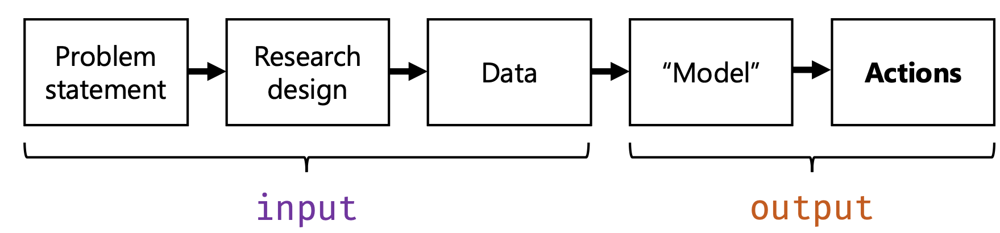
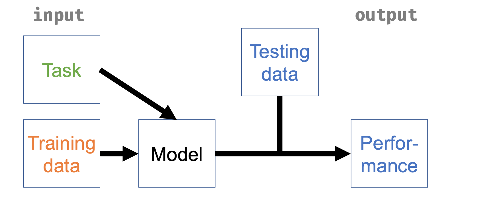

# Machine learning I: overfitting and the bias–variance tradeoff {#sec-overfitting}

Researchers who consult a statistician sometimes ask whether they are "allowed" to use a particular model. Taken literally the question has no answer, since no authority licenses statistical models; what it usually means is: are the assumptions of this model defensible for my data and my question? That is a sensible question, and the first four chapters of this book were largely about how to answer it. It reflects a concern with **input validity**: on this view, a good analysis is one whose ingredients are in order — the question, the design, the data, and the assumptions — and if the input is good, the numbers that come out inherit its credibility.

Machine learning works with a different definition of quality, and the difference motivates this chapter and the next. To a machine learner, a good model is a model that *performs*: one whose predictions of data it has never seen are demonstrably accurate, whatever its ingredients. This is a concern with **output validity**. On this definition the question "am I allowed to use this model?" has an empirical answer: whether it predicted well, measured honestly. @fig-input-output shows what the two words refer to: the input is the chain that runs from the problem statement through the research design to the data, and the output is everything produced from it, the model and the actions based on the model. Input validity judges an analysis by the left side of the figure; output validity judges it by the right.

{#fig-input-output width="90%"}

Each definition sees what the other misses. Statisticians criticize machine learning applications that ignore measurement, sampling, and validity: input blindness. Machine learners criticize analyses defended entirely on the grounds of their assumptions, with no check on whether the model predicts anything: output blindness. The fields are converging from both ends, and this book needs both perspectives: chapters 1 to 4 concerned the interrogation of inputs, and this chapter and the next concern the measurement of outputs. They do not present a catalogue of new models. A few new models will appear along the way, but the ideas are the point, and the ideas apply just as well to the regression models of the earlier chapters.

::: {.callout-note appearance="simple" icon="false" title="Optional in this chapter"}
Why the wrong model won: the algebra (the exact bias, variance and noise of the three models of @sec-explanation-prediction, and the sample size at which the verdict reverses; Exercise 6.4 belongs to it). Everything else is required, as are all other inline exercises.
:::

::: {.callout-note appearance="simple" icon="false" title="Before you start"}
This chapter builds on three earlier results: the distinction between explaining and predicting, and the simulation in which a wrong model predicted better than the true one (@sec-explanation-prediction); shrinkage of group estimates toward the mean in multilevel models (@sec-batching), which returns here as a penalty on coefficients; and confounding bias from chapters 1 to 3, which this chapter shows to be one case of a more general notion of bias.
:::

## What machine learning is

The standard definition is Tom Mitchell's, and it is thirty years old: "A computer program is said to learn from experience E with respect to some class of tasks T and performance measure P, if its performance at tasks in T, as measured by P, improves with experience E" [@mitchell1997].

Every element of this definition matters, and none of it mentions neural networks. The **task** is what the program must do: assign a probability of hypertension to a survey respondent, translate a sentence, flag a fraudulent transaction. The **experience** is data: for us, a set of observations with the outcome recorded, the setting called **supervised** learning, because the recorded outcomes supervise the fit. The **performance measure** is a number that says how well the task was done, measured on cases the program did not learn from: **held-out** cases, in the vocabulary of @sec-explanation-prediction, data set aside and not used in the fitting. Learning is nothing more than performance improving with experience. @fig-ml-definition draws the definition as a diagram: the task and the training data (the experience) go into the model, and what comes out is judged by its performance on testing data the model did not learn from.

{#fig-ml-definition width="80%"}

By this definition, the logistic regression of @sec-theory-to-glm is a machine learning method. The task: predict which panel members have a hypertension diagnosis. The experience: 4,158 LISS respondents with their integration scores, ages, genders, and BMIs recorded alongside the outcome. The performance measure: how well the predicted probabilities fit respondents the model never saw. The model is the same; what changed is the criterion by which it is judged. In @sec-theory-to-glm the model was judged by its inputs: whether the theory justified placing social integration among the predictors, whether the coefficients meant what we claimed. Here it is judged by its output, and the coefficients could be meaningless so long as the predictions hold up.^[This is the two-cultures split of @sec-explanation-prediction, made operational. Breiman's algorithmic culture is the output-validity culture, and his complaint about the other 98 percent was input blindness about the one input that is a model: "if the model is a poor emulation of nature, the conclusions may be wrong" [@breiman2001].]

The definition is liberating in a practical sense. Once the task and the performance measure are fixed, questions that formerly had to be argued become empirical. Should income be log-transformed? Should the interaction be included? Would a random forest do better? Each candidate can be tried, its performance measured honestly, and the best kept; no argument about assumptions needs to be settled first. The liberation has a price, which is contained in the word *honestly*: each of these comparisons can overstate the model's performance if information leaks from the evaluation data into the fit, and the whole of @sec-evaluation is about preventing that. This chapter is about the phenomenon that makes honest measurement hard in the first place.

::: {.callout-tip icon="false" title="Exercise 6.1"}
State the task, the experience, and the performance measure for each scenario, and say on which data the performance must be measured.

(a) A hospital wants to flag, at admission, patients likely to be readmitted within 30 days.
(b) A political scientist wants to code 50,000 parliamentary speeches as economic, social, or procedural, using 2,000 speeches coded by hand.
(c) The random-effects meta-analysis of @sec-anova, asked to predict the log odds ratio in a newly planned BCG trial.
:::

::: {.callout-note collapse="true" icon="false" title="Answer 6.1"}
(a) Task: predict readmission within 30 days from admission-time information. Experience: past admissions with their outcomes. Performance: accuracy of the predictions on admissions not used for learning, ideally later ones, since that matches how the model will be used.
(b) Task: assign one of three labels to a speech. Experience: the 2,000 hand-coded speeches. Performance: agreement with human labels on hand-coded speeches held out from the learning.
(c) Task: predict $\theta$ in a new study. Experience: the thirteen completed trials. Performance: how close the prediction lands, which can only be measured once new trials exist. The model of @sec-anova was already making predictions, and Mitchell's definition covers it.
:::

## Watching overfitting

The phenomenon is easiest to see in a world we control: a smooth curve, $f(x) = \sin(2\pi x)$, plus noise with standard deviation 0.5. Fifty observations are drawn for learning, and ten thousand fresh ones for evaluation. To this world we fit polynomials of increasing degree, from a straight line to degree 12, and measure each fit twice by mean squared error (MSE), the average of the squared prediction errors: once on the fifty points it learned from, and once on the ten thousand it never saw.

```{r}
#| label: fig-overfit
#| fig-cap: "One training set of 50 points from a known curve (left: the true curve, a degree-3 fit, and a degree-12 fit) and the two error curves (right). Training MSE falls forever as the degree rises; test MSE falls, bottoms out, and then climbs. The dashed line marks the noise floor, the error a perfect model would still make."
#| fig-width: 8
#| fig-height: 3.4
set.seed(6)
f <- function(x) sin(2 * pi * x)
n <- 50
train <- data.frame(x = runif(n))
train$y <- f(train$x) + rnorm(n, sd = 0.5)
test <- data.frame(x = runif(10000))
test$y <- f(test$x) + rnorm(10000, sd = 0.5)

mse <- function(m, d) mean((d$y - predict(m, d))^2)
degrees <- 1:12
errs <- sapply(degrees, function(k) {
  m <- lm(y ~ poly(x, k), data = train)
  c(train = mse(m, train), test = mse(m, test))
})

par(mfrow = c(1, 2))
grid <- data.frame(x = seq(0, 1, length.out = 200))
plot(train$x, train$y, xlab = "x", ylab = "y", main = "The data and two fits")
lines(grid$x, f(grid$x), lwd = 2)
lines(grid$x, predict(lm(y ~ poly(x, 3), train), grid), lty = 2, lwd = 2)
lines(grid$x, predict(lm(y ~ poly(x, 12), train), grid), lty = 3, lwd = 2)
legend("topright", c("truth", "degree 3", "degree 12"), lty = 1:3, bty = "n", cex = 0.8)
matplot(degrees, t(errs), type = "b", pch = c(1, 16), lty = 1,
        xlab = "polynomial degree", ylab = "mean squared error",
        main = "Training vs test error")
abline(h = 0.25, lty = 2)
legend("topleft", c("training", "test"), pch = c(1, 16), bty = "n")
```

The training error only goes down, and necessarily so: a higher-degree polynomial can do everything a lower-degree one can and more, so giving the model more freedom can never hurt its fit *to the data it is fitting*. The test error behaves differently. It falls at first, because the straight line misses the curve; it reaches a minimum around degree 3 to 5; and then it climbs, slowly and then steeply, until the degree-12 fit predicts fresh data far worse than the straight line did. James, Witten, Hastie, and Tibshirani call this U-shape "a fundamental property of statistical learning that holds regardless of the particular data set at hand and regardless of the statistical method being used" [@james2021].

A model in the climbing region is **overfitting**: it has fitted the accidents of its fifty points, the noise, and mistaken them for structure. In the left panel, the dotted degree-12 curve can be seen following individual observations; every such wiggle is the model explaining variation that was never there to explain. Note also that the training error gives no warning of any of this: at degree 12 the training error is the lowest of the whole sequence while the test error is at its worst. Judged by its inputs, nothing remarkable has happened, since a polynomial is a respectable model. Judged by its output, the model has failed.

::: {.callout-tip icon="false" title="Exercise 6.2"}
Run the chunk above and modify it. (a) Raise the training sample from 50 to 500 and rerun. Where is the bottom of the U now, and why did it move? (b) Set the noise standard deviation to 0 and rerun. What happens to the U, and what does that tell you about what overfitting is made of? (c) Your training error at degree 12 with the original settings is about 0.16, well below the noise floor of 0.25. Explain how a model can beat the noise floor on training data, and why it can never do so on test data.
:::

::: {.callout-note collapse="true" icon="false" title="Answer 6.2"}
(a) The bottom barely moves, since the truth is no more complicated than before, but the climb to its right flattens: at degree 12 the test MSE drops from about 3.5 to about 0.26. With ten times the data the accidents average out, so excess flexibility stops being dangerous. The cost of flexibility depends on the model and the sample size together, not on the model alone.
(b) With no noise the test error keeps falling as the degree rises toward the truth's complexity, and the U all but disappears. Overfitting is made of noise: it is the fitting of randomness, so a world without randomness has little to overfit.
(c) On training data, fitting the noise *reduces* measured error, because the noise is present in the data being scored. On test data the accidents are new ones, drawn fresh, so memorized noise predicts nothing and its cost appears in full. Below-floor training error is the signature of memorization.
:::

## The bias–variance decomposition

The U-shape can be explained by a decomposition that is the most useful equation in these two chapters. Fix a single point $x_0$ and consider the average squared error if fresh training sets of 50 were repeatedly drawn from this world, the model fitted to each, and a fresh observation at $x_0$ predicted each time. For any model fitted by any method, this average splits into three terms [@james2021; @hastie2009]:

$$
\underbrace{E\left[\bigl(y_0 - \hat f(x_0)\bigr)^2\right]}_{\text{expected test error}}
\;=\;
\underbrace{\sigma^2}_{\text{noise}}
\;+\;
\underbrace{\bigl[\,E\hat f(x_0) - f(x_0)\,\bigr]^2}_{\text{bias}^2}
\;+\;
\underbrace{\operatorname{Var}\bigl(\hat f(x_0)\bigr)}_{\text{variance}} .
$$ {#eq-bias-variance}

The notation requires care. Here $f$ is the true regression function, the curve the world actually uses to turn $x$ into the systematic part of $y$; in the simulation it is $\sin(2\pi x)$, and in real problems it is unknown. The outcome $y_0 = f(x_0) + \varepsilon$ is a fresh observation at the point $x_0$, one the model has never seen, and $\sigma^2 = \operatorname{Var}(\varepsilon)$ is the variance of its noise around the true curve. The estimate $\hat f$ is the fitted function produced by applying the method to one training set, so $\hat f(x_0)$ is that fitted function's prediction at $x_0$. The expectation operator $E$ averages over both sources of randomness at once: the training set that produced $\hat f$, and the noise in the fresh observation $y_0$. The left-hand side is therefore an average of the bracketed squared error $\bigl(y_0 - \hat f(x_0)\bigr)^2$ over many repetitions of the whole procedure, not the error of any single fit; likewise, $E\hat f(x_0)$ on the right is the average prediction at $x_0$ across repeated training sets, and $\operatorname{Var}\bigl(\hat f(x_0)\bigr)$ is the variance of that prediction across the same repetitions.

With the notation fixed, the three terms on the right can be taken one at a time, in their exact meanings, because loose versions of these words cause confusion.

The **noise**, $\sigma^2$, is the variance of the outcome around the true curve: the part of $y$ that nothing at all predicts, because it is measurement error, unmeasured causes, or genuine randomness. It is called the **irreducible error**, and it sets a floor. No model can have expected test error below $\sigma^2$, because even a model that knew $f$ exactly would still miss each fresh observation by the noise. In our simulated world the floor is $0.5^2 = 0.25$, the dashed line in @fig-overfit. In real problems the floor is real but unknown, and forgetting its existence leads to impossible demands on prediction. The Fragile Families Challenge of @sec-explanation-prediction reads differently in this light: when 160 teams with thirteen thousand variables all plateau at an $R^2$ of about 0.2 for the most predictable outcomes, and near zero for the rest, the parsimonious explanation is that the floor for a single child's life outcomes is high: much of what happens to a person is, from the standpoint of age-nine data, noise.^[Parsimonious, not proven: a floor is only demonstrated relative to the information you have. Better measurements or different variables could lower it, which is the question PreFer was designed to ask.]

**Bias** is a property of the average fit: it "refers to the error that is introduced by approximating a real-life problem, which may be extremely complicated, by a much simpler model" [@james2021]. Fit a straight line to a sine curve a thousand times and average the thousand lines: the average is still a line, and at the peak of the curve it will sit far below the truth, every time. That systematic miss is bias. It does not shrink as more data are collected, because its source is the model's shape, not the sample's size. The word means what it meant in chapters 1 to 3, an error that averaging over repeated samples does not remove; the confounding bias of those chapters is a special case, since a model that omits a confounder is wrong on average, about an effect there and about a prediction here. The simulation of @sec-explanation-prediction supplied another example of bias: there, the true causal factor, medication, was absent from the model with the lowest prediction error, so that model's average predictions cannot correspond exactly to the true expected value of each observation. The next section returns to that example in detail.

**Variance** is a property of the fit's instability: it "refers to the amount by which $\hat f$ would change if we estimated it using a different training data set" [@james2021]. The degree-12 polynomial passes close to its fifty points, but fitted to a different fifty points from the same world it passes close to those instead, producing a visibly different curve. Its predictions at $x_0$ swing from training set to training set, and the swinging is error, even though it averages out to roughly the right place.

The equation can be checked numerically at the peak of the curve, $x_0 = 0.25$, with two thousand fresh training sets per model:

```{r}
#| label: decomposition
set.seed(7)
sims <- 2000
x0 <- 0.25
pred_at_x0 <- function(k) replicate(sims, {
  x <- runif(n)
  y <- f(x) + rnorm(n, sd = 0.5)
  predict(lm(y ~ poly(x, k)), newdata = data.frame(x = x0))
})
res <- sapply(c(1, 3, 12), pred_at_x0)
tab <- t(apply(res, 2, function(p) {
  c(bias2 = (mean(p) - f(x0))^2, variance = var(p), noise = 0.25,
    total = (mean(p) - f(x0))^2 + var(p) + 0.25)
}))
rownames(tab) <- paste("degree", c(1, 3, 12))
round(tab, 3)
```

Reading across the table: the straight line is stable (variance 0.017) but wrong (bias$^2$ 0.265), missing the peak the same way every time. The degree-12 fit is right on average (bias$^2$ 0.000) but unstable (variance 0.067, four times the straight line's). Degree 3 is nearly right *and* nearly stable, and its total, 0.267, sits just above the floor of 0.25: close to the best any method could achieve at this point. This is the **bias–variance tradeoff**: flexibility buys less bias at the price of more variance, and expected error is minimized where the terms of that exchange become unfavourable, not at either extreme. Every method discussed later in this chapter is a way of choosing a position on this tradeoff, and ISL calls it "one of the most important recurring themes in this book" [@james2021]. It is a recurring theme in this book too: it explains why a wrong model can predict better than the true one, the fact that @sec-explanation-prediction promised this chapter would explain. The true model has zero bias, and zero bias is worth little if the variance overwhelms it.

::: {.callout-tip icon="false" title="Exercise 6.3"}
Using @eq-bias-variance and the table above, say which term or terms each change moves, in which direction, and what happens to expected test error.

(a) The training sample grows from 50 to 5,000, model fixed at degree 12.
(b) The outcome is measured with a better instrument, halving $\sigma$.
(c) Twenty pure-noise predictors are added to a linear regression, sample size fixed.
(d) You replace the true model with a simpler, wrong one, in a small sample.
:::

::: {.callout-note collapse="true" icon="false" title="Answer 6.3"}
(a) Variance falls, and substantially, since each coefficient is now estimated from a hundred times the data; bias is untouched (a degree-12 polynomial tracks the sine very closely on this range, so it was already negligible), and so is the noise. Test error falls toward the floor.
(b) The noise term falls by three quarters, and so, to a lesser degree, does the variance, since the coefficients are estimated from less noisy data. Bias is unchanged. Better measurement lowers the floor itself, which no amount of modelling can.
(c) Bias is unchanged, since the true coefficients of the junk are zero and the model can represent that. Variance rises: twenty extra coefficients must be estimated, each free to chase chance correlations. Test error rises with no compensation.
(d) Bias appears where there was none; variance falls, because the simpler model has fewer quantities to estimate from the same data. In a small sample the trade can be profitable: the expected error of the wrong model can be lower.
:::

## Why the wrong model won

The decomposition can now explain the result of @sec-explanation-prediction. In the simulation there, `fit_wrong`, which uses only the causally inert `exercise`, beat `fit_both`, which uses every observable predictor, and `fit_true`, which uses only the one genuine cause, did far worse than either. The two senses of bias meet in `fit_wrong`: its coefficient for exercise is badly biased as an estimate of an effect, in the sense of chapters 1 to 3, while its predictions are nearly unbiased in the sense of this chapter, and these are different properties of the same fitted model. That world was built from three numbers, $g = 3$ for the strength of the confounding, $b = 0.15$ for medication's effect, and twenty observations for training, and because we built it, every term of @eq-bias-variance can be computed exactly instead of being watched in one random sample.

The computation, which the next section carries out, gives this result. Omitting medication introduces a small squared bias, $b^2 = 0.0225$, but avoids estimating one extra coefficient, which at $n = 20$ would have added about $0.10$ of estimation variance. The error avoided is about four times the error introduced, so at this sample size leaving the true cause out of the model produces better predictions, and the balance reverses only at about ninety observations. Medication's effect is real, but too small to be estimated reliably from twenty observations. `fit_true` loses for a different reason, a squared bias of $8.1$ from discarding exercise, the one observed variable that carries information about motivation, and no sample size repairs that.

## Why the wrong model won: the algebra

*Optional. If you skip this section, take with you that every term of @eq-bias-variance can be computed exactly for the simulation of @sec-explanation-prediction, and that the computation confirms the summary above: `fit_true` loses to a squared bias of $8.1$ that no sample size removes, and `fit_wrong` beats `fit_both` at $n = 20$ only because the variance it avoids is four times the squared bias it accepts.*

Write the data-generating process in symbols: exercise $X_1$, medication $X_2$, the unobserved motivation $U$, and the outcome symptoms $Y$. With $U$, $X_2$, and the disturbances $\delta$ and $\varepsilon$ all independent standard normal, the code says

$$
X_1 = g\,U + \delta \quad \text{(exercise)}, \qquad
Y = g\,U + b\,X_2 + \varepsilon \quad \text{(symptoms)}.
$$

Every variable is jointly normal, so every conditional expectation we need is linear and every conditional variance is a constant. One quantity appears throughout: the squared correlation between exercise and motivation,

$$
\rho_{UX}^2 = \operatorname{Cor}(U, X_1)^2 = \frac{g^2}{g^2 + 1} = 0.9,
$$

which comes with the regression of the unobserved $U$ on the observed $X_1$: $E(U \mid X_1) = \frac{g}{g^2+1}\,X_1$, with $\operatorname{Var}(U \mid X_1) = \frac{1}{g^2+1}$.^[For jointly normal variables with mean zero, the conditional expectation is the regression of one on the other, $E(U \mid X_1) = \frac{\operatorname{Cov}(U, X_1)}{\operatorname{Var}(X_1)}\,X_1$, and the conditional variance is the constant $\operatorname{Var}(U \mid X_1) = \operatorname{Var}(U) - \operatorname{Cov}(U, X_1)^2 / \operatorname{Var}(X_1)$. Here $\operatorname{Cov}(U, X_1) = g$ and $\operatorname{Var}(X_1) = g^2 + 1$.] Exercise does nothing to symptoms, but it is highly informative about the variable that does.

From this the best possible predictor from the observables follows. Take the conditional expectation of the outcome equation given $X_1$ and $X_2$: motivation depends only on $X_1$, while $X_2$ is its own predictor and $\varepsilon$ has mean zero, so

$$
E(Y \mid X_1, X_2) = g\,E(U \mid X_1) + b\,X_2
= \frac{g^2}{g^2+1}\,X_1 + b\,X_2
= \rho_{UX}^2\,X_1 + b\,X_2 .
$$

The variance around this best predictor is the part of $Y$ that no function of the observables can capture: the leftover piece of motivation, $g\,U - g\,E(U \mid X_1)$, plus the disturbance. Since the two are independent,

$$
\operatorname{Var}(Y \mid X_1, X_2)
= g^2 \operatorname{Var}(U \mid X_1) + \operatorname{Var}(\varepsilon)
= \rho_{UX}^2 + \operatorname{Var}(\varepsilon) .
$$

With these two results in hand, take the three terms of @eq-bias-variance in turn.

**Irreducible error.** Substituting $\rho_{UX}^2 = 0.9$ and $\operatorname{Var}(\varepsilon) = 1$ gives

$$
\sigma^2 = \operatorname{Var}(Y \mid X_1, X_2) = 0.9 + 1 = 1.9 .
$$

This term is the same for all three models, because it depends on what is observable, not on what a model does with it; had motivation been observable, it would have been $1$.

**Bias.** Averaged over training sets, each model's fit is the population regression of $Y$ on its own predictors, $E(Y \mid \text{own predictors})$; its bias is the difference between the best possible predictor $E(Y \mid X_1, X_2)$ and that average fit. Averaging the squared difference over test observations:^[Bias and variance here are the terms of @eq-bias-variance averaged additionally over fresh test observations $(X_1, X_2)$, rather than taken at one fixed point $x_0$.]

* `fit_true`: the average fit is $E(Y \mid X_2) = b\,X_2$, so the bias is $E(Y \mid X_1, X_2) - E(Y \mid X_2) = \rho_{UX}^2\,X_1$, and bias$^2 = E[(\rho_{UX}^2 X_1)^2] = \rho_{UX}^4 (g^2 + 1) = g^2 \rho_{UX}^2 = 8.1$.
* `fit_both`: the average fit is $E(Y \mid X_1, X_2)$ itself, so the bias, and with it bias$^2$, is $0$.
* `fit_wrong`: the average fit is $E(Y \mid X_1) = \rho_{UX}^2\,X_1$, so the bias is $E(Y \mid X_1, X_2) - E(Y \mid X_1) = b\,X_2$, and bias$^2 = b^2 \operatorname{Var}(X_2) = b^2 = 0.0225$.

**Variance.** Each model's coefficients must be estimated from $n = 20$ observations. The classical result for regression gives the expected estimation variance at a fresh test point as approximately $s^2\,p/n$, where $s^2 = \operatorname{Var}(Y \mid \text{own predictors})$ is the model's residual variance and $p$ its number of coefficients, intercept included.^[The approximation $s^2 p/n$ is the large-sample result of section 2.5 of @hastie2009. The table reports the exact version for normally distributed predictors, $s^2 \left[\frac{1}{n} + \left(1 + \frac{1}{n}\right)\frac{q}{n - q - 2}\right]$ with $q$ the number of slopes, which can be shown by averaging the usual prediction variance of a regression over the distribution of the predictors; at $n = 20$ it is somewhat larger than $s^2 p/n$.]

* `fit_true`: $s^2 = \operatorname{Var}(Y \mid X_2) = g^2 + 1 = 10$, since all of motivation lands in the residual; with $p = 2$, variance $\approx 10 \times 2/20 = 1.00$ (exactly $1.12$).
* `fit_both`: $s^2 = \operatorname{Var}(Y \mid X_1, X_2) = 1 + \rho_{UX}^2 = 1.9$; with $p = 3$, variance $\approx 1.9 \times 3/20 = 0.29$ (exactly $0.34$).
* `fit_wrong`: $s^2 = \operatorname{Var}(Y \mid X_1) = 1 + \rho_{UX}^2 + b^2 = 1.9225$, since the ignored medication effect joins the residual; with $p = 2$, variance $\approx 1.9225 \times 2/20 = 0.19$ (exactly $0.21$).

Summing the three terms gives each model's expected test error $E(\text{MSE})$, and its square root puts the result on the scale reported in @sec-explanation-prediction:

| model | irreducible | bias$^2$ | est. variance | $E(\text{MSE})$ | $\sqrt{E(\text{MSE})}$ |
|:------------|------:|------:|------:|------:|-----:|
| `fit_true`  | 1.900 | 8.100 | 1.118 | 11.12 | 3.33 |
| `fit_both`  | 1.900 | 0     | 0.344 |  2.24 | 1.50 |
| `fit_wrong` | 1.900 | 0.023 | 0.215 |  2.14 | 1.46 |

The results can be read off the columns. `fit_true` fails because of bias, and nothing else: its 8.1 is far larger than every other entry in the table, no sample size will shrink it, and its source is the decision to discard the one variable that carries information about the dominant cause of symptoms. The comparison that matters, `fit_both` against `fit_wrong`, is decided by the two small terms: including medication removes $b^2 = 0.0225$ of squared bias, but estimating its coefficient adds roughly $\sigma^2/n \approx 0.10$ of variance. At $n = 20$ the added variance exceeds the removed bias fourfold, so the wrong model wins, though only narrowly, $1.46$ against $1.50$, both just above the floor's $\sqrt{1.9} \approx 1.38$. The balance reverses where $b^2$ exceeds $\sigma^2/n$, at $n \approx \sigma^2/b^2 = 84$ by the approximation and $89$ by the exact formula, about ninety observations, which is why, when Exercise 5.3 pushed `n_train` from 20 to 100 to 500, `fit_both` pulled ahead somewhere in the low hundreds and stayed ahead.

::: {.callout-tip icon="false" title="Exercise 6.4"}
Use the table above, keeping each model's bias$^2$ fixed and letting each variance term scale as $s^2 p/n$.

(a) At what training size does `fit_both` overtake `fit_wrong`?
(b) Repeat with $b = 0.5$. Both `fit_wrong`'s bias$^2$ and its residual variance $s^2$ change.
(c) Why does `fit_true`'s bias depend neither on $n$ nor on $b$?
:::

::: {.callout-note collapse="true" icon="false" title="Answer 6.4"}
(a) The variance gap is $(1.9 \times 3 - 1.9225 \times 2)/n = 1.855/n$, which equals the squared bias of $0.0225$ at $n = 82$; from there on `fit_both` is ahead. The exact formula of the footnote gives $89$, the "about ninety" of the text.
(b) Now bias$^2 = b^2 = 0.25$, and the ignored medication effect adds $0.25$ to `fit_wrong`'s residual variance, $s^2 = 1.9 + 0.25 = 2.15$. The variance gap is $(5.7 - 4.3)/n = 1.4/n$, equal to $0.25$ at $n \approx 6$ (about $12$ with the exact formula). With a real effect the fuller model wins almost immediately, as Exercise 5.3(b) found.
(c) It is $g^2 \rho_{UX}^2 = 8.1$, a property of the population, the strength of the confounding, and not of the sample, so $n$ does not enter it; and $b$ does not enter it because `fit_true` includes medication and estimates its effect without bias.
:::

We can check our derivations by simulation as well: two thousand fresh training sets of twenty, each model refitted every time and scored on a common test set.

```{r}
#| label: wrong-model-decomposition
set.seed(11)
g <- 3; b <- 0.15; n_train <- 20
gen <- function(n) {
  medication <- rnorm(n); motivation <- rnorm(n)
  exercise   <- g * motivation + rnorm(n)
  symptoms   <- g * motivation + b * medication + rnorm(n)
  data.frame(symptoms, exercise, medication)
}
test  <- gen(20000)
forms <- list(true  = symptoms ~ medication,
              both  = symptoms ~ exercise + medication,
              wrong = symptoms ~ exercise)
mses <- replicate(2000, {
  d <- gen(n_train)
  sapply(forms, function(f)
    mean((test$symptoms - predict(lm(f, d), test))^2))
})
round(rowMeans(mses), 2)
```

The simulated values of $E(\text{MSE})$ equal the table's column to within simulation error. The seed of @sec-explanation-prediction produced one draw from exactly this distribution; averaged over all possible training sets, the wrong model's win is not an accident of the seed but the expected outcome.

## Controlling flexibility: shrinkage, trees and forests

If flexibility is a dial, the practical question is where the useful settings are and what turning it looks like across model families. The following example shows one turn of the dial in a slightly more realistic world: a linear regression with two real predictors and a supply of junk. The truth is $y = 1 + 0.5x_1 - 0.5x_2 + \varepsilon$ with $\sigma^2 = 1$, a hundred observations for training, and the junk predictors are pure noise.

```{r}
#| label: noise-predictors
set.seed(9)
make_data <- function(n, p_junk = 60) {
  x1 <- rnorm(n); x2 <- rnorm(n)
  y  <- 1 + 0.5 * x1 - 0.5 * x2 + rnorm(n)
  X  <- cbind(x1, x2, matrix(rnorm(n * p_junk), n, p_junk))
  colnames(X) <- c("x1", "x2", paste0("junk", seq_len(p_junk)))
  list(X = X, y = y)
}
test62 <- make_data(10000)
for (p_junk in c(0, 20, 60)) {
  tr   <- make_data(100)
  keep <- seq_len(2 + p_junk)
  fit  <- lm(y ~ ., data = data.frame(y = tr$y, tr$X[, keep]))
  err  <- mean((test62$y - predict(fit, data.frame(test62$X[, keep])))^2)
  cat(p_junk, "junk predictors: test MSE", round(err, 2), "\n")
}
```

With no junk the model achieves 1.07, just above the floor of 1. Twenty junk predictors cost a quarter of a point; sixty, on a hundred observations, nearly triple the error. The model was not biased; it simply had 62 coefficients to estimate from 100 observations, and every spurious correlation it found became a spurious prediction. This is the small-scale version of what the curse of dimensionality does at large scale: as the number of predictors grows, a fixed sample spreads thin, and Hastie, Tibshirani, and Friedman compute that matching the density of 100 observations on one predictor would take $100^{10}$ observations on ten [@hastie2009].

An intuitive solution is to search: fit every model that uses some subset of the 62 candidate predictors, evaluate each on held-out data, and keep the winner. Given enough data this **best-subset selection** would indeed find the right answer, the model with the two real predictors and no junk. Unfortunately the number of subsets of 62 candidates is $\sum_{j=0}^{62} \binom{62}{j} = 2^{62}$, more models than any computer will fit, and that count is for linear regression alone; every transformation and interaction considered would double it again. The discrete search is hopeless, and even its feasible approximations, such as stepwise selection, inherit a subtler problem: each of the many comparisons is another opportunity to fit noise, so the search itself adds variance.

**Shrinkage** is the remedy, and its idea is to replace the discrete search over subsets with a single continuous dial. Instead of asking, for each predictor separately, the yes-or-no question of whether it belongs in the model, shrinkage keeps all 62 predictors and asks one question with a numerical answer: how strongly should every coefficient be pulled toward zero? That strength is a single number $\lambda$, chosen by performance on held-out data, so the search over $2^{62}$ subsets collapses into the search over one dimension. A number like $\lambda$, which the fitting criterion does not estimate and which is instead set by held-out performance, is called a **hyperparameter** (a tuning parameter, in older statistical usage); the polynomial degree of @fig-overfit was one too. Shrinkage introduces bias deliberately. Ridge regression adds a penalty $\lambda \sum_j \beta_j^2$ to the **least-squares criterion**, the sum of squared residuals that `lm` minimizes, and the lasso adds $\lambda \sum_j |\beta_j|$; both pull every coefficient toward zero, and the lasso pulls small ones exactly to zero, throwing predictors out of the model entirely, so that a form of subset selection survives inside the continuous method [@james2021]. A pulled-toward-zero coefficient is a biased estimate of a nonzero effect. It is also a far less variable one, and @eq-bias-variance sums the two sources of error, so if a little squared bias buys a large drop in variance, the trade profits:

```{r}
#| label: shrinkage
#| message: false
library(glmnet)
library(randomForest)
set.seed(10)
tr    <- make_data(100)
ols   <- lm(y ~ ., data = data.frame(y = tr$y, tr$X))
# alpha = 0 is ridge regression, alpha = 1 the lasso
ridge <- cv.glmnet(tr$X, tr$y, alpha = 0)
lasso <- cv.glmnet(tr$X, tr$y, alpha = 1)
forest <- randomForest(x = tr$X, y = tr$y)
mse_of <- function(m)
  mean((test62$y - predict(m, newx = test62$X, s = "lambda.min"))^2)
ols_mse <- mean((test62$y - predict(ols, data.frame(test62$X)))^2)
round(c(ols = ols_mse, ridge = mse_of(ridge), lasso = mse_of(lasso),
        forest = mean((test62$y - predict(forest, test62$X))^2)), 2)
# the number of predictors the lasso kept
sum(coef(lasso, s = "lambda.min") != 0) - 1
```

On this training draw plain least squares scores 1.97, ridge 1.25, and the lasso 1.04, just above the floor; `cv.glmnet` chose $\lambda$ automatically, by a method that is the centrepiece of @sec-evaluation. The last line counts the nonzero coefficients other than the intercept: the lasso kept 12 of the 62 predictors, including both real ones. The fourth row previews the next paragraph: a random forest, fitted with one line and no tuning at all, lands at 1.18. Shrinkage appeared earlier in this book: the multilevel models of @sec-anova shrink each group's estimate toward the grand mean, the same trade of variance for bias, discovered independently by several fields.

The remaining model families can now be introduced for what they are, positions on the same dial, and this book will not treat any of them in depth. **Regression trees** cut the predictor space into boxes and predict a constant in each: grown deep, they are flexible and highly unstable, the far end of the dial. A **random forest** grows hundreds of deep trees, each on a random redraw of the data (the "bootstrap" of @sec-evaluation), letting each split consider only a random subset of predictors so the trees disagree, and averages them: averaging many unstable, roughly unbiased fits reduces variance greatly while keeping the flexibility, which is why the untuned forest above did so well [@james2021]. **Boosting** works in the opposite direction, growing small trees in sequence, each one fitted to what the previous ensemble still gets wrong, shrunk by a learning rate so that the model approaches the data gradually; ISL's summary is that methods which "learn slowly tend to perform well" [@james2021]. **Neural networks**, transformers included, stack layers of simple regressions into functions of enormous flexibility, controlled by their own collection of variance-reduction techniques, among them stopping the training early, before the fit has memorized the noise. On a hundred observations of tabular survey data they offer no advantage; at the scale of language, as @sec-explanation-prediction described, the same recipe transformed what prediction can do.

Since these are all positions on a dial, the choice among them is an empirical question, task by task, and the empirical answers are frequently unfavourable to the flexible end. The systematic review of 71 clinical prediction studies described in @sec-explanation-prediction found no average performance benefit of flexible machine learning methods over logistic regression on tabular clinical data [@christodoulou2019]. When deep learning on 216,000 electronic health records did beat traditional risk scores at predicting in-hospital mortality, it did so by a useful but modest margin [@rajkomar2018]. The outcome is decided by the data, not by the method's sophistication: large amounts of signal-rich data favour the flexible end, and the modest samples of much social and health research favour the rigid end, as @eq-bias-variance predicts.

::: {.callout-tip icon="false" title="Exercise 6.5"}
Extend the shrinkage chunk. (a) Plot `ridge$lambda` against the cross-validated error, the held-out error that `cv.glmnet` computed for each $\lambda$ (`plot(ridge)` does this), and describe the shape in the vocabulary of this chapter. (b) At $\lambda$ near zero, which term of @eq-bias-variance dominates ridge's error, and at very large $\lambda$, which? (c) What does the model predict for everyone when $\lambda \to \infty$, and what named quantity does its test MSE then approach? Check numerically with `predict(ridge, newx = test62$X, s = max(ridge$lambda))`.
:::

::: {.callout-note collapse="true" icon="false" title="Answer 6.5"}
(a) A U-shape, the same one as @fig-overfit read right to left, since large $\lambda$ means low flexibility. The minimum is the best available trade.
(b) Near zero, variance: the model is ordinary least squares with 62 free coefficients. At large $\lambda$, bias: the coefficients are forced toward zero regardless of the truth.
(c) With all slopes forced to zero the model predicts the training mean of $y$ for everyone. Its test MSE approaches the outcome's total variance around its mean, here about $1 + 0.25 + 0.25 = 1.5$ (the check gives $1.48$): the error of knowing nothing. The floor of 1, by contrast, is the error of knowing everything. All models fall between those two numbers, which should be computed in any real problem before a model's performance is judged.
:::

## Evaluating with one dataset

One question remains open, because @sec-evaluation answers it. Every trustworthy number in this chapter came from ten thousand fresh observations, available only because the world was simulated. Real problems offer no such luxury: there is one dataset, and every choice of model and hyperparameter must somehow be evaluated on it. Done carelessly, the performance measure itself overfits, the empirical liberation becomes a new way of fooling oneself, and the fishing of @sec-rq-to-interpretation returns. How to split and resample one dataset into a number that can be trusted, and what the trustworthy numbers of the prediction literature actually look like, is the subject of the next chapter.

## What to carry forward {.unnumbered}

Five results from this chapter are used in the chapters that follow. A model is judged by its output when its performance on held-out data is measured, and Mitchell's triple of task, experience and performance measure says what has to be fixed before that measurement means anything ("What machine learning is"); @sec-evaluation is about making the measurement honest. Overfitting is the fitting of noise, its signature is a training error that keeps falling while the held-out error rises, and the training error therefore gives no warning of it ("Watching overfitting"); @sec-evaluation applies the same lesson to the analyst who selects among models, and @sec-unsupervised reads a mixture model's in-sample log-likelihood as a training error that improves with every added class. Expected test error is irreducible error plus squared bias plus variance, @eq-bias-variance, with bias and variance defined over repeated training sets ("The bias–variance decomposition"); @sec-evaluation calls the gap between apparent and honestly measured performance optimism, and @sec-unsupervised applies the equation to the choice among rigid and flexible parameterizations of a mixture model. A wrong model can beat the true one because the variance saved by estimating fewer coefficients can exceed the bias introduced, and the balance depends on the sample size ("Why the wrong model won"), which settles the paradox that @sec-explanation-prediction left open. Shrinkage trades bias for variance through a hyperparameter $\lambda$ chosen on held-out data, the same trade as the multilevel shrinkage of @sec-anova, and trees, forests, boosting and neural networks are further positions on the same flexibility dial ("Controlling flexibility"); @sec-evaluation shows how $\lambda$ and every other hyperparameter are chosen without fooling oneself.

**Terms and symbols introduced.** input validity and output validity; task, experience, performance measure; supervised learning; held-out data; mean squared error (MSE); overfitting; noise, irreducible error, bias, variance; bias–variance tradeoff; flexibility; curse of dimensionality; best-subset selection; shrinkage, ridge regression, the lasso; hyperparameter; least-squares criterion; regression trees, random forest, boosting, neural networks; learning curve; $f$ the true regression function and $\hat f$ its estimate from one training set; $x_0$ and $y_0$ a fresh test point and its outcome; $\varepsilon$ and $\sigma^2$ the noise and its variance; $E$ and $\operatorname{Var}$ as averages over repeated training sets; $\rho^2_{UX}$ the squared correlation between exercise and motivation; $s^2$, $p$ and $q$ a model's residual variance, number of coefficients and number of slopes; $\lambda$ the shrinkage hyperparameter.

**Exercises that use R.** 6.2 (the polynomial fits rerun with more data and without noise); 6.5 (the ridge cross-validation curve and its limit); 6.B (a learning curve, then the same curve with pairwise interactions).

## Further study {.unnumbered}

Chapter 2 of @james2021 is the textbook treatment this chapter follows, with the bias–variance decomposition and the U-shaped test error curve, and its chapter 6 covers ridge regression, the lasso and subset selection with the `glmnet` code used here. @hastie2009 is the graduate-level version of the same material, and its chapter 7 works the bias–variance decomposition out for nearest-neighbour and ridge fits and relates it to model selection. @geman1992 is the paper that introduced the bias–variance dilemma to machine learning, and it argues why very flexible learners need large samples. @breiman2001 is the statement of the output-validity view, and of why an algorithmic model can be judged by its predictions alone, that this chapter and @sec-explanation-prediction rely on. @shmueli2010 works out the explanation-versus-prediction distinction in detail and is the source of the "wrong model wins" argument that this chapter completed. @belkin2019 describes what happens beyond the right-hand end of @fig-overfit when a model has far more parameters than observations, the "double descent" of modern machine learning; the samples in this book never reach that regime, but it is part of why very large neural networks overfit less than the U-shape alone would predict.

## Test yourself {.unnumbered}

::: {.callout-tip icon="false" title="Exercise 6.A"}
A researcher predicts a binary health outcome from omics data, in the spirit of the examples in @rajkomar2018 and the omics prediction literature. Candidate features are ranked in advance and models using the top 1, 2, 5, ..., 100 features are fitted to the same 200 training cases; @fig-features-exercise shows each model's accuracy on two datasets, labelled only A and B.

```{r}
#| label: fig-features-exercise
#| echo: false
#| fig-cap: "Accuracy of models using an increasing number of ranked features, all fitted to 200 training cases, evaluated on two datasets A and B. Each point averages many training sets."
#| fig-width: 6
#| fig-height: 3.6
set.seed(13)
p_max <- 100
beta_f <- c(rep(0.5, 5), rep(0.3, 10), rep(0, 85))
gen_feat <- function(n) {
  X <- matrix(rnorm(n * p_max), n, p_max)
  list(X = X, y = rbinom(n, 1, plogis(X %*% beta_f)))
}
test_f <- gen_feat(20000)
ks <- c(1, 2, 5, 10, 15, 20, 30, 50, 75, 100)
accf <- sapply(ks, function(k) rowMeans(replicate(40, {
  d <- gen_feat(200)
  df <- data.frame(y = d$y, d$X[, 1:k, drop = FALSE])
  m <- suppressWarnings(glm(y ~ ., data = df, family = binomial))
  te <- data.frame(test_f$X[, 1:k, drop = FALSE]); names(te) <- names(df)[-1]
  c(A = mean((predict(m, df, type = "response") > 0.5) == d$y),
    B = mean((suppressWarnings(predict(m, te, type = "response")) > 0.5)
             == test_f$y))
})))
par(mar = c(4, 4, 1, 1))
matplot(ks, t(accf), type = "b", pch = c(1, 16), lty = 1,
        xlab = "number of features in the model", ylab = "accuracy")
legend("topleft", c("dataset A", "dataset B"), pch = c(1, 16), bty = "n")
```

(a) One of A and B is the training data and the other is held-out data. Which is which, and how can you tell without being told?
(b) Which of the fitted models should be preferred, and what accuracy should the researcher honestly expect from it on new cases?
(c) At 100 features the model classifies dataset A almost perfectly. Restate what has happened in the terms of @eq-bias-variance.
:::

::: {.callout-note collapse="true" icon="false" title="Answer 6.A"}
(a) A is the training data: its curve rises monotonically, because added features can never worsen the fit to the data being fitted, only improve or preserve it, just as the training curve of @fig-overfit only falls. B, which improves while added features carry signal and then deteriorates, is the held-out data; only fresh data can reveal that the later features are being used to fit noise.
(b) The model at the peak of curve B, here around 15 features, with an expected accuracy of about 0.70, the peak's height. Curve A's numbers are not estimates of performance on new cases and play no role in the choice, though the *comparison* of the two curves is what diagnoses the problem.
(c) With 100 features and 200 training cases the model is flexible enough to memorize its training set, so its error on dataset A approaches zero while its variance term explodes: each training set produces a very different fitted model, and the swings are pure error on fresh data. Near-perfect training accuracy is a warning sign.
:::

::: {.callout-tip icon="false" title="Exercise 6.B"}
The chunk below draws @fig-learning-exercise, a **learning curve**: one classifier, a logistic regression on ten predictors, fitted to training sets of increasing size drawn from the same population, with its classification accuracy measured each time on the training data itself and on a large held-out test set. Part (d) asks you to run it.

```{r}
#| label: fig-learning-exercise
#| fig-cap: "Accuracy of one classifier as a function of training-set size, measured on the training data and on held-out data. Each point averages many training sets of that size."
#| fig-width: 6
#| fig-height: 3.6
set.seed(12)
p_all <- 10
gen_cls <- function(n) {
  X <- matrix(rnorm(n * p_all), n, p_all)
  colnames(X) <- paste0("x", 1:p_all)
  p <- plogis(0.8 * X[, 1] - 0.8 * X[, 2])
  data.frame(y = rbinom(n, 1, p), X)
}
test_cls <- gen_cls(20000)
sizes <- c(25, 50, 100, 250, 500, 1000, 2500, 5000)
acc <- sapply(sizes, function(n) rowMeans(replicate(40, {
  d <- gen_cls(n)
  m <- suppressWarnings(glm(y ~ ., data = d, family = binomial))
  p_tr <- predict(m, d, type = "response")
  p_te <- suppressWarnings(predict(m, test_cls, type = "response"))
  c(train = mean((p_tr > 0.5) == d$y),
    test  = mean((p_te > 0.5) == test_cls$y))
})))
par(mar = c(4, 4, 1, 1))
matplot(sizes, t(acc), type = "b", pch = c(1, 16), lty = 1,
        log = "x", xlab = "training-set size (log scale)",
        ylab = "accuracy")
legend("right", c("training", "test"), pch = c(1, 16), bty = "n")
```

(a) The training accuracy starts near its maximum in the smallest samples and *falls* as the data grow. Explain why, using the vocabulary of this chapter.
(b) Is this model's flexibility high or low, relative to this problem? Point to the features of the figure that tell you.
(c) The two curves have met by a few thousand observations. What would collecting another hundred thousand observations buy, and what would be needed instead to improve the predictions?
(d) Run the chunk, then change the model to include every pairwise interaction, `y ~ .^2` (10 main effects, 45 products, 56 coefficients with the intercept), and run it again; `round(acc, 3)` prints the numbers behind the figure. Describe how the training and the test curve change, at what $n$ they meet, and where the plateau is now. Which term of @eq-bias-variance did the extra flexibility buy, and which did it not?
:::

::: {.callout-note collapse="true" icon="false" title="Answer 6.B"}
(a) A small training set is easy to memorize: with 25 observations and a handful of coefficients, the model can fit much of the noise along with the signal, and fitted noise *counts as correct* on the data being scored. As the sample grows the data outgrow the model's ability to memorize, the accidents average out, and the training accuracy falls toward the model's true accuracy. The falling training curve is the classification version of Exercise 6.2(c): apparent performance above the achievable level is the signature of fitting noise.
(b) Low. Two features of the figure show it: the curves converge early, by a few thousand observations, and then run flat *together*: no persistent gap between training and test (which would signal remaining variance), and no further improvement with more data (which a more flexible model could still convert). The common plateau near 0.70 is the model's bias plus the problem's noise floor.
(c) Almost nothing: the test curve is flat, so variance is already spent and more of the same data cannot help. Improvement would have to come from lowering bias or the floor itself, that is, from a more flexible model *if* the truth is more complicated than this model can express, or from better predictors and better measurement if the floor is what remains.
(d) The training curve now starts at 1.00 for $n = 25$ and $50$ (56 coefficients fit 25 or 50 observations perfectly) and is still 0.99 at $n = 100$, against 0.94 and 0.77 before. The test curve starts at chance, 0.51 at $n = 25$, against 0.57 before, and is below the additive model's at every size: 0.56 against 0.66 at $n = 100$, 0.66 against 0.69 at $n = 500$. The curves close to within half a point only at $n = 5{,}000$ (0.697 against 0.692), where the additive model's curves had met by a few thousand. The plateau is the same 0.70, because the truth is additive: the extra flexibility bought variance, which more data had to pay off, and no reduction in bias, since there was none to remove.
:::

::: {.callout-tip icon="false" title="Exercise 6.C"}
Two models are fitted to predict school dropout from administrative data, and their error is plotted against training-set size. Model L (logistic regression, 10 predictors): training error rises from 8% to 11% as the sample grows from 500 to 50,000; held-out error falls from 13% to 11.5% and is flat from 10,000 onward. Model G (gradient-boosted trees, tuned deep): training error stays near 0.5% at every sample size; held-out error falls from 19% to 12.4% and is still falling at 50,000.

(a) Diagnose each model in bias–variance vocabulary, using the gap between the curves and their levels.
(b) For each model, name two interventions that its diagnosis recommends and one that it shows to be a waste of effort.
(c) The base rate of dropout is 9%. What does that make of both models' numbers, and which question from @sec-explanation-prediction should have been asked first?
:::

::: {.callout-note collapse="true" icon="false" title="Answer 6.C"}
(a) Model L: the curves converge to a common plateau, training error from below, held-out from above, so variance is spent and what remains is bias plus noise; the model is too rigid or the floor is high. Model G: a huge persistent gap between near-zero training error and 12.4% held-out error is high variance, memorization; the still-falling held-out curve says more data is still buying something.
(b) Model L: add flexibility, better predictors, or interactions; more data is the waste, as the flat curve shows. Model G: more data, or less flexibility (shallower trees, stronger shrinkage, earlier stopping); reducing training error further is the waste, since it is already near zero and means nothing.
(c) A model predicting "nobody drops out" scores 9% error, so 11.5% and 12.4% are both *worse than the no-information rule* on raw error. Error rate is the wrong performance measure at this base rate, and the first question should have been the task-and-metric question: what decision does this prediction feed, and what does a miss cost in each direction? @sec-evaluation takes this up properly.
:::

::: {.callout-tip icon="false" title="Exercise 6.D"}
Rajkomar and colleagues trained deep learning models on 216,221 hospitalizations from two American academic medical centres to predict, among other things, in-hospital mortality, reporting an AUC (a ranking-accuracy measure between 0.5 and 1, defined in @sec-evaluation) of about 0.93 to 0.94 at both sites [@rajkomar2018].

(a) State the task, experience, and performance measure, and one detail in the description above that input-oriented chapters of this book would immediately interrogate.
(b) The models used the entire electronic record, including free-text notes, rather than curated variables. Explain the bias–variance reading of that choice, and why the same choice on 2,000 patients would likely have backfired.
(c) The two hospitals are both large academic centres. Say precisely which question this leaves open, in the vocabulary of @sec-rq-to-interpretation, and why no amount of within-sample evaluation settles it.
:::

::: {.callout-note collapse="true" icon="false" title="Answer 6.D"}
(a) Task: predict death during the current admission from the record so far. Experience: 216,221 completed hospitalizations with outcomes. Performance: discrimination (how well the predictions rank the patients who die above those who survive, defined in @sec-evaluation) on held-out admissions. The detail an input-oriented reader would question is "two academic medical centres": the experience is two particular institutions' records, with their particular patients, coding habits, and clinical practices, so the units and the sampling deserve the same scrutiny as any survey's.
(b) Using everything is a low-bias choice: no curator's judgement excludes signal. It is viable only because a quarter-million cases control the variance that tens of thousands of raw features would otherwise generate. With 2,000 patients the same choice sits at the far right of @fig-overfit's x-axis: the junk-predictor demonstration, at scale, with the model overfitting whichever chance patterns the notes contain.
(c) External validity: whether the performance holds for other hospitals, populations, record systems, and years. Within-sample evaluation, however honest, estimates performance for the population the experience was drawn from; generalization beyond it is an assumption of *exchangeability*, that the new hospital's patients, records and practices are like the old ones in every way that matters for the prediction, and only evaluation elsewhere can test it. @sec-evaluation returns to this as external validation, where such transfers routinely disappoint.
:::

::: {.callout-tip icon="false" title="Exercise 6.E (optional)"}
This exercise is optional: it asks for the derivation of @eq-bias-variance itself, and it is more challenging than the others. Nothing later in the book depends on it, but working through it once shows why the equation holds.

Write $y_0 = f(x_0) + \varepsilon$ with $E(\varepsilon) = 0$, $\operatorname{Var}(\varepsilon) = \sigma^2$, and $\varepsilon$ independent of the training data (and hence of $\hat f$). Take these steps.

(a) In $E(y_0 - \hat f(x_0))^2$, substitute for $y_0$, and expand the square around the two pieces $\varepsilon$ and $f(x_0) - \hat f(x_0)$. Why does the cross term vanish?
(b) In the remaining piece $E(f(x_0) - \hat f(x_0))^2$, add and subtract $E\hat f(x_0)$ inside the square, expand again, and identify the three resulting terms. Why does this cross term vanish too?
(c) State what is random in each expectation, in words. This is the step that makes the equation mean something.
:::

::: {.callout-note collapse="true" icon="false" title="Answer 6.E"}
(a) $E(y_0 - \hat f)^2 = E(\varepsilon + f - \hat f)^2 = E(\varepsilon^2) + 2E[\varepsilon(f - \hat f)] + E(f - \hat f)^2$. The middle term is zero because $\varepsilon$ is independent of $\hat f$ and has mean zero, so $E[\varepsilon(f - \hat f)] = E(\varepsilon)\,E(f - \hat f) = 0$. The first term is $\sigma^2$.
(b) $E(f - \hat f)^2 = E\bigl[(f - E\hat f) - (\hat f - E\hat f)\bigr]^2 = (f - E\hat f)^2 + E(\hat f - E\hat f)^2 - 2(f - E\hat f)\,E(\hat f - E\hat f)$. The last term vanishes because $E(\hat f - E\hat f) = 0$ by construction. What remains is bias squared plus variance.
(c) The expectations average over two sources of randomness: the fresh observation's noise $\varepsilon$, and the training set that produced $\hat f$. Bias and variance are statements about repeated *training sets*, which is why the simulation in this chapter estimated them by drawing two thousand of them, and why neither can be seen in any single fitted model.
:::

::: {.callout-tip icon="false" title="Exercise 6.F (optional)"}
This exercise is optional and more challenging than the others: it works out the shrinkage trade of "Controlling flexibility" for a single coefficient, and nothing later in the book depends on it.

An estimator is distributed as $\hat\beta \sim N(\beta, v)$, and it is shrunk to $\hat\beta_\lambda = \hat\beta/(1 + \lambda)$, which is what ridge regression does to each coefficient when the predictors are uncorrelated and standardized.

(a) Write the bias, the variance and the mean squared error $E(\hat\beta_\lambda - \beta)^2$ of $\hat\beta_\lambda$ as functions of $\lambda$.
(b) Find the $\lambda^*$ that minimizes the mean squared error, and show that the minimum is below $v$, the mean squared error of the unshrunk estimator.
(c) Interpret $\lambda^*$: when should one shrink hard, and what does that say about the junk coefficients in the shrinkage chunk?
:::

::: {.callout-note collapse="true" icon="false" title="Answer 6.F"}
(a) $E(\hat\beta_\lambda) = \beta/(1 + \lambda)$, so the bias is $-\lambda\beta/(1 + \lambda)$; the variance is $v/(1 + \lambda)^2$; and the mean squared error is bias$^2$ plus variance, $(\lambda^2 \beta^2 + v)/(1 + \lambda)^2$.
(b) Differentiating with respect to $\lambda$ gives $\dfrac{2(1 + \lambda)(\lambda\beta^2 - v)}{(1 + \lambda)^4}$, which is zero at $\lambda^* = v/\beta^2$, negative below it and positive above it, so this is the minimum. Substituting, $\mathrm{MSE}(\lambda^*) = \dfrac{v \beta^2}{\beta^2 + v}$, which is $v$ multiplied by $\beta^2/(\beta^2 + v) < 1$: some shrinkage always beats none, whatever $\beta$ and $v$ are.
(c) $\lambda^*$ is the noise-to-signal ratio of the coefficient. A small effect estimated noisily should be pulled nearly to zero; a large effect estimated precisely should hardly be touched. The sixty junk coefficients have $\beta = 0$, so their optimal $\lambda^*$ is infinite: pulling them all the way to zero costs no bias and removes all their variance, which is why ridge shrank them hard and why the lasso, whose penalty can reach exactly zero, set fifty of them to zero.
:::
