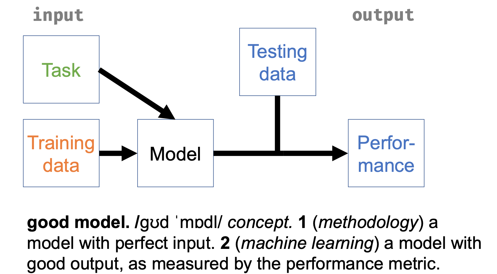
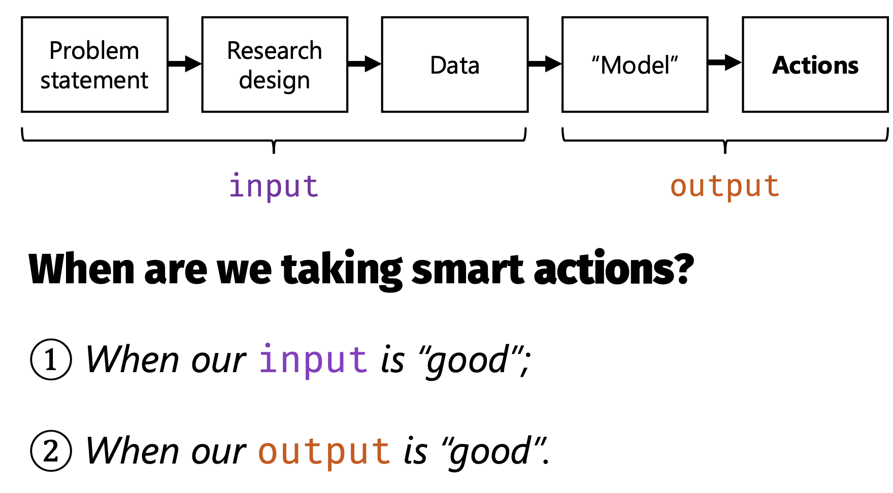

# Machine learning: overfitting and the bias-variance tradeoff {#sec-overfitting}

<!-- DO: go through the entirety of the chapter below and see if you can rewrite things into more normal academic language. --> 

Researchers who visit a statistical consultant sometimes open with a question that sounds reasonable and is, on reflection, strange: "am I allowed to use this model?" Allowed by whom? There is no licensing board for regression. What the question means is: are the assumptions of this model defensible for my data and my question? That is a sensible thing to ask, and the first four chapters of this book were largely about how to answer it. Call it a concern with **input validity**: a good analysis is one whose ingredients are in order: the question, the design, the data, and the assumptions. If the input is good, the numbers that come out inherit its credibility.

Machine learning runs on a different definition, and the difference is the door into this chapter and the next. A good model, to a machine learner, is a model that *performs*: one whose predictions of data it has never seen are demonstrably accurate, whatever its ingredients. Call that **output validity**. On this definition "am I allowed to use this model?" has a precise answer, and the answer is another question: did it predict well, measured honestly? @fig-input-output draws the two definitions side by side.

::: {#fig-input-output layout-ncol="1"}

{#fig-io1 width="75%"}

{#fig-io2 width="75%"}

Two definitions of a good model. Classical statistics polices the input; machine learning measures the output.
:::

Each definition sees what the other misses, and the caricature runs in both directions. Statisticians shake their heads at machine learning applications that ignore measurement, sampling, and validity, which is input blindness. Machine learners shake their heads at analyses defended entirely by the pedigree of their assumptions, with no check on whether the model predicts anything, which is output blindness. The fields are converging from both ends, and this book needs both: chapters 1 to 4 taught you to interrogate inputs, and this chapter and the next teach you to measure outputs. What they do not do is teach you a zoo of new models. Some new models will wander through, but the ideas are the thing, and the ideas apply just as well to the regressions you already know.

## What machine learning is

The standard definition is Tom Mitchell's, and it is thirty years old: "A computer program is said to learn from experience E with respect to some class of tasks T and performance measure P, if its performance at tasks in T, as measured by P, improves with experience E" [@mitchell1997].

Read it slowly, because everything in it is load-bearing and nothing in it mentions neural networks. The **task** is what the program must do: assign a probability of low birth weight to a mother, translate a sentence, flag a fraudulent transaction. The **experience** is data: for us, a set of observations with the outcome recorded, the setting called **supervised** learning, because the recorded outcomes supervise the fit. The **performance measure** is a number that says how well the task was done, measured on cases the program did not learn from. Learning is nothing more than performance improving with experience.

<!-- DO: note that the example in chapter 2 changed. Adjust below. -->
By this definition, the logistic regression of @sec-theory-to-glm is a machine learning method. The task: predict which babies will be born underweight. The experience: 189 recorded births. The performance measure: how well the predicted probabilities fit births the model never saw. Nothing about the model changed. What changed is the judge. In @sec-theory-to-glm the model was judged by its inputs: whether the theory justified the variables, whether the coefficients meant what we claimed. Here it is judged by its output, and the coefficients could be gibberish so long as the predictions hold up.^[This is the two-cultures split of @sec-explanation-prediction, now operational. Breiman's algorithmic culture is exactly the output-validity culture, and his complaint about the other 98 percent was input blindness about the one input that is a model: "if the model is a poor emulation of nature, the conclusions may be wrong" [@breiman2001].]

The definition is liberating, and I mean that practically. Once the task and the performance measure are fixed, questions that formerly required doctrine become empirical. Should I log-transform income? Include the interaction? Use a random forest instead? Try it, measure performance honestly, keep what wins. Nobody needs to win an argument about assumptions first. The liberation has a price, which is the word *honestly*: every one of those comparisons can leak and flatter, and the whole of @sec-evaluation is about paying the price properly. This chapter is about the phenomenon that makes honest measurement hard.

::: {.callout-tip icon="false" title="Exercise 6.1"}
State the task, the experience, and the performance measure for each scenario, and say on which data the performance must be measured.

(a) A hospital wants to flag, at admission, patients likely to be readmitted within 30 days.
(b) A political scientist wants to code 50,000 parliamentary speeches as economic, social, or procedural, using 2,000 speeches coded by hand.
(c) The random-effects meta-analysis of @sec-anova, asked to predict the log odds ratio in a newly planned BCG trial.
:::

::: {.callout-note collapse="true" icon="false" title="Answer 6.1"}
(a) Task: predict readmission within 30 days from admission-time information. Experience: past admissions with their outcomes. Performance: accuracy of the predictions on admissions not used for learning, ideally later ones, since that matches how the model will be used.
(b) Task: assign one of three labels to a speech. Experience: the 2,000 hand-coded speeches. Performance: agreement with human labels on hand-coded speeches held out from the learning.
(c) Task: predict $\theta$ in a new study. Experience: the thirteen completed trials. Performance: how close the prediction lands, which can only be measured once new trials exist. The exercise is the point: the model of @sec-anova was already making predictions, and Mitchell's definition covers it comfortably.
:::

## Watching overfitting

Now the phenomenon. As always I build a world we control: a smooth curve, $f(x) = \sin(2\pi x)$, plus noise with standard deviation 0.5. Fifty observations for learning, and ten thousand fresh ones for judging. To this world I fit polynomials of increasing degree, from a straight line to a degree-12 monster, and I measure each fit twice, by mean squared error (MSE), the average of the squared misses: once on the fifty points it learned from, and once on the ten thousand it never saw.

```{r}
#| label: fig-overfit
#| fig-cap: "One training set of 50 points from a known curve (left: the true curve, a degree-3 fit, and a degree-12 fit) and the two error curves (right). Training MSE falls forever as the degree rises; test MSE falls, bottoms out, and then climbs. The dashed line marks the noise floor, the error a perfect model would still make."
#| fig-width: 8
#| fig-height: 3.4
set.seed(6)
f <- function(x) sin(2 * pi * x)
n <- 50
train <- data.frame(x = runif(n))
train$y <- f(train$x) + rnorm(n, sd = 0.5)
test <- data.frame(x = runif(10000))
test$y <- f(test$x) + rnorm(10000, sd = 0.5)

mse <- function(m, d) mean((d$y - predict(m, d))^2)
degrees <- 1:12
errs <- sapply(degrees, function(k) {
  m <- lm(y ~ poly(x, k), data = train)
  c(train = mse(m, train), test = mse(m, test))
})

par(mfrow = c(1, 2))
grid <- data.frame(x = seq(0, 1, length.out = 200))
plot(train$x, train$y, xlab = "x", ylab = "y", main = "The data and two fits")
lines(grid$x, f(grid$x), lwd = 2)
lines(grid$x, predict(lm(y ~ poly(x, 3), train), grid), lty = 2, lwd = 2)
lines(grid$x, predict(lm(y ~ poly(x, 12), train), grid), lty = 3, lwd = 2)
legend("topright", c("truth", "degree 3", "degree 12"), lty = 1:3, bty = "n", cex = 0.8)
matplot(degrees, t(errs), type = "b", pch = c(1, 16), lty = 1,
        xlab = "polynomial degree", ylab = "mean squared error",
        main = "Training vs test error")
abline(h = 0.25, lty = 2)
legend("topleft", c("training", "test"), pch = c(1, 16), bty = "n")
```

The training error only goes down. It has to: a higher-degree polynomial can do everything a lower-degree one can and more, so giving the model more freedom can never hurt its fit *to the data it is fitting*. The test error tells the real story. It falls at first, because the straight line genuinely misses the curve; it bottoms out around degree 3 to 5; and then it climbs, slowly and then steeply, until the degree-12 fit predicts fresh data far worse than the straight line did. James, Witten, Hastie, and Tibshirani call this U-shape "a fundamental property of statistical learning that holds regardless of the particular data set at hand and regardless of the statistical method being used" [@james2021].

A model in the climbing region is **overfitting**: it has memorized the accidents of its fifty points, the noise, and mistaken them for structure. Look at the dotted curve in the left panel chasing individual observations. Every wiggle is the model explaining something that was never there to explain. And notice what the training error is worth as a warning: nothing. At degree 12 the training error is at its lowest of the whole sequence while the test error is at its worst. Judged by input thinking, nothing dramatic has happened, since a polynomial is a perfectly respectable model. Judged by output, the model has quietly failed.

::: {.callout-tip icon="false" title="Exercise 6.2"}
Run the chunk above and modify it. (a) Raise the training sample from 50 to 500 and rerun. Where is the bottom of the U now, and why did it move? (b) Set the noise standard deviation to 0 and rerun. What happens to the U, and what does that tell you about what overfitting is made of? (c) Your training error at degree 12 with the original settings is about 0.16, well below the noise floor of 0.25. Explain how a model can beat the noise floor on training data, and why it can never do so on test data.
:::

::: {.callout-note collapse="true" icon="false" title="Answer 6.2"}
(a) The bottom barely moves, since the truth is no more complicated than before, but the climb to its right flattens dramatically: at degree 12 the test MSE drops from about 3.5 to about 0.26. With ten times the data the accidents average out, so excess flexibility stops being dangerous. What complexity costs belongs to the model-and-sample-size pair, never to the model alone.
(b) With no noise the test error keeps falling as the degree rises toward the truth's complexity, and the U all but disappears. Overfitting is made of noise: it is the fitting of randomness, so a world without randomness has little to overfit.
(c) On training data, fitting the noise *reduces* measured error, because the noise is right there in the data being scored: memorizing accidents pays. On test data the accidents are new ones, drawn fresh, so memorized noise predicts nothing and its cost appears in full. Below-floor training error is the signature of memorization.
:::

## Why: the decomposition

The U-shape has an anatomy, and it is the most useful equation in these two chapters. Fix a single point $x_0$ and ask: if I repeatedly drew fresh training sets of 50 from this world, fitted my model to each, and each time predicted a fresh observation at $x_0$, how large would my squared error be on average? For any model fitted by any method, the answer splits into three terms [@james2021; @hastie2009]:

<!-- DO: define each term in the equation, including y_0, f, \hat{f}, \sigma, and E. Use brackets around the term whose expectation is taken for clarity. -->
$$
\underbrace{E\,\bigl(y_0 - \hat f(x_0)\bigr)^2}_{\text{expected test error}}
\;=\;
\underbrace{\sigma^2}_{\text{noise}}
\;+\;
\underbrace{\bigl[\,E\hat f(x_0) - f(x_0)\,\bigr]^2}_{\text{bias}^2}
\;+\;
\underbrace{\operatorname{Var}\bigl(\hat f(x_0)\bigr)}_{\text{variance}} .
$$ {#eq-bias-variance}

Take the terms one at a time, in their exact meanings, because loose versions of these words cause endless confusion.

The **noise**, $\sigma^2$, is the variance of the outcome around the true curve: the part of $y$ that nothing at all predicts, because it is measurement error, unmeasured causes, or genuine randomness. It is called the **irreducible error**, and it sets a floor. No model, however clever, can have expected test error below $\sigma^2$, because even a model that knew $f$ exactly would still miss each fresh observation by the noise. In our simulated world the floor is $0.5^2 = 0.25$, the dashed line in @fig-overfit. In real problems the floor is real but unknown, and forgetting its existence is how people come to demand the impossible from prediction. The Fragile Families result of @sec-explanation-prediction reads differently in this light: when 160 teams with thirteen thousand variables all plateau at an $R^2$ of 0.2 for the most predictable outcomes, and near zero for the rest, the parsimonious explanation is not that all 160 teams were clumsy but that the floor for a single child's life outcomes is high, that much of what happens to a person is, from the standpoint of age-nine data, noise.^[Parsimonious, not proven: a floor is only demonstrated relative to the information you have. Better measurements or different variables could lower it, which is exactly the question PreFer was designed to ask.]

**Bias** is a property of the average fit: it "refers to the error that is introduced by approximating a real-life problem, which may be extremely complicated, by a much simpler model" [@james2021]. Fit a straight line to a sine curve a thousand times and average the thousand lines: the average is still a line, and at the peak of the curve it will sit far below the truth, every single time. That systematic miss is bias. It does not shrink as you collect more data, because its source is the model's shape, not the sample's size. Another example of bias was shown in chapter @sec-explanation-prediction, section 5.2: in that example the true causal factor medication was absent from the model with lowest prediction error. Therefore this model's average predictions cannot correspond exactly to the true value (before noise) of each observation.

**Variance** is a property of the fit's instability: it "refers to the amount by which $\hat f$ would change if we estimated it using a different training data set" [@james2021]. The degree-12 polynomial threads its fifty points beautifully, but hand it a different fifty points from the same world and it threads those instead, producing a visibly different curve. Its predictions at $x_0$ swing from training set to training set, and the swinging is error, even though it averages out to roughly the right place.

Equations deserve checking, so let us check this one numerically, at the peak of the curve, $x_0 = 0.25$. Two thousand fresh training sets per model:

```{r}
#| label: decomposition
set.seed(7)
sims <- 2000
x0 <- 0.25
pred_at_x0 <- function(k) replicate(sims, {
  x <- runif(n)
  y <- f(x) + rnorm(n, sd = 0.5)
  predict(lm(y ~ poly(x, k)), newdata = data.frame(x = x0))
})
res <- sapply(c(1, 3, 12), pred_at_x0)
tab <- t(apply(res, 2, function(p) {
  c(bias2 = (mean(p) - f(x0))^2, variance = var(p), noise = 0.25,
    total = (mean(p) - f(x0))^2 + var(p) + 0.25)
}))
rownames(tab) <- paste("degree", c(1, 3, 12))
round(tab, 3)
```

Read the table across. The straight line is stable (variance 0.017) and wrong (bias$^2$ 0.265): it misses the peak the same way every time. The degree-12 fit is right on average (bias$^2$ 0.000) and unstable (variance 0.067, four times the straight line's). Degree 3 is nearly right *and* nearly stable, and its total, 0.267, sits just above the floor of 0.25: close to the best any method could do at this point. That is the **bias-variance tradeoff**: flexibility buys less bias at the price of more variance, and expected error is minimized where the exchange rate turns against you, not at either extreme. Everything on the complexity menu below is a way of choosing a position on this dial, and ISL calls the tradeoff "one of the most important recurring themes in this book" [@james2021]. It is one of the most important recurring themes in this one too: it is why a wrong model can predict better than the true one, the fact that @sec-explanation-prediction promised this chapter would explain. The true model has zero bias, and zero bias is worth nothing if the variance swamps it.

::: {.callout-tip icon="false" title="Exercise 6.3"}
Using @eq-bias-variance and the table above, say which term or terms each change moves, in which direction, and what happens to expected test error.

(a) The training sample grows from 50 to 5,000, model fixed at degree 12.
(b) The outcome is measured with a better instrument, halving $\sigma$.
(c) Twenty pure-noise predictors are added to a linear regression, sample size fixed.
(d) You replace the true model with a simpler, wrong one, in a small sample.
:::

::: {.callout-note collapse="true" icon="false" title="Answer 6.3"}
(a) Variance falls, and substantially, since each coefficient is now estimated from a hundred times the data; bias is untouched (a degree-12 polynomial tracks the sine to within a hair on this range, so it was already negligible), and so is the noise. Test error falls toward the floor.
(b) The noise term falls by three quarters, and so, more quietly, does the variance, since the coefficients are estimated from less noisy data. Bias is unchanged. Better measurement lowers the floor itself, which no amount of modelling can.
(c) Bias is unchanged, since the true coefficients of the junk are zero and the model can represent that. Variance rises: twenty extra coefficients must be estimated, each free to chase chance correlations. Test error rises with no compensation.
(d) Bias appears where there was none; variance falls, because the simpler model has fewer quantities to estimate from the same data. In a small sample the trade can be profitable, and that is the whole point: the expected error of the wrong model can be lower.
:::

## Why the wrong model won

The decomposition can now pay the debt this chapter owes to @sec-explanation-prediction. In the simulation there, `fit_wrong`, which knows only the causally inert `exercise`, beat `fit_best`, which knows everything observable, and `fit_true`, loyal to the one genuine cause, finished a distant last. That world was built from three numbers, $g = 3$ for the strength of the confounding, $b = 0.15$ for medication's effect, and twenty observations for training, and because we built it, every term of @eq-bias-variance can be computed exactly instead of being watched in one random sample.

Write the data-generating process in symbols: exercise $X_1$, medication $X_2$, the unobserved motivation $U$, and the outcome symptoms $Y$. With $U$, $X_2$, and the disturbances $\delta$ and $\varepsilon$ all independent standard normal, the code says

$$
X_1 = g\,U + \delta \quad \text{(exercise)}, \qquad
Y = g\,U + b\,X_2 + \varepsilon \quad \text{(symptoms)}.
$$

Every variable is jointly normal, so every conditional expectation we need is linear and every conditional variance is a constant. One quantity appears throughout: the squared correlation between exercise and motivation,

$$
\rho_{UX}^2 = \operatorname{Cor}(U, X_1)^2 = \frac{g^2}{g^2 + 1} = 0.9,
$$

which comes with the regression of the unobserved $U$ on the observed $X_1$: $E(U \mid X_1) = \frac{g}{g^2+1}\,X_1$, with $\operatorname{Var}(U \mid X_1) = \frac{1}{g^2+1}$. Exercise does nothing to symptoms, but it is highly informative about the variable that does. Now take the three terms of @eq-bias-variance in turn.

**Irreducible variance.** None of the models observes $U$, so the noise term of @eq-bias-variance is

$$
\sigma^2 = \operatorname{Var}(Y \mid X_1, X_2)
= g^2 \operatorname{Var}(U \mid X_1) + \operatorname{Var}(\varepsilon)
= \rho_{UX}^2 + 1 = 1.9 :
$$

the disturbance $\varepsilon$ contributes $1$, and the remaining tenth of motivation's contribution, the part that not even exercise can recover, contributes $\rho_{UX}^2 = 0.9$. This term is the same for all three models, because it depends on what is observable, not on what a model does with it; had motivation been observable, it would have been $1$.

**Bias.** Averaged over training sets, each model's fit is the population regression of $Y$ on its own predictors, $E(Y \mid \text{own predictors})$; its bias is the difference between that and the best possible predictor from the observables, $E(Y \mid X_1, X_2) = \rho_{UX}^2\,X_1 + b\,X_2$. Averaging the squared difference over test observations:^[Bias and variance here are the terms of @eq-bias-variance averaged additionally over fresh test observations $(X_1, X_2)$, rather than taken at one fixed point $x_0$.]

* `fit_true`: the average fit is $E(Y \mid X_2) = b\,X_2$, which misses $\rho_{UX}^2\,X_1$, so bias$^2 = E[(\rho_{UX}^2 X_1)^2] = \rho_{UX}^4 (g^2 + 1) = g^2 \rho_{UX}^2 = 8.1$.
* `fit_best`: the average fit is $\rho_{UX}^2\,X_1 + b\,X_2$, the best possible predictor itself, so bias$^2 = 0$.
* `fit_wrong`: the average fit is $E(Y \mid X_1) = \rho_{UX}^2\,X_1$, which misses $b\,X_2$, so bias$^2 = b^2 \operatorname{Var}(X_2) = b^2 = 0.0225$.

**Variance.** Each model's coefficients must be estimated from $n = 20$ observations. The classical result for regression gives the expected estimation variance at a fresh test point as approximately $s^2\,p/n$, where $s^2 = \operatorname{Var}(Y \mid \text{own predictors})$ is the model's residual variance and $p$ its number of coefficients, intercept included.^[The table reports the exact version for normally distributed predictors, $s^2 \left[\frac{1}{n} + \left(1 + \frac{1}{n}\right)\frac{q}{n - q - 2}\right]$ with $q$ the number of slopes; at $n = 20$ it is somewhat larger than $s^2 p/n$.]

* `fit_true`: $s^2 = \operatorname{Var}(Y \mid X_2) = g^2 + 1 = 10$, since all of motivation lands in the residual; with $p = 2$, variance $\approx 10 \times 2/20 = 1.00$ (exactly $1.12$).
* `fit_best`: $s^2 = \operatorname{Var}(Y \mid X_1, X_2) = 1 + \rho_{UX}^2 = 1.9$; with $p = 3$, variance $\approx 1.9 \times 3/20 = 0.29$ (exactly $0.34$).
* `fit_wrong`: $s^2 = \operatorname{Var}(Y \mid X_1) = 1 + \rho_{UX}^2 + b^2 = 1.9225$, since the ignored medication effect joins the residual; with $p = 2$, variance $\approx 1.9225 \times 2/20 = 0.19$ (exactly $0.21$).

Summing the three terms gives each model's expected test error $E(\text{MSE})$, and its square root puts the result on the scale reported in @sec-explanation-prediction:

| model | irreducible | bias$^2$ | est. variance | $E(\text{MSE})$ | $\sqrt{E(\text{MSE})}$ |
|:------------|------:|------:|------:|------:|-----:|
| `fit_true`  | 1.900 | 8.100 | 1.118 | 11.12 | 3.33 |
| `fit_best`  | 1.900 | 0     | 0.344 |  2.24 | 1.50 |
| `fit_wrong` | 1.900 | 0.023 | 0.215 |  2.14 | 1.46 |

Read the verdicts off the columns. `fit_true` is destroyed by bias, and by nothing else: its 8.1 dwarfs every other entry in the table, no sample size will shrink it, and its source is the decision to discard the one variable that carries information about the dominant cause of symptoms. The real contest, `fit_best` against `fit_wrong`, is settled by an exchange of the two small terms: including medication removes $b^2 = 0.0225$ of bias and costs one extra coefficient's rent, roughly $\sigma^2/n \approx 0.10$ of variance. At $n = 20$ the rent exceeds the bias fourfold, so the wrong model wins, though only narrowly, $1.46$ against $1.50$, both a whisker above the floor's $\sqrt{1.9} \approx 1.38$. The trade tips where $b^2$ outgrows the rent, at $n \approx \sigma^2/b^2$, about ninety observations here, which is why, when Exercise 5.3 pushed `n_train` from 20 to 100 to 500, `fit_best` pulled ahead somewhere in the low hundreds and never looked back.

Arithmetic deserves checking as much as equations do, so let the computer referee: two thousand fresh training sets of twenty, each model refitted every time and scored on a common test set.

```{r}
#| label: wrong-model-decomposition
set.seed(11)
g <- 3; b <- 0.15; n_train <- 20
gen <- function(n) {
  medication <- rnorm(n); motivation <- rnorm(n)
  exercise   <- g * motivation + rnorm(n)
  symptoms   <- g * motivation + b * medication + rnorm(n)
  data.frame(symptoms, exercise, medication)
}
test  <- gen(20000)
forms <- list(true  = symptoms ~ medication,
              best  = symptoms ~ exercise + medication,
              wrong = symptoms ~ exercise)
mses <- replicate(2000, {
  d <- gen(n_train)
  sapply(forms, function(f) mean((test$symptoms - predict(lm(f, d), test))^2))
})
round(rowMeans(mses), 2)
```

The simulated values of $E(\text{MSE})$ land on the table's column to within simulation error. The seed of @sec-explanation-prediction produced one draw from exactly this distribution; averaged over all possible training sets, the wrong model's victory is no accident of the seed but the expected outcome, and the table shows the whole mechanism: a tiny bias accepted, a coefficient's rent saved, and a true cause whose effect is too small, in twenty observations, to pay its own way.

## The dial: controlling complexity

If complexity is a dial, the practical question is where the useful settings are and what turning it looks like across model families. Watch one turn of it in a slightly more realistic world: a linear regression with two real predictors and a supply of junk. The truth is $y = 1 + 0.5x_1 - 0.5x_2 + \varepsilon$ with $\sigma^2 = 1$, a hundred observations for training, and the junk predictors are pure noise.

```{r}
#| label: noise-predictors
set.seed(9)
make_data <- function(n, p_junk = 60) {
  x1 <- rnorm(n); x2 <- rnorm(n)
  y  <- 1 + 0.5 * x1 - 0.5 * x2 + rnorm(n)
  X  <- cbind(x1, x2, matrix(rnorm(n * p_junk), n, p_junk))
  colnames(X) <- c("x1", "x2", paste0("junk", seq_len(p_junk)))
  list(X = X, y = y)
}
test62 <- make_data(10000)
for (p_junk in c(0, 20, 60)) {
  tr   <- make_data(100)
  keep <- seq_len(2 + p_junk)
  fit  <- lm(y ~ ., data = data.frame(y = tr$y, tr$X[, keep]))
  err  <- mean((test62$y - predict(fit, data.frame(test62$X[, keep])))^2)
  cat(p_junk, "junk predictors: test MSE", round(err, 2), "\n")
}
```

With no junk the model achieves 1.07, just above the floor of 1. Twenty junk predictors cost a quarter of a point; sixty, on a hundred observations, nearly triple the error. Nothing biased the model. It simply had 62 coefficients to estimate from 100 observations, and every spurious correlation it found became a spurious prediction. This is the small-scale version of what the curse of dimensionality does at large scale: as the number of predictors grows, a fixed sample spreads impossibly thin, and Hastie, Tibshirani, and Friedman compute that matching the density of 100 observations on one predictor would take $100^{10}$ observations on ten [@hastie2009].

<!-- DO: rewrite and finish below -->
An intuitive approach to solving this problem in practice is to fit all possible models with 0, 1, 2, ..., 60 predictors and evaluate their performance in held-out data and pick the best one. With enough data this will indeed find the right model (0 predictors), but unfortunately, there are $\sum_{p=0}^{60} \choose{60}{j} = 2^{60}$ possible models to consider, and that's just with linear regression. 
**Shrinkage** is the remedy to this problem. What it does is to replace [TODO]
, and it is bias administered on purpose. Ridge regression adds a penalty $\lambda \sum_j \beta_j^2$ to the least-squares criterion, and the lasso adds $\lambda \sum_j |\beta_j|$; both pull every coefficient toward zero, and the lasso pulls small ones exactly to zero, throwing predictors out of the model entirely [@james2021]. A pulled-toward-zero coefficient is a biased estimate of a nonzero effect. It is also a far less variable one, and @eq-bias-variance does not care where error comes from, so if a little squared bias buys a large drop in variance, the trade profits:

```{r}
#| label: shrinkage
#| message: false
library(glmnet)
library(randomForest)
set.seed(10)
tr    <- make_data(100)
ols   <- lm(y ~ ., data = data.frame(y = tr$y, tr$X))
ridge <- cv.glmnet(tr$X, tr$y, alpha = 0)   # ridge; alpha = 1 is the lasso
lasso <- cv.glmnet(tr$X, tr$y, alpha = 1)
forest <- randomForest(x = tr$X, y = tr$y)
mse_of <- function(m) mean((test62$y - predict(m, newx = test62$X, s = "lambda.min"))^2)
round(c(ols    = mean((test62$y - predict(ols, data.frame(test62$X)))^2),
        ridge  = mse_of(ridge), lasso = mse_of(lasso),
        forest = mean((test62$y - predict(forest, test62$X))^2)), 2)
```

On this training draw plain least squares scores 1.97, ridge 1.25, and the lasso 1.04, a whisker from the floor; `cv.glmnet` chose $\lambda$ automatically, by a method that is the centrepiece of @sec-evaluation. The lasso kept 12 of the 62 predictors, including both real ones. The fourth row previews the next paragraph: a random forest, fitted with one line and no tuning at all, lands at 1.18. If shrinkage feels familiar, it should: the multilevel models of @sec-anova shrink each group's estimate toward the grand mean, and it is the same trade, variance sold for bias, discovered independently by several fields.

The rest of the model zoo can now be introduced for what it is, positions and tricks on the same dial, and this book will not make a big deal of any of them. **Regression trees** cut the predictor space into boxes and predict a constant in each: grown deep, they are flexible and wildly unstable, the far end of the dial. A **random forest** grows hundreds of deep trees, each on a random redraw of the data (the "bootstrap" of @sec-evaluation), letting each split consider only a random subset of predictors so the trees disagree, and averages them: averaging many unstable, roughly unbiased fits slashes variance while keeping the flexibility, which is why the untuned forest above did so well [@james2021]. **Boosting** goes the other way, growing tiny trees in sequence, each one fitted to what the previous ensemble still gets wrong, shrunk by a learning rate so that the model creeps toward the data; ISL's summary is that methods which "learn slowly tend to perform well" [@james2021]. **Neural networks**, transformers included, stack layers of simple regressions into functions of enormous flexibility, tamed by their own bag of variance-control tricks, among them stopping the training early, before the fit has memorized the noise. On a hundred observations of tabular survey data they buy you nothing; at the scale of language, as @sec-explanation-prediction described, the same recipe rewrote what prediction can do.

Which brings back the liberation. Since these are all positions on a dial, the choice among them is an empirical question, task by task, and the empirical answers are frequently deflating for the exotic end. A systematic review of 71 clinical prediction studies found no average performance benefit of flexible machine learning methods over logistic regression on tabular clinical data, and found that the comparisons claiming one were disproportionately the ones with biased evaluations [@christodoulou2019]. When deep learning on 216,000 electronic health records did beat traditional risk scores at predicting in-hospital mortality, it did so by a margin worth having but not a revolution [@rajkomar2018]. The dial, not the destiny, decides: lots of signal-rich data favours the flexible end, and the modest samples of much social and health research favour the rigid end, exactly as @eq-bias-variance says it must.

::: {.callout-tip icon="false" title="Exercise 6.4"}
Extend the shrinkage chunk. (a) Plot `ridge$lambda` against the cross-validated error (`plot(ridge)` does this) and describe the shape in the vocabulary of this chapter. (b) At $\lambda$ near zero, which term of @eq-bias-variance dominates ridge's error, and at very large $\lambda$, which? (c) What does the model predict for everyone when $\lambda \to \infty$, and what named quantity does its test MSE then approach? Check numerically with `predict(ridge, newx = test$X, s = max(ridge$lambda))`.
:::

::: {.callout-note collapse="true" icon="false" title="Answer 6.4"}
(a) A U-shape, the same one as @fig-overfit read right to left, since large $\lambda$ means low complexity. The minimum is the best available trade.
(b) Near zero, variance: the model is ordinary least squares with 62 free coefficients. At large $\lambda$, bias: the coefficients are crushed toward zero regardless of the truth.
(c) With all slopes forced to zero the model predicts the training mean of $y$ for everyone. Its test MSE approaches the outcome's total variance around its mean, here about $1 + 0.25 + 0.25 = 1.5$: the error of knowing nothing. The floor of 1, by contrast, is the error of knowing everything. All models live between those two numbers, which are worth computing in any real problem before admiring anyone's performance.
:::

## The price of the liberation

One loose end remains, and it is deliberately loose, because @sec-evaluation exists to tie it. Every trustworthy number in this chapter came from ten thousand fresh observations that I could conjure because the world was simulated. Real problems offer no such luxury: there is one dataset, and every choice of model and tuning constant must somehow be paid for out of it. Pay carelessly and the performance measure itself overfits, the empirical liberation collapses into a new way of fooling yourself, and the fishing of @sec-rq-to-interpretation returns with official permission. How to split and resample your way to a number you can trust, and what the trustworthy numbers of the prediction literature actually look like, is next.

## Test yourself {.unnumbered}

<!--DO: Include an exercise like the learning curve one: "old-course/old-exams/Midterm exam ReMa Multivariate-resit-2025.docx" Question 3 (b) and (c), and Midterm exam ReMa Multivariate-example.docx in the same directory, Question 4 (a) and (b) (only). --> 

<!-- DO: make the derivation an optional last. This will be too challengign for many studetnts (but not all!) -->
::: {.callout-tip icon="false" title="Exercise 6.A"}
Derive @eq-bias-variance. Write $y_0 = f(x_0) + \varepsilon$ with $E(\varepsilon) = 0$, $\operatorname{Var}(\varepsilon) = \sigma^2$, and $\varepsilon$ independent of the training data (and hence of $\hat f$). Take these steps.

(a) In $E(y_0 - \hat f(x_0))^2$, substitute for $y_0$, and expand the square around the two pieces $\varepsilon$ and $f(x_0) - \hat f(x_0)$. Why does the cross term vanish?
(b) In the remaining piece $E(f(x_0) - \hat f(x_0))^2$, add and subtract $E\hat f(x_0)$ inside the square, expand again, and identify the three resulting terms. Why does this cross term vanish too?
(c) State what is random in each expectation, in words. This is the step that makes the equation mean something.
:::

::: {.callout-note collapse="true" icon="false" title="Answer 6.A"}
(a) $E(y_0 - \hat f)^2 = E(\varepsilon + f - \hat f)^2 = E(\varepsilon^2) + 2E[\varepsilon(f - \hat f)] + E(f - \hat f)^2$. The middle term is zero because $\varepsilon$ is independent of $\hat f$ and has mean zero, so $E[\varepsilon(f - \hat f)] = E(\varepsilon)\,E(f - \hat f) = 0$. The first term is $\sigma^2$.
(b) $E(f - \hat f)^2 = E\bigl[(f - E\hat f) - (\hat f - E\hat f)\bigr]^2 = (f - E\hat f)^2 + E(\hat f - E\hat f)^2 - 2(f - E\hat f)\,E(\hat f - E\hat f)$. The last term vanishes because $E(\hat f - E\hat f) = 0$ by construction. What remains is bias squared plus variance.
(c) The expectations average over two sources of randomness: the fresh observation's noise $\varepsilon$, and the training set that produced $\hat f$. Bias and variance are statements about repeated *training sets*, which is why the simulation in this chapter estimated them by drawing two thousand of them, and why neither can be seen in any single fitted model.
:::

::: {.callout-tip icon="false" title="Exercise 6.B"}
Two models are fitted to predict school dropout from administrative data, and their error is plotted against training-set size. Model L (logistic regression, 10 predictors): training error rises from 8% to 11% as the sample grows from 500 to 50,000; held-out error falls from 13% to 11.5% and is flat from 10,000 onward. Model G (gradient-boosted trees, tuned deep): training error stays near 0.5% at every sample size; held-out error falls from 19% to 12.4% and is still falling at 50,000.

(a) Diagnose each model in bias-variance vocabulary, using the gap between the curves and their levels.
(b) For each model, name two interventions that its diagnosis recommends and one that it shows to be a waste of effort.
(c) The base rate of dropout is 9%. What does that make of both models' numbers, and which question from @sec-explanation-prediction should have been asked first?
:::

::: {.callout-note collapse="true" icon="false" title="Answer 6.B"}
(a) Model L: the curves converge to a common plateau, training error from below, held-out from above, so variance is spent and what remains is bias plus noise; the model is too rigid or the floor is high. Model G: a huge persistent gap between near-zero training error and 12.4% held-out error is high variance, memorization; the still-falling held-out curve says more data is still buying something.
(b) Model L: add flexibility, better predictors, or interactions; more data is the waste, as the flat curve shows. Model G: more data, or less flexibility (shallower trees, stronger shrinkage, earlier stopping); polishing training error is the waste, since it is already near zero and means nothing.
(c) A model predicting "nobody drops out" scores 9% error, so 11.5% and 12.4% are both *worse than the no-information rule* on raw error. Error rate is the wrong performance measure at this base rate, and the first question should have been the task-and-metric question: what decision does this prediction feed, and what does a miss cost in each direction? @sec-evaluation takes this up properly.
:::

::: {.callout-tip icon="false" title="Exercise 6.C"}
Rajkomar and colleagues trained deep learning models on 216,221 hospitalizations from two American academic medical centres to predict, among other things, in-hospital mortality, reporting an AUC of about 0.93 to 0.94 at both sites [@rajkomar2018].

(a) State the task, experience, and performance measure, and one detail in the description above that input-oriented chapters of this book would immediately interrogate.
(b) The models used the entire electronic record, including free-text notes, rather than curated variables. Explain the bias-variance reading of that choice, and why the same choice on 2,000 patients would likely have backfired.
(c) The two hospitals are both large academic centres. Say precisely which question this leaves open, in the vocabulary of @sec-rq-to-interpretation, and why no amount of within-sample evaluation settles it.
:::

::: {.callout-note collapse="true" icon="false" title="Answer 6.C"}
(a) Task: predict death during the current admission from the record so far. Experience: 216,221 completed hospitalizations with outcomes. Performance: discrimination on held-out admissions. The input eye lands on "two academic medical centres": the experience is two particular institutions' records, with their particular patients, coding habits, and clinical practices, so the units and the sampling deserve the same scrutiny as any survey's.
(b) Using everything is a low-bias choice: no curator's judgement excludes signal. It is viable only because a quarter-million cases control the variance that tens of thousands of raw features would otherwise generate. With 2,000 patients the same choice sits at the far right of @fig-overfit's x-axis: the junk-predictor demonstration, at scale, with the model overfitting whichever chance patterns the notes contain.
(c) External validity: whether the performance holds for other hospitals, populations, record systems, and years. Within-sample evaluation, however honest, estimates performance for the population the experience was drawn from; generalization beyond it is an assumption about exchangeability that only evaluation elsewhere can test. @sec-evaluation returns to this as external validation, where such transfers routinely disappoint.
:::
